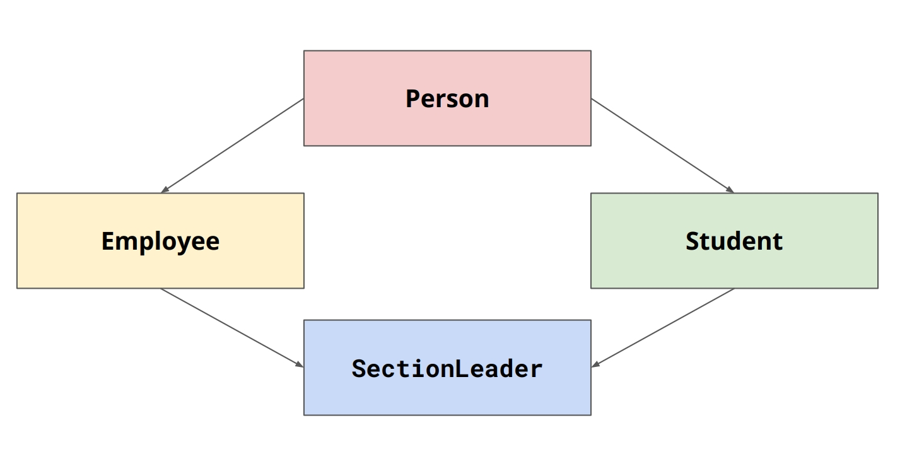

#

## 什么是object-oriented-programming

* centered around objects
* focuses on design and implementation of classes
* classes are the user defined types that can be declared as an object?

## header 和source 的区别

|······|  headerfile  |  sourcefile  |
|------|--------------|--------------|
|contains|function prototypes,class declarations,type definitions,macros,constants|function implementations,executable code|
|access|this is shared across source files|is compiled into an object file|
|example|void somefunction();|void somefunction(){```};|

## class design

* a constructor
* private member functions/variables
* public member functions(interface for a user)
* destructor

```cpp
class StanfordID {
private:
std::string name;
std::string sunet;
int idNumber;
public:
/// constructor for our student
StanfordID(std::string name, std::string sunet, int idNumber);
/// method to get name, sunet, and ID, respectively
std::string getName();
std::string getSunet();
int getID();
}


```


### constructor

* initializes the state of newly created objects
* syntax:the name of the class
* 在cpp文件中，当定义成员函数需要将类当成命名空间使用

```cpp
StanfordID::StanfordID(std::string name, std::string sunet, int idNumber) {
name = name;
sunet = sunet;
idNumber = idNumber;
}
```

* 使用关键字this to disambiguate which name you are referring to.

```cpp
StanfordID::StanfordID(std::string name, std::string sunet, int idNumber) {
this->name = name;
this->state = state;
this->age = age;
}
```

* List initialization constructorStanfordID::StanfordID(std::string name, std::string sunet, int idNumber): name{name}, sunet{sunet}, idNumber{idNumber} {};

```cpp
// default constructor
StanfordID::StanfordID() {
name = “John Appleseed”;
sunet = “jappleseed”;
idNumber = 00000001;
}
// parameterized constructor
StanfordID::StanfordID(std::string name, std::string sunet, int idNumber) {
this->name = name;
this->state = state;
this->age = age;
}

```

### implemented members

```cpp
std::string StanfordID::getName() {
return this->name;
}
std::string StanfordID::getSunet() {
return this->sunet;
}
int StanfordID::getID() {
return this->idNumber;
}


```

### the destructor

StanfordID::~StanfordID() {
// free/deallocate any data here
}

* The destructor is not explicitly called, it is automatically called when an object goes out of scope

### other

* type aliasing-allows you create synonymous identifiers for types

```cpp
template<typename>T
class vector{
    using iterator=T*;
};

// An example of type aliasing
using String = std::string;
String name;
String sunet;
int idNumber;


```

## inheritance

* dynamic polymorphism:different types of objects may need the same interface
* extensibility:inheritance allows you to extend a class by crating a subclass with specific properties
* pure virtual function:it is instantiaed in the base class but overwritten in the subclass(d p)

```cpp
class shape{
public:
    virtual double area()const =0;
};
class circle:public shape{
public:
    //constructor
    circle(double radius):_radius{radius}{};
    double area() const {
        return 3.14*_radius*_radius;
    }
private:
    double _radius;
};

```

|type|public|protected|private|
|----|------|---------|-------|
|example|class B: public A{```}|class B:protected A{```}|class B:private A{```}|
|public members|are public in the derived class|protected in the dervied class|private in the derived class|
|protected members|protected in the dervied class|protected in the dervied class|private in the derived class|
|private members|not accessible in derived class|not accessible in derived class|not accessible in derived class|

### the dimanond problem



* both **students** and **employee** inherit from **person**,they each call the constrctor of **person**,**sectionleader** ends up with two copies of **person**,one from **student** another from **employee**

* 解决方法：让员工和学生虚继承人
* virtual inheritance means that a derived class,in this case sectionleader.should only have a single instance of base case ,in this case person,this requires the derived class to initialize the base class

* classes allow you to encapsulate functinality and data with access protections
* inheritance allows us to design powerful and versatile abstractions that can help us model complex relationships in code

