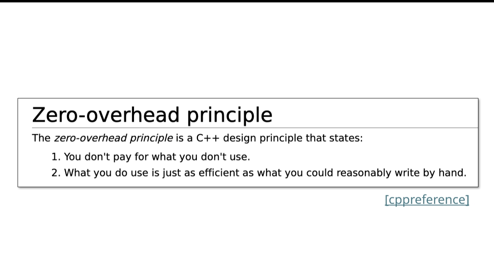
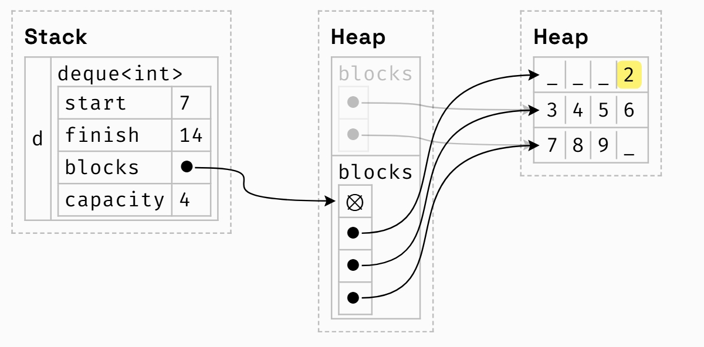
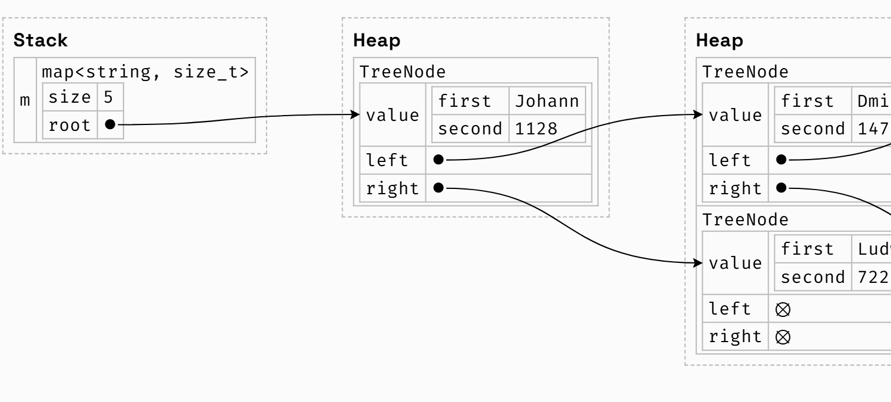

#

## 什么是stl、模板

> The Standard **Template** Library

* all stl containers are templates
* the library was created by alexander stepanov

### 内容

* **containers** store groups of things
* **iterstors**  traverse containers 遍历容器
* **functors**  represent functions as objects
* **algorithms** transform and modify containers in a generic way

## sequence containers

> store a linear sequence of elements

### vector

```c++
std::vector<int>vec{1,2,3,4};
vec.push_back(5);
vec.push_back(6);
vec[1]=20;
for(size_t i=0;i<vec.size();i++){
    std::cout<<vec[i]<<" ";
}
* use range-based for when possible
    for(auto elem:vec){
        std::cout<<elem<<" ";
    }
* use const auto& when possible

std::vector<massivetype>vec{...};
for(auto elem:vec)...
|
for(const auto& elem:v)
  * applies for all iterable containers
  * saves making a potentially expensive copy of each element


```

* operator[]does not perform bounds checking

```cpp
std::vector<int> vec{5,6};
vec[1]=3;
vec[2]=4;//undefined behavior
vec.at(2)=4;//runtime error
```

> zero-overhead principle  

* 管理一小块的内存，当需要更多内存时分配一个新的内存空间并释放掉旧的空间，通常是原空间的两倍，存在堆里
* 在前面插入元素很慢

### deque

* a("deck")is a double-ended queue
* allows efficient insertion/removal at either end
* 与vector 相比，多了两个操作push_front/pop_front

### deque 如何实现的？

vector 只有一块内存,deque内存分为了几块，array of arrays

* 为了记录in-use区域的开始和结束位置，使用索引start和finish（iterator） start and finish refer to indexes across all blocks

注意finish和start的位置
* 按索引查找不太方便，需要两个指针(start + i) / 4， (start + i) % 4

## associative containers

> a set of elements organized by unique keys

### odered containers

* 有序的限制条件->按key查找对数时间
* 内部通过比较函数进行排序，于是遍历一个map中的key-value对或者一个集合中的元素时总会从小到大的key排序

```c++
std::map<std::string,std::string> famous{
    {"Bjarne","Stroustroup"},
    {"Herb","Sutter"},
    {"Alexander","Stepanov"},
};

for(const auto&[key,value]:famous){
    //structure binding ,a collection of pairs
    std::cout<<key<<":"<<value<<std::endl;
}

//output
//a
//b
//h
```

#### requirments

* 第一个参数是可比的，有操作符<
* 如果缺少<可以自己补一个，三种方法
  * 重载<

  ```c++
  bool operator<(const mytype&a,const mytype&b){
    //return true if a is less than b
  }
  ```

  * 定义一个functor

  ```c++
  struct less{
    bool operator()(const mytype&a,const mytype&b){
        //return true if a is less than b
    }
  }

  std::map<mytype,double,less>my_map;
  std::set<mytype,less>my_set;
  ```

    * 通过传递一个 comparison template argument to map and set

  * 使用lambuda function

  ```c++
  auto comp=[](const mytype&a,const mytype&b){
    //return true if a is less than b
  }
  std::map<mytype,double,decltype(comp)> my_map(comp);
  //declar type
  std::set<mytype,double,decltype(comp)> my_set(comp);
  ```

    * decltype(comp)infers the compile-time type of the lambda function comp

#### std::map<K,V>

* 与python中的字典或javascrip中的对象运作方式一样
* m[k] will insert a default initialized value into m if k does not exist!

#### std::set<T>

* the standard way of storing a collection of unique elements in C++，
* a map without any values.

#### behind the scenes

how these data structures are implemented behind the scences
如果可以比较两个元素那么就可以构建一个有效的数据结构来快速判断键或值是否存在在map或set中
编译器总是使用红黑树，查找时使用二分查找

### unordered containers

* hash tables>more common language
* make use of hash and equality functions to achieve neat constant time key lookups
