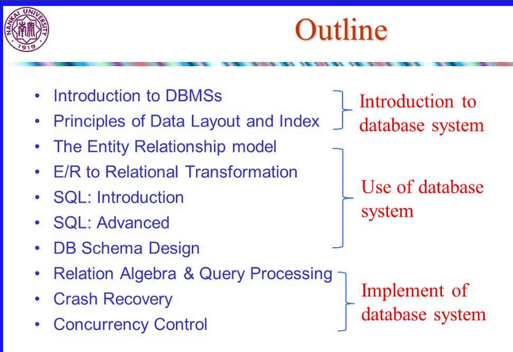
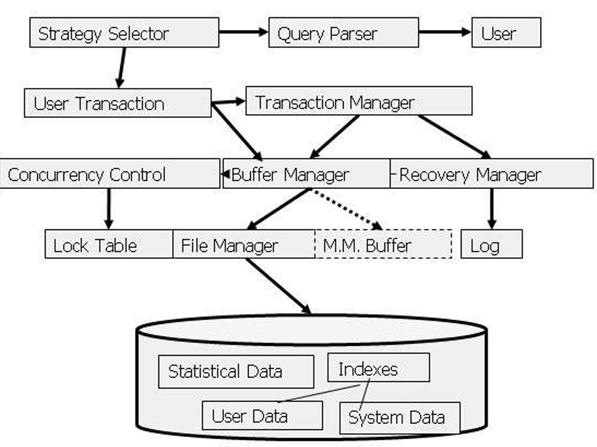

# introduction

## course goals 

**the basics** of how to use and manage data
how to design and create such database;
use them (via sql query language)
implement

## definitions 

* dbms=data base management system; a piece of software designed to store and manage database;
ep. mysql,oracle

* database system: dbms+data+application programs

## 使用它的原因

如果使用文件系统，在源代码中描述数据的类型（元数据metadata）使得想使用数据的人必须访问源代码；
为防止并发操作出现问题 处理文件封锁和解锁的源代码会相当复杂

## 它是咋工作的

**metadata=catalog=data dictionary**

sql:ddl dml

* sql 支持任何复杂查珣和更新操作
* 数据操作语言的特点：声明式
* 模式与数据的关系：schema-types;instances-variable

### 数据项存储 数据模型

数据库中的数据是按照一定的逻辑结构存放的，这种结构用数据模型来表示

#### 分类

* relational
* key/value
* graph
* document/xml/object
* wide-column/column-family

* array/matrix/vectors(machine learning)

(obsolete/legacy/rare)
* hierarchical
* network
* multi-value

#### 关系模型的术语

* tables--relations
* columns--attributes
* rows--tuples
* schema(e.g.:acc_schema=(bname,acct_no,balance))

## foundamental concepts

### data independence 

* concepts:applications do not need to worry about how the data is structured and stored

* logical data independence逻辑独立性
  * protection from changes in the logical structure of the data;
  * can add(drop) column/table;
* physical data independence物理独立性
  * protection from physical layout changes
  * can add index;change record order

  ## dbms users

  * implementer(build system)
  * designer(establishes schema)
  * application developer(progams that operate on databasae)
  * adminster(dba):loads data,keeps running smoothly top

  ## overall system architecture

  * file&system structure
    * records in blocks,dictionary,buffer management
  * indexing & hashing
    * b-trees,hashing
  * query processing
    * query costs,join strategies
  * crash recovery
    * failures,stable storage
  * concurrency control
    * correctness,locks
  * transaction processing
    * logs,deadlocks
  
  
  ## 构建一个db应用的步骤

  0.选择应用领域
  1.conceptual design
    * an er diagram of the app.domain
  2.选择一个dbms类型
  3.