# 介绍

## 第一部分 基础

- sql 是一门 十分高级的语言：做什么 而不是 怎么做；
- 数据库管理系统 figures out 最好的执行查询的方法？ _查询优化_
- useage:
  - **define** database structure
  - **query** a database;
  - **update** ;
- 包括：
  - **ddl**:定义数据库结构
  - **dml**： 查询与更新
- ； 结束

### ddl :data define language

- **create**:

  1. **table**:define table name attributes,attributes'type
  2. **view**: user view of data;
  3. **index**: 指定的属性上建索引

- **drop**:

  1. **table**:delete table,attributes and values
  2. **view**
  3. **index**

- alter :改变属性值（一些）

### dml :data manipulation language

!!! note

    insert ;delete;update;select from where;增删改查

### 定义一个关系模式

- 建表 create table name(list of elements);
  **elements**:
  1. 属性和他们的类型
  2. 键的声明
  3. 约束

### 基本类型

char(n);varchar(n);int;smallint;numeric(p,d);real,double precision

### 删除数据库对象

- `drop` : database,table,view,index,trigger;

- `delete from`

### 改变列

> 增加或者删除关系的一个属性

- 使用 `alter table r add/drop <column>`
- 栗子：

  ```sql
  alter table bars add phone char(16) default 'unlisted'


  alter table bars drop column license;

  ```

### 一些习题

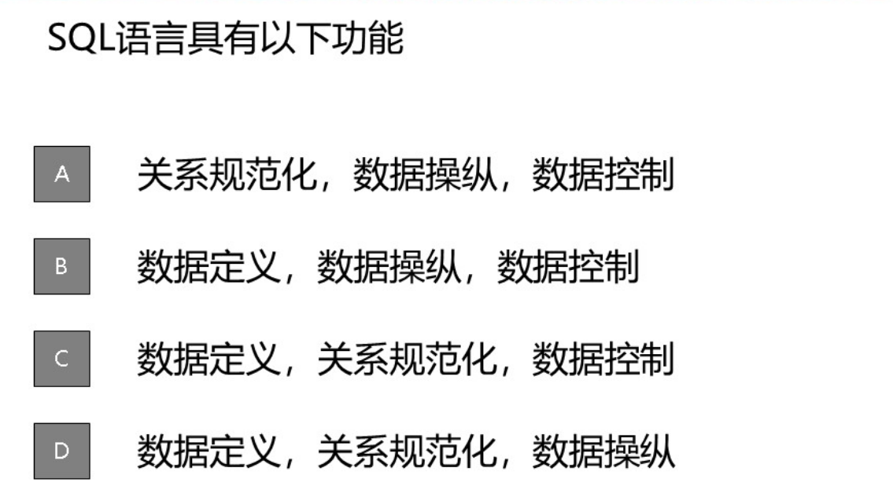
b
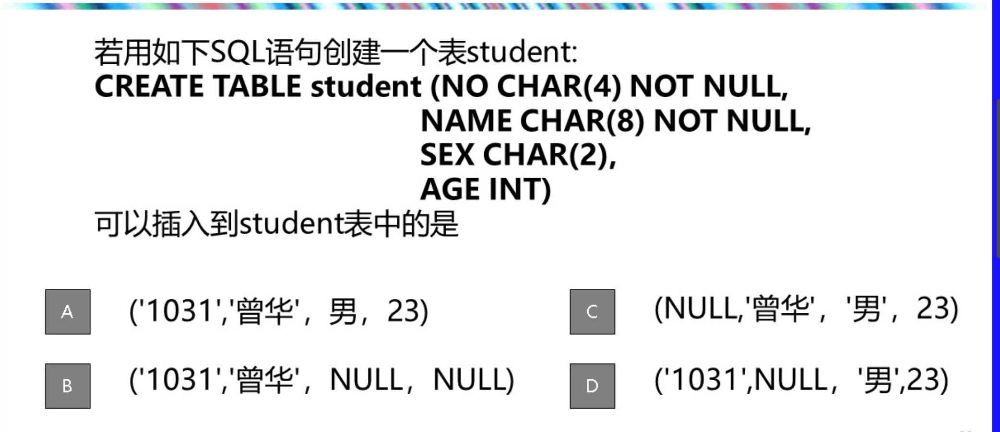
a 男是字符，引号，故不选 b

## 实体完整性

### 键的声明

| 键名              | 区别 1     | 2          |
| ----------------- | ---------- | ---------- |
| **`primary key`** | 只能有一个 | 不可为空值 |
| **`unique`**      | 可有多个   | 可为空     |

> 一些 dbms 有制造自己的区别，例如会为主键建索引（加快查询），而不是 unique

两者的声明分为两类：

- 单值：放在属性类别声明的后边 `name char(20) unique`

- 多个值： **只能如此**another element 放在后边;单值也适用`unique(bar,beer)`

### 一些题

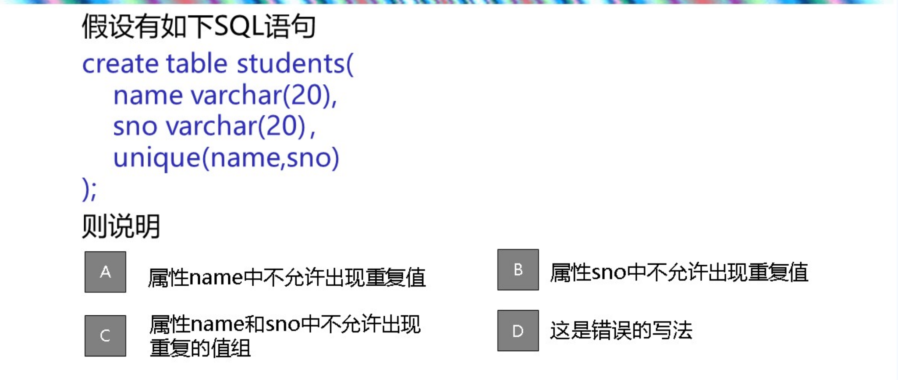
c

注意不同
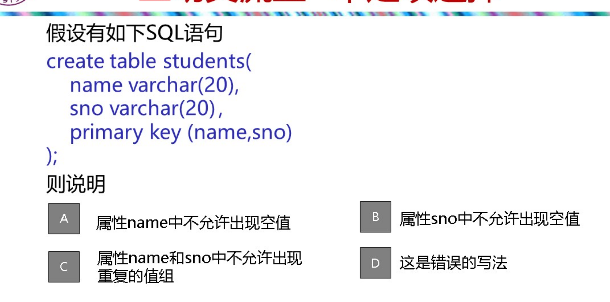
abc

### 外键

#### 表达

同样两种方式：

1. 一个：在属性定义时，`references <relation>(<attribute>)`
2. 作为模式的一个元素：
   `foreign key (<list of attributes>) references <relation> (<attributes>)
`

```sql
create table beers{
    name char(20) primary key,
    manf char(20)
};
create table sells(
    bar char(20),
    beer char(20),
    price real,
    foreign key (beer) references beers(name)
);

```

得到
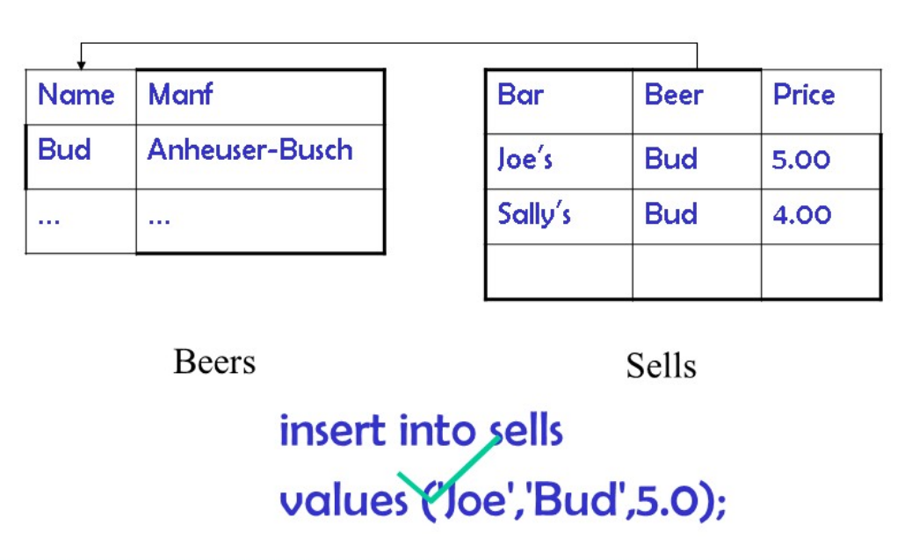

!!! note

    参照的属性必须被声明为主键或者unique(唯一性)

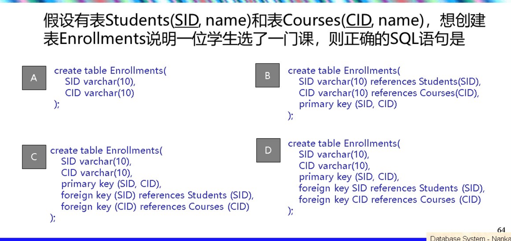
bc

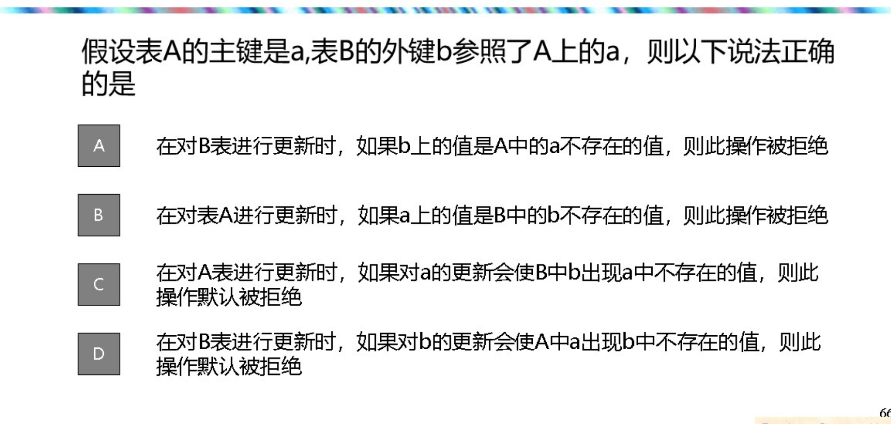
ac

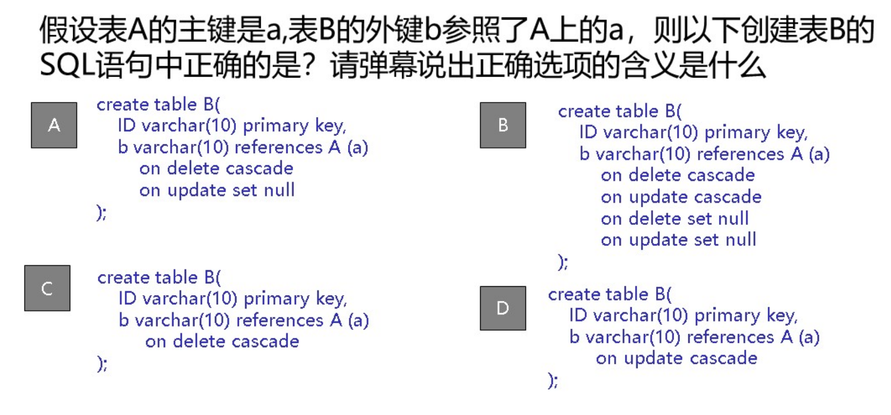
acd

#### 维护引用完整性

> 当数据库被更新时，三个方式

##### 1. Default 缺省

拒绝更新，当违反引用完整性时

#### 2. cascade 级联

直观上，**引用属性**（**源**）的改变 被仿造 到**外键**（**目的**） 上

删除：
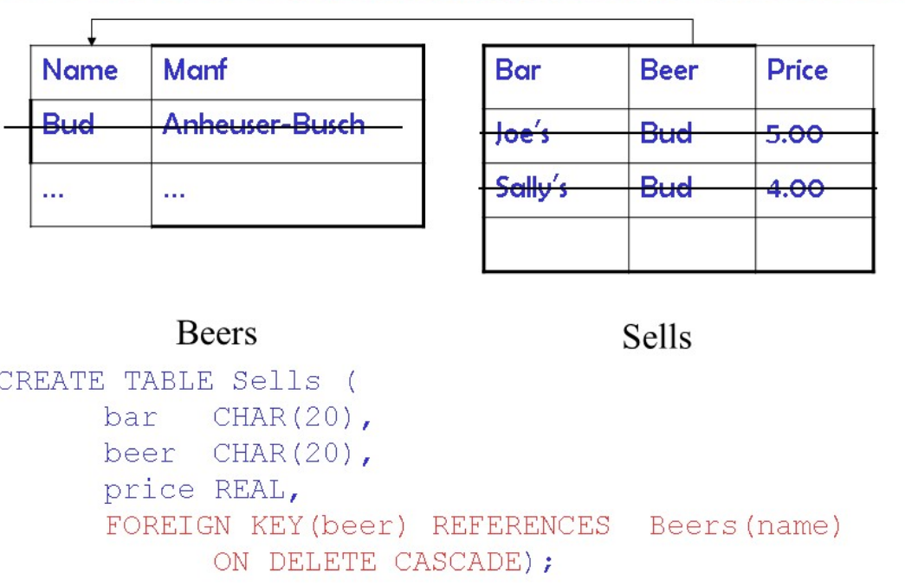
更新：
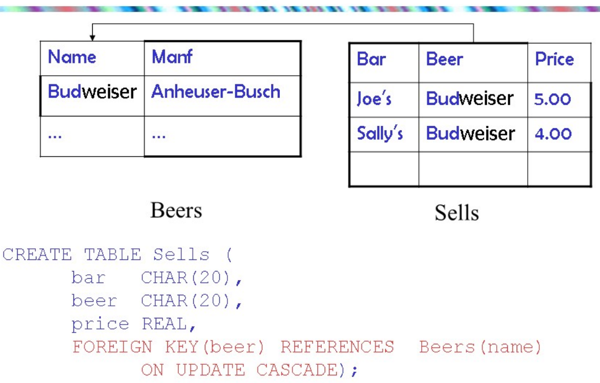

#### 3.set NULL

删除：
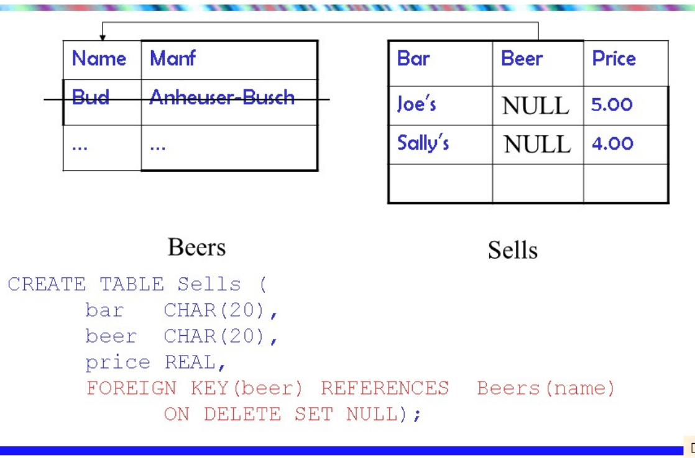
更新：
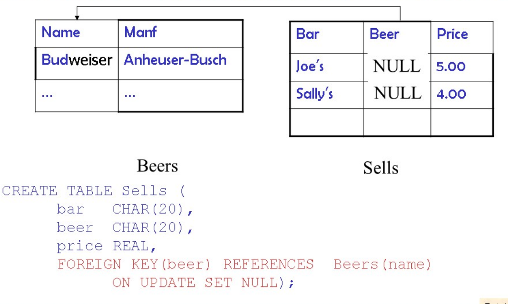

### 其他对属性的声明

- not null
- default
- check

  - 属性

  ```sql
  create table sells(
    bar char(20),
    beer char(20) check (beer in (select name from beers)),
    price real check (price <=5.00)
  );

  ```

  check on beer 像 外键约束，只是： **更新\*\***插入**时才会调用，**删除\*\* **更新** 不会调用

  - 元组

  ```sql
  %只有joe的酒吧可售超过5美元的啤酒
  create table sells(
    bar char(20),
    beer char(20),
    price real,
    check(bar='Joe"s Bar' OR price <= 5.00>)
  );

  alter table sells add check(bar='Joe's Bar or beer<>'Miller'');


  ```

## 第三部分 sql queries and sql injection

### 查询

principal form:

select desired attributes
from relations
where condition about tuple variables;

- =和 in

!!! note
**字符串 单引号**

````sql
where manf in ('A co.','B co.')

    or

    where manf in ('A co.','B co.')
    ```

- star as list of all attribute,

> 当 from 只有一个关系的时候，

- 重命名列 `as<new name>`

- 列中也可以出现表达式(作为值)

!!! example

    sells(bar,beer,price)

```sql
    select bar,beer,price*120 as priceinyen
    from sells;

````

!!! note
不可出现 where 句？

- 列中出现字符串常量；（confused?）

  ```sql
  select drinkers,'likes bud' as wholikesbud
  from likes
  where beer='bud';


  ```


!!! example
sells(bar,beer.price)

    find the price joe's bar charges for bud

    ```sql
    select price
    from sells
    where bar='joe"s bar' and beer='bud';
    ```

!!! note

    * 字符串中的双引号代表一个单一好
    * 比较运算符：**<>**不等于
    * where 句中的条件可以使用逻辑运算符（and or not）
    * sql 对大小写不敏感，只是在被引的字符串中敏感

### injection

- 起因：程序利用字符串构造的方式执行

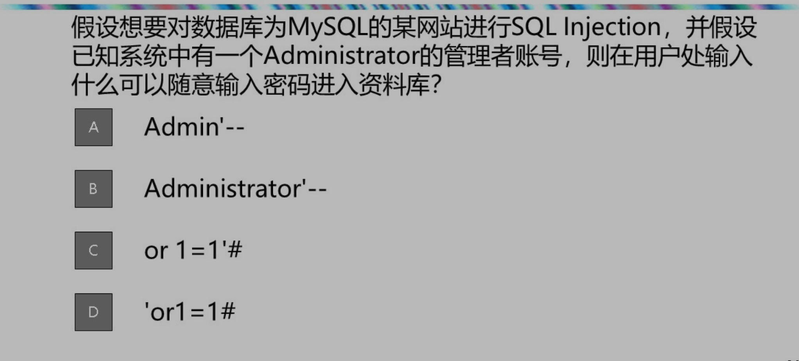

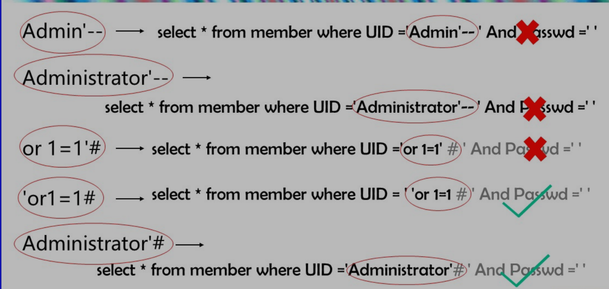

## 第四部分

### patterns where 语句？

####

- "属性 like patttern"
- % 任何字符串
- \_ 任意一个字符串
- not like

!!! example
drinkers(name,addr,phone) \* find drinkers whose phone has prefix 555.

    ```sql
    select name
    from drinkers
    where phone like '555%'

    ```

### 空值

#### 含义

- unknown value: e.g.j 的吧一定有地址，只是我们不知道是啥
- inapplicable: e.g.单身汉没有配偶属性

#### 三值逻辑条件

**true**,**false**,**unknown**

- 任意值与 null 相比，真值为*unknown*
- 什么时候查询才会出结果？当 where 从句中真值为**true**（不是 false or unknown）时

##### closer

- true =1; false=0; unknown =1/2;
- and =min; or = max; not(x)=1-x;

!!! example"surprsing"

      | bar  | beer  | price  |
      |---|---|---|
      | joe's bar  | bud  | null  |

    ```sql
    select bar
    from sells
    where price<2.00 or price>=2.00;
            #未知or未知
            # 未知

    ```

- joe's bar 不会出现在结果中，尽管 where 是重言式（tautology）

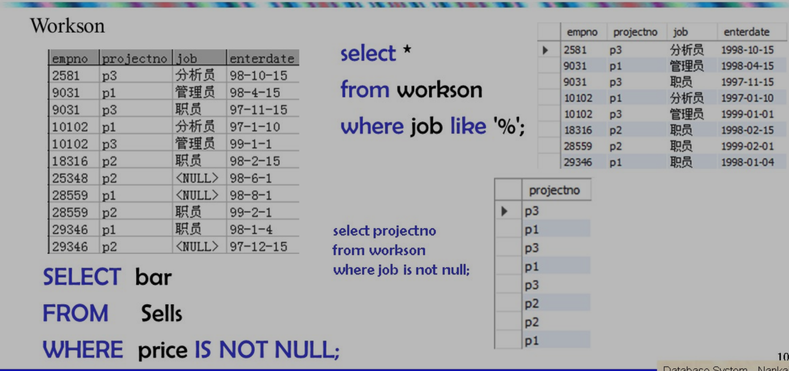

### order by

asc desc
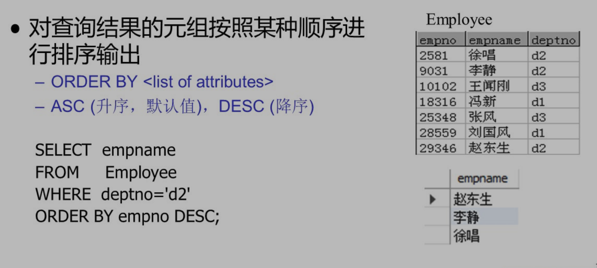

### 多表查询

- list of relations in from clause
- relation.attribure disambiguates attributes from several relations with the same name.

!!! example

      likes(drinker,beer);frequents(drinker,bar)
      find the beers that the frequrnters of joe's bar like.

      ```sql
      select beer
      from frequents,likes
      where bar='joe"s bar' and
            frequents.drinker=likes.drinker;


      ```

- 自然连接 natural join
  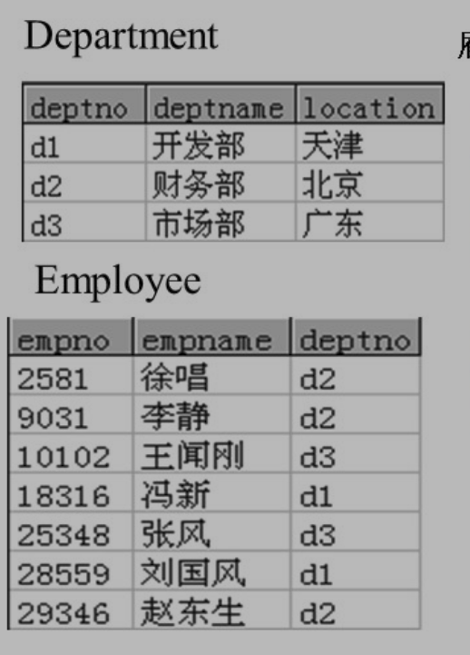

  - q1:雇员信息以及所在部门名称和地点？

    ```sql

    select*
    from employee,department
    where
    department.deptno=employee.deptno;
    ```

    or

    ```sql
    select empno,empname,employee,deptno,deptname,location
    from employee,department
    where employee.deptno=department.deptno;
    ```

    or

    ```sql

    select *
    from employee natural join department;


    ```

  - q2:工作地点在天津的所有雇员信息以及所在部门名称和地点？

  ```sql
  select *
  from employee,department
  where location='天津'and
  department.deptno=employee.deptno;


  ```

  ```sql
  select *
  from employee natural join department
  where location ='天津'；


  ```

  - q3:工作地点在天津的雇员姓名？

  ```sql
  select empname
  from employee natural join department
  where location='天津'
  ```

### 练习

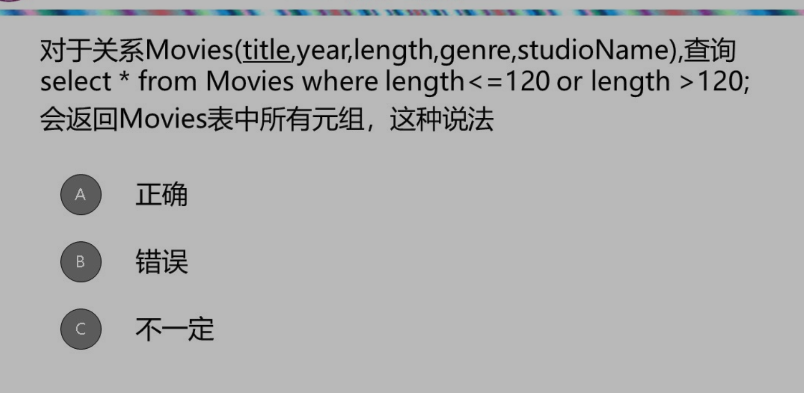
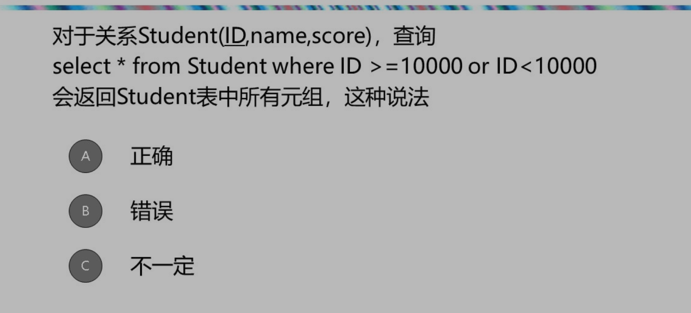

**主键不允许出现空值**

- natural join 也可以多表连接
  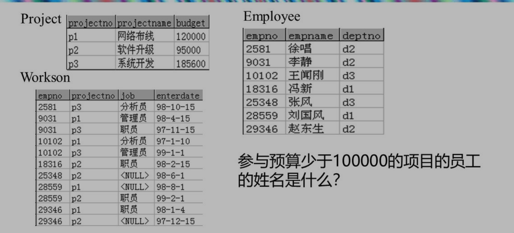
  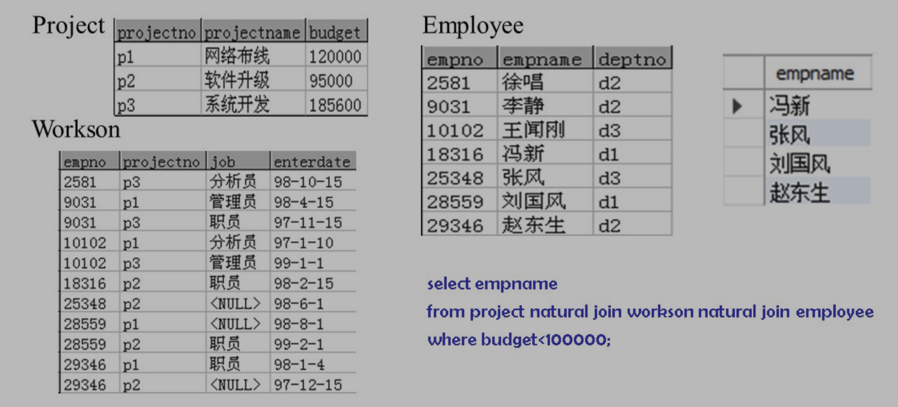

## 第五部分

### explicit tuple variables

实际上只是起了别名
需要参考多个 相同关系的拷贝->use tuple variables as aliases of the relations

!!! example1

      * 找到一对由同一个厂家生产的啤酒；find pairs of beers by the same manufacturer;

      Beers(<u>name</u>,manf)

      ```sql

        select b1.name,b2.name
        from Beers b1,Beers b2
        where b1.manf=b2.manf and
          b1.name<b2.name;  #去掉重名

      ```

!!! example2

      * 找到隶属同一部门的员工对


      ```sql

        select e1.empname,e2.empname
        from employee e1,employee e2
        where e1.deptno=e2.deptno and
        e1.empname<e2.empname #去掉重名

      ```

      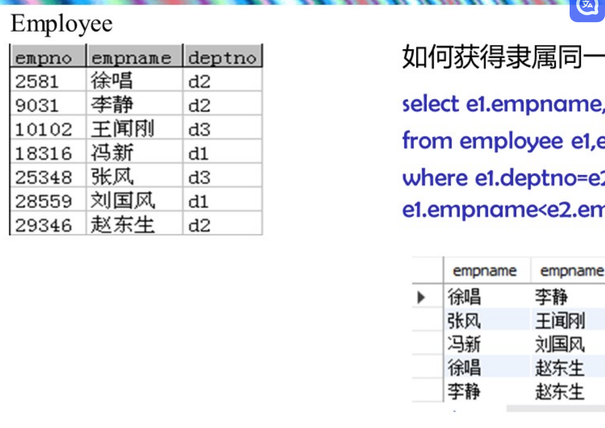

### Subqueries 子查询

- meaning: 一个查询结果可以用在另一个查询的 where 语句中

!!! example

    Sells(<u>bar</u>,<u>beer</u>,price)

    * find bars that serve Miller at the same price Joe charges for Bud

    ```sql
    select bar
    from sells
    where beer='Miller' and price=(
        select price
        from sells
        where bar='Joe' and beer='Bud'


    );


    ```

#### the **in** operator

meaning: "tuple in relation" is true iff the tuple is in the relation

!!! example

      find the name and manufacture of beers that Fred likes.

      beers(<u>name</u>,manf);likes(<u>drinker</u>,<u>beer</u>);


      ```sql

      select *
      from beers
      where name in
      (
        select beer
        from likes
        where drinker='Fred'
      )


      ```

    若用两个关系而不是一个关系

    ```sql

    select name.manf
    from beers,likes
    where drinker='Fred' and beer =name;

    ```

- 也有 not in

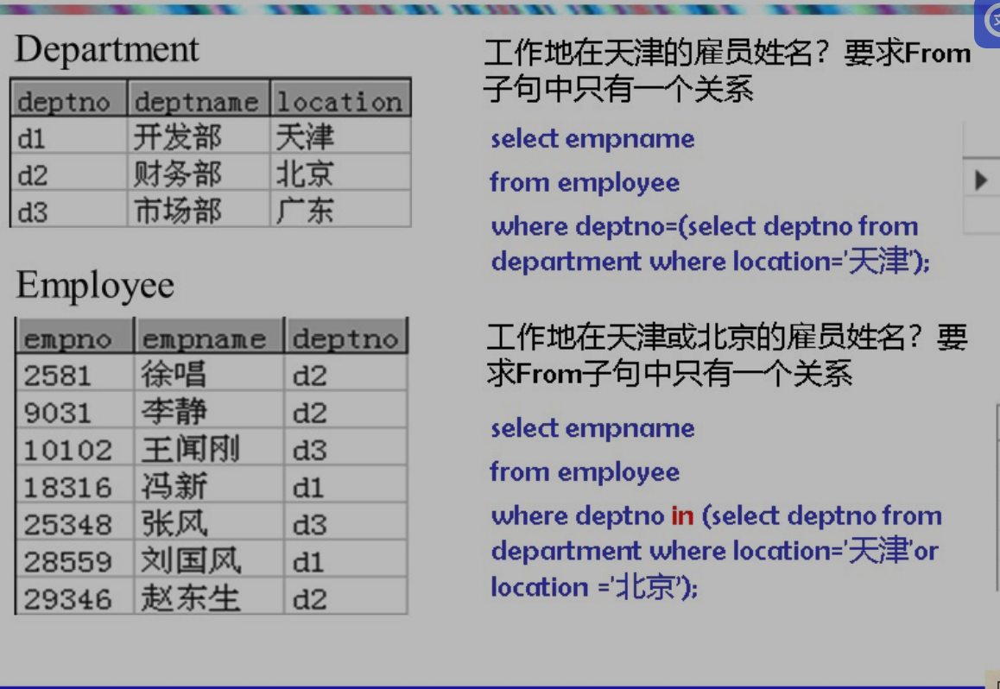

- 一个满足可用=，多个用 In

### **exits**

"exits(relation)" is true iff the relation is nonempty.

- **unique** and **exits**? how can they be together? **请记住吧**

!!! example

    beers(<u>name</u>,manf)

    * find the beers that are unique beer by their manufacturer.


    ```sql
    select name
    from beers b1
    where not exists(
        select *
        from beers
        where manf=b1.manf
          and name<>b1.name)

    ```

- 雷同的另一个例子：
  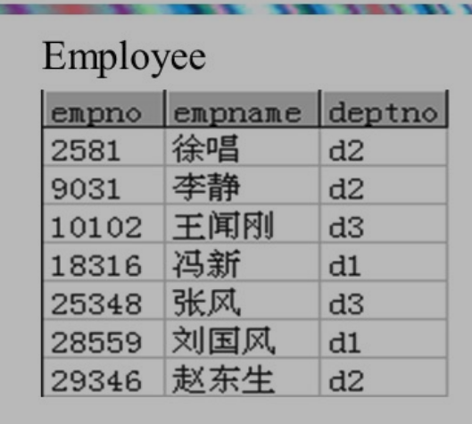
  查找部门中只有一名员工的员工姓名

```sql

select empname

from employee e1

where not exists(
  select *
  from employee
  where deptno=e1.deptno
    and empname<> e1.empname
);

```

### **ANY**，**ALL** quantifiers

#### any

- meaning: x= any(<relation>) is true if and only if x equals **at least one** tuple in the relation.

> 说人话： x 是关系表中的一员（x in <relation>）

- 同样的，= 可以换成其他任何比较的操作符

!!! note

     tuples must have **one** component only.

#### all

- x<>all(relation) is true iff for **every** tuple in the relation ,x is not equal to t.

> 说人话： x 不是该关系表的成员（x not in <relation>)

- 同样的，<>可以换成其他任何比较的操作符

!!! note

     tuples must have **one** component only.

#### 例子

!!! example

    sells(<u>bars</u>,<u>beer</u>,price)

1. find the beers sold for the highest price.

   ```sql
   select beer

   from sells

   where price >= all(select price from sells);

   ```

2. find the beers not sold for the lowest price

```sql
 select beer

 from sells

 where price >any(select price fome sells)


```

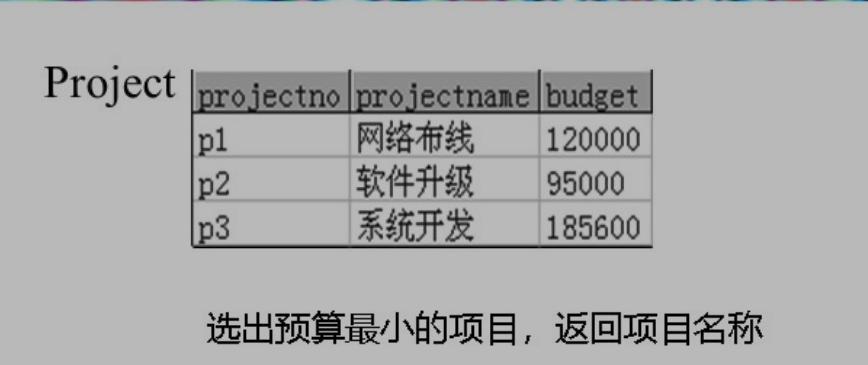

```sql

select projectno

from project

where budget <= all(select budget from project);

```

### 一些题 2

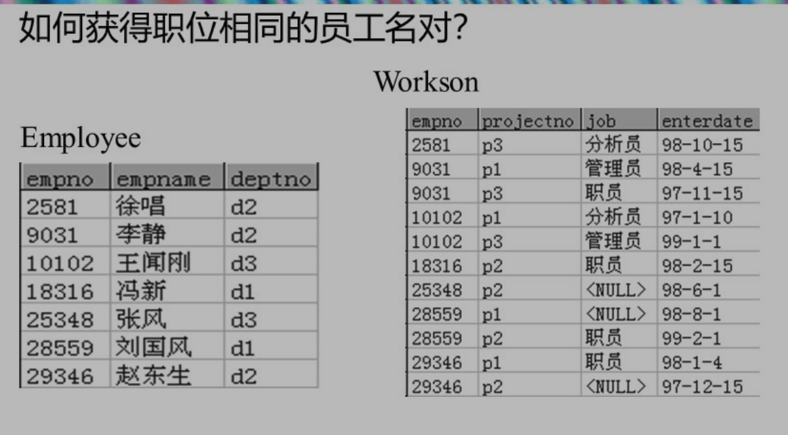

```sql

select e1.empname,e2.empname

from employee e1 natural join workson w1 ,employee e2 natural join workson w2

where  w1.job=w2.job and e1.empname<e2.empname;


```

- 注意使用小于而不是不等于，不等于的话交换顺序还是重复了呀

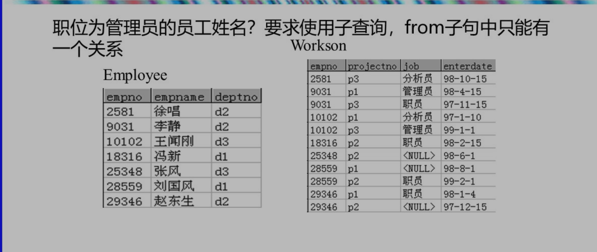

```sql

select empname
from employee

where  empno in (select empno  from workson where job='管理员')


```

**使用 in 啦**

4:
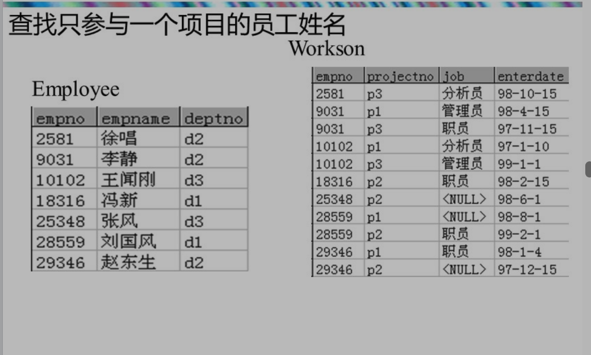

```sql

select e1.name


from employee e1 natural join workson w1

where not exists(
select *
from employee natural join workson

where name=e1.name and projectno<>w1.projectno


);

```

课件的写法：

```sql
select empname
from employee
where  empno in(

select empno
from worksom w1
where  not exits(select *
from workson
where workson.empno=w1.empno and workson.projectno <>w1.projectno)

)


```

5:
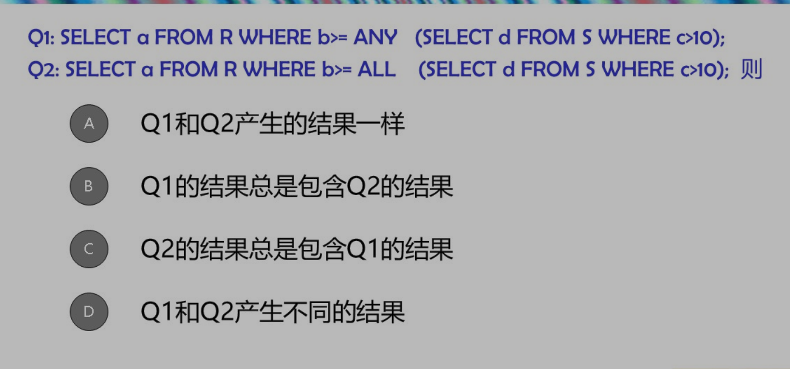

- any 与 all 的区别：

空集情形
如果子查询没有返回任何行，

b >= ANY (empty set) → 整个条件为 FALSE（因为不存在“至少一个”可比的值）。

b >= ALL (empty set) → 整个条件为 TRUE（因为“对所有值都成立”的空集命题在逻辑上是空集蕴涵，视为真）。

## 第六部分

### Union Intersection Difference

!!! example
likes(<u>drinker<\u>,<u>beer<\u>); Sells(<u>bar<\u>,<u>beer<\u>,price);

    Frequents(<u>drinker<\u>,<u>bar<\u>)

    找到喝酒的人和啤酒 喝酒的人喜欢这款啤酒并且 经常去一个卖这款酒的酒吧

    ```sql
    (select * from likes)

    intersect

    (select drinker,beer
    from sells,frequents
    where frequents.bar=sells.bar);


    ```

### forcing set/bag semantics

- deafault fot select from where is bag;
- default for union, intersection ,ot difference is set
- force set semantics with DISTINCT after SELECT

  - expensive execution.better be worth it.

!!! example

      find the different prices for beers
      sells(<u>bar<\u>,<u>beer<\u>,price)


      ```sql
      SELECT DISTINCT price
      FROM Sells;

      ```

### 聚合 aggregations

sum,avg,min,max,count,and count(\*)

!!! example
sells(<u>bar<\u>,<u>beer<\u>,price)

    ```sql
      select avg (price)
      from sells
      where beer='Bud'


      select count(distinct price)
      from sells
      where beer='Bud';

    ```


    所有项目的平均预算？`select avg(budget)`
    所有项目的最少预算？`select min(budget)`

### Groping

- group by(attribute list);
  -select from where group by

- the result of from where clausrs is grouped by values of the group-by attribute list aggregations take place within each group

!!! example
sells(<u>bar<\u>,<u>beer<\u>,price)

    find the average sales price for each beer

    ```sql
      select beer,avg(price)
      from sells
      group by beer;
    ```

    frequents(<u>drinker<\u>,<u>bar<\u>)

    ```sql
    select drinker,avg(price)
    from frequents,sells
    where beer='Bud' and frequent.bar=sells.bar
    group by drinker;

    ```

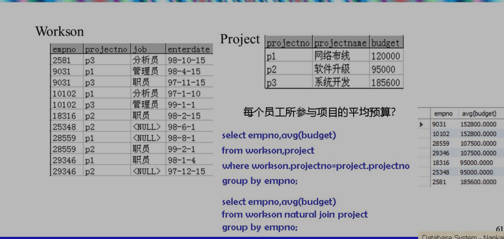

### select lists with aggreaation

sells(bar,beer,price)

不可以：

```sql
select bar,min(price)

from sells
where beer='Bud'

```

**rule**:select 语句中的元素要么被 aggregated or 出现在 groupby 语句中

- 找到酒吧 卖 bud 最便宜

```sql

select bar
from sells
where price <= all(select price from sells where beer='Bud')

```

### Having clause

- are selections on groups

!!! example

    beers(<u>name<\u>,manf);sells(<u>beer<\u>,price)
    * find the average price of those beers that are either served in at least 3 bars or manufactured by busch


    ```sql

      select beer,avg(price)

      from sells

      group by beer

      having count(\*)>3 or beer in (select name from beers where manf='Busch');

    ```
    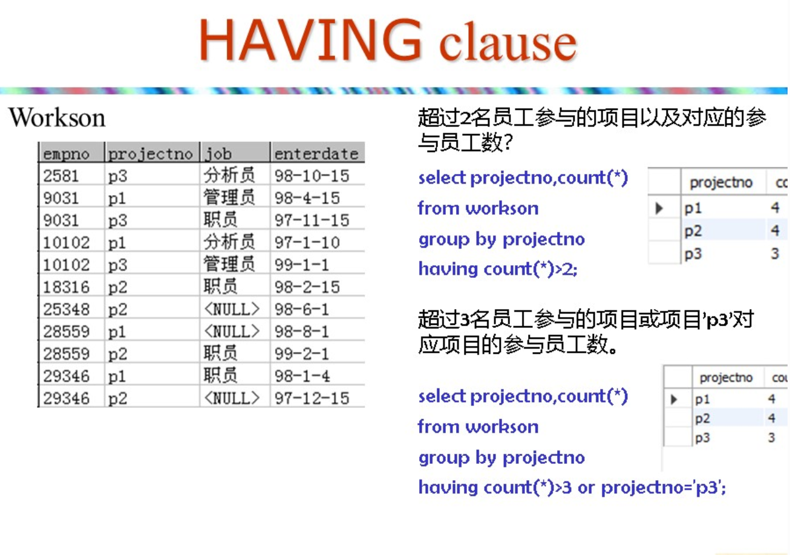

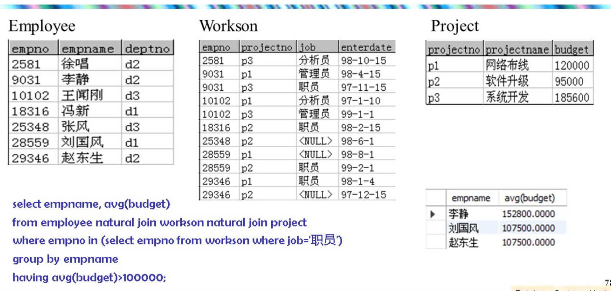

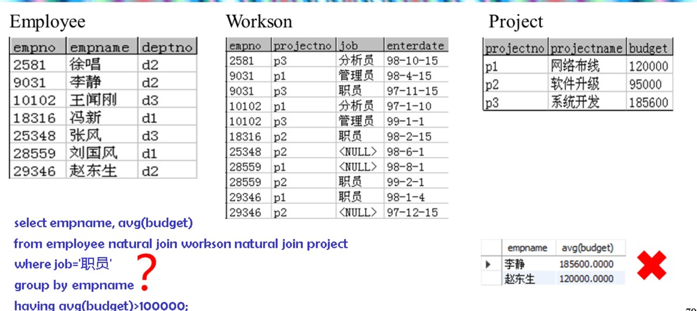

null 就不会拼接了把
