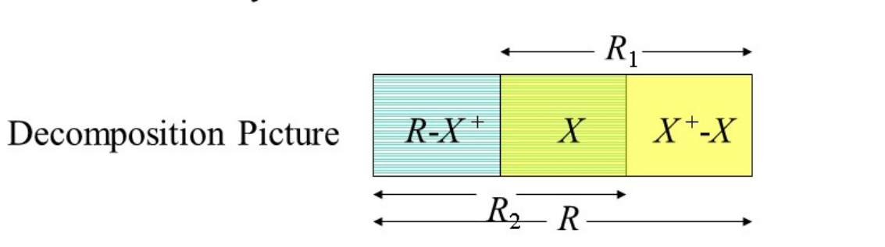
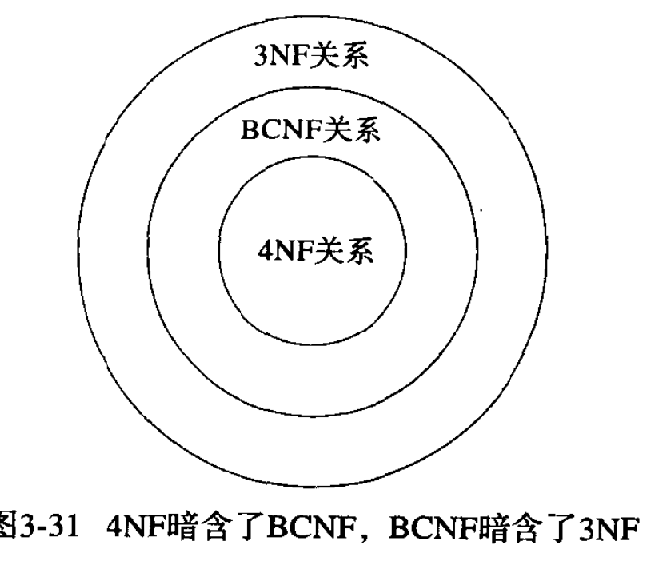

#

## BCNF boyce codd normal form

### 概念的理解

- definition: whnever there is a **notrivial** FD a1,a2,……，an->b,for r,it is the case that {a1,a2,……an}is a **superkey** for r.

* 直白的讲，whenever a set of attributes of r is determing another attributes,it should determine all attributes of r.

* **若一个关系模式只含有两个属性，它是 bc 范式**
* **若一个关系模式没有函数依赖，它是 bc 范式**

### 方法

- step 1: 找 key🔑
- step 2: 找所有的非平凡函数依赖
- step 3: 测试左部是否为超键

#### 分解

replace r by relations with schemas: 1. r1=x+(x 的闭包) 2. r2=r-x++x;

分解后还需要再次检查的

## 3 NF

x->a violates 3nf if and only if x is not a superkey and also a is not prime.

- prime :a member of any key

## 4 NF

