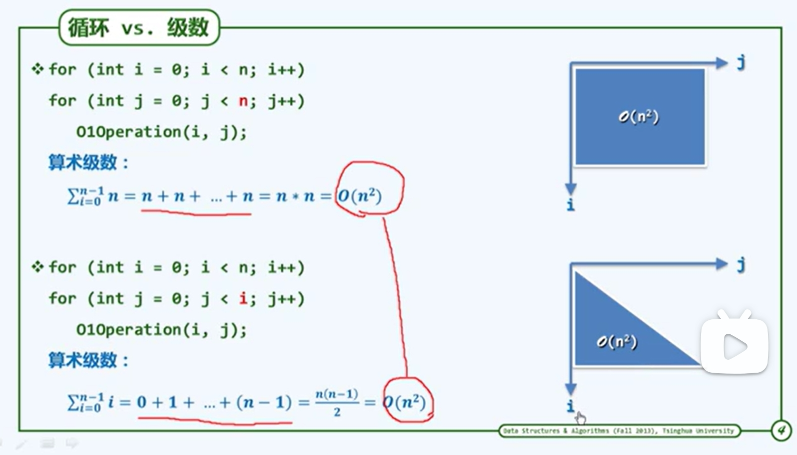
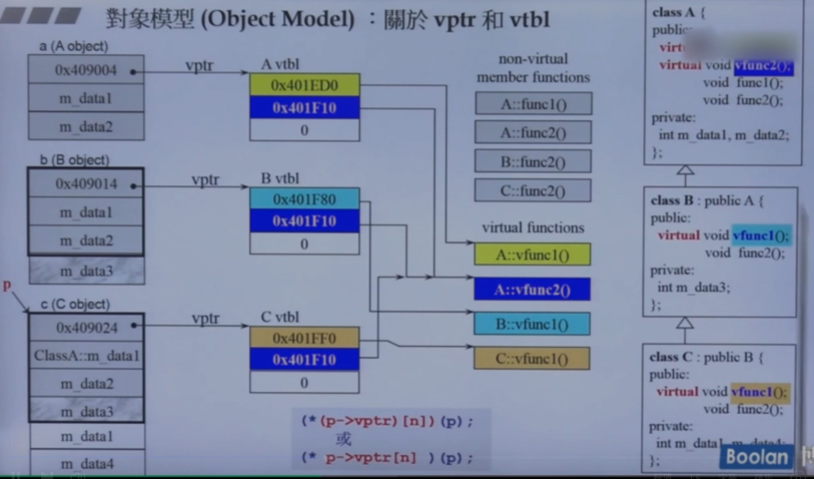

# 绪论

## 计算

* 研究对象：规律、技巧，过程规律方法
* 研究目标：高效计算、低耗

> cs (手段)should be called computing science,for the same reason why surgery is not called knife science. -dijkstra

* 绳索计算机及其算法
  12 垂直 3点的环
* 尺规计算机及其算法
  机械地执行……
* 算法
  *计算=信息处理
  * 借助某种工具，遵照一定规则，以明确而机械的形式进行
  * 计算模型=计算机=信息处理工具
  * 算法，及特定计算模型下，旨在解决特定问题地指令序列
    * 输入：问题；输出：答案；
    * 正确性；确定性；可行性（大象冰箱）：每一基本操作都可实现，且在常数时间内完成
    * 有穷性：hailstone 27 程序未必是算法
* 好算法
  正确 健壮（不合法做处理）可读（结构化 准确命名 注释）*效率*： 既要马儿快快跑，又要马儿吃得少
  算法+数据结构=程序 N.wirth,1976
  狗尾续貂……（算法+数据结构）*效率（非简单堆砌）=computation

## 计算模型

**度量** 一把尺子标有刻度> to measure is to know.if you cannot measure it,you cannot improve it. -lord kelvin

* 算法分析
  * 正确性；**成本（性能）**如何度量如何比较
  如何归纳概括 分类 问题实例的**规模**往往是决定计算成本地主要因素最坏情况 成本最高
  算法 输入（规模类型）程序员语言编译器 硬件：体系结构 软件：操作系统
  引出理想平台或模型
* turing machine
  * tape
  * alphabet
  * head 功能 读写
  * state 经过一个节拍 转向另一个状态
  * transition funtion 状态h停机
* ram
  *寄存器顺序编号 加减，赋值
二者是一班计算工具的简化和抽象，使我们独立于具体的平台
在这些模型中 运行时间转换 基本操作次数

## 大o记号 直尺的刻度

> mathematics is more in need of good notations than of new theorems.
好读书不求甚解。    看重长远，更大规模，主流。
长远:n足够大
主流：非主流常系数低次项可忽略
上界悲观估计
Ω 下界 T(n)>cf(n)
θ 确界

* 刻度1  常数o(1)
* 刻度2 对数o 常底数无所谓 loga n=loga b*logb n
* 刻度3 多项式n的 c次方
* 刻度4 线性 O(n)
* 刻度5 指数 2的n次方
   2 subset NP-complete

## 算法分析

通过挖掘不变性和单调性来证明正确性

* 迭代：级数求和
* 递归：递归跟踪+递推方程
* 猜测+验证

## 级数

* 算术级数：与末项平方同阶
* 幂方级数:比幂次方高1
* 几何级数：与末项同阶,a>1

与上图做对比


```c++
i<<=1 //左移一位 二进制
```

## 冒泡排序

* 不变性：k轮扫描交换后，最大的k个元素必然就位
* 单调性：k轮扫描交换后，问题规模缩减至n-k
* 正确性： 之多经过n趟扫描

## 封底估算back-of-the-envelope calculation

费米 纸 原子弹爆炸当量
古希腊 地球直径
对时间
1day=24hr\*60min\*60sec=10^5 sec
1life=1century=100yr\*365=3*10^4day=3\*10^9sec
三生三世=300yr=10^10 三生三世中的一天=一天的一秒
宇宙大爆炸至今=10^21
*考察对全国人口普查数据的排序

算法改进的威力

## 迭代和递归

> to iterate is human,to recurse,divine ?

* 减而治之
  规模缩小+平凡问题 递归基
  *数组倒置

  ```c++
  void reverse(int* A,int lo,int hi);
    if (lo<hi>)//low high 之间有足够多的元素,问题规模奇偶性不变，每次减2，需要两个递归基
    {swap(A[lo].A[hi];reverse(A,lo+1,hi-1))}

* 分而治之

  ``` 数组求和:二分递归
    ```c++
    sum(int A[],int lo,int hi){

      //区间范围【L,h】
      if (lo==hi)return A[LO];
      int mi=(lo+hi)>>1;//chuyi2
      return sum(A,lo,mi)+sum(A,mi+1,hi);//入口形式为sum(A,0,n-1)


    }
    ```

  算法所需时间 几何级数
  * Max2:迭代一
    从数组区间A[lo,hi]中找到最大两个整数A[]和A[]
    循环扫描，三重，扫描前后 x1得到 o(2n-3)
    M:二

    ```c++
    void(int A[],int lo,int hi,int &x1,int &x2){
      if(A[x1=lo]<A[x2=lo+1])swap(x1.x2);//initial
      for(int i=lo+2;i<hi;i++>)
        if(A[x2]<A[i])
          if(A[x1]<A[x2=i])
            swap(x1,x2);


    }


    ```


Max2:递归+分治