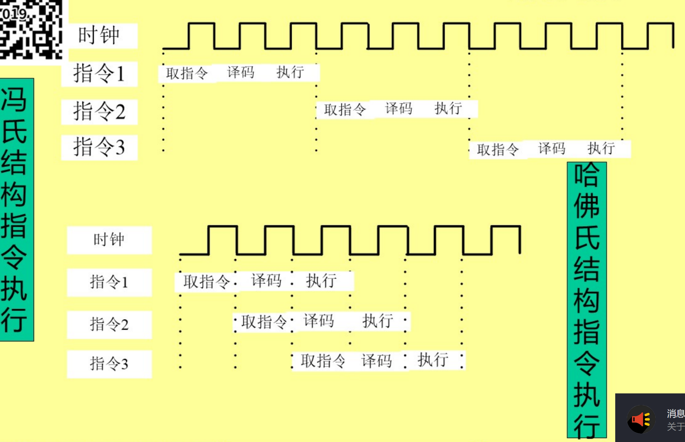
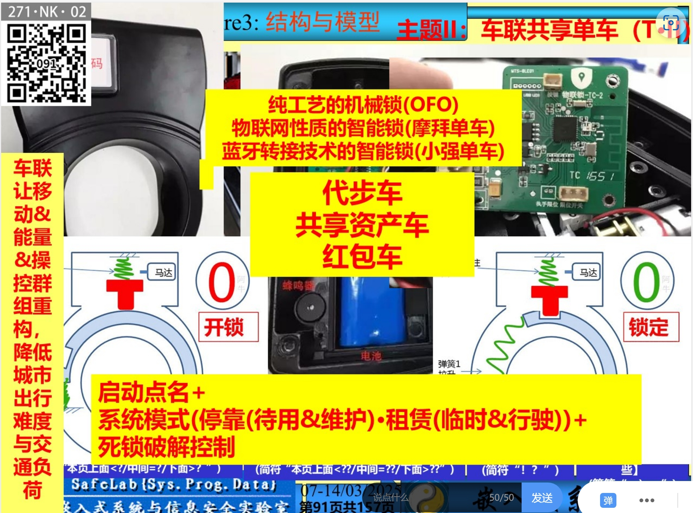
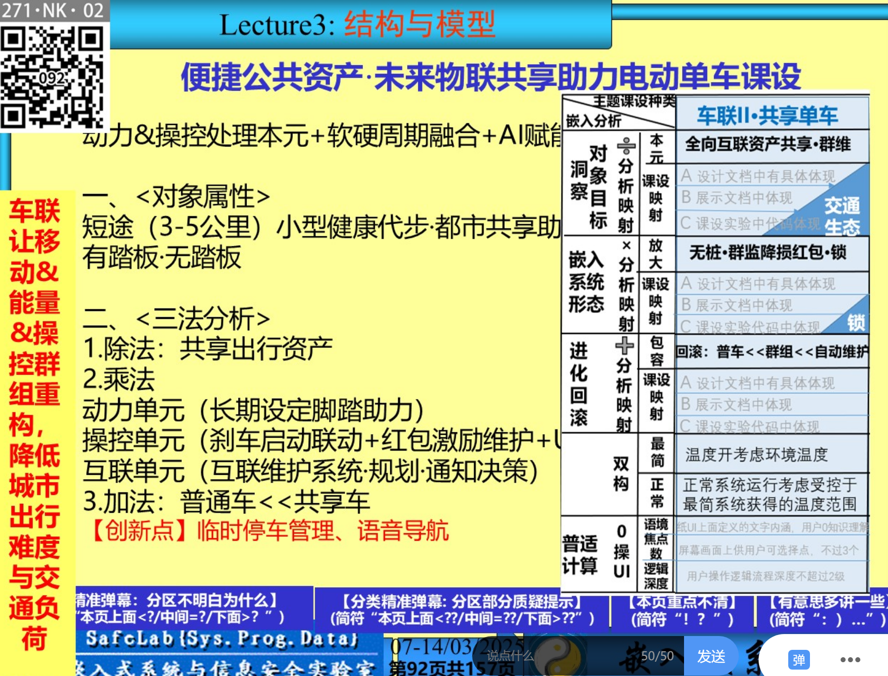
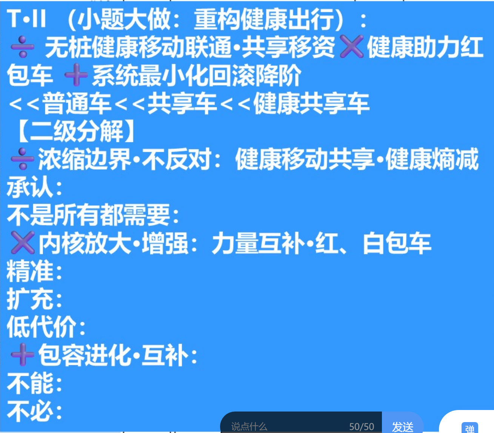

# week 4

* 手拉手
  技术：命名？写程序 大小波峰 匈牙利 对结构的命名 利己利他利未来？
  * 8xml? 日志 
  * git fork merge 闭环 
  * 组织到技术？

## chapter2

### 内容目标

* 深度理解**定义**及**五层结构**
* 掌握嵌入式三法则分析 **除×加**

2  7  1 私 公 助教

### 2.4数学模型

* 白箱：定律
* 黑箱：
* 灰箱：
前提：有**对象** 定义出发

!!! note "example"
  蒸汽机瓦特改良 非原创 deepseek瓦特
  离心球负荷阀门旋转
  负反馈 控制论
  三点改良

#### 2.3.2

系统的控制模型：开环 闭环 组合

波形音频五线谱？不同视角？
频率 时域 二次谐波逼近方波？转换？

[傅里叶变换理解](https://www.bilibili.com/video/BV1A4411Y7vj/?spm_id_from=333.337.search-card.all.click&vd_source=3520e6fcd3766dfd2076c83cd52235f1)

心脏波？台湾 的老师 。王维中（谐音）中医…… 对应
引入拉普拉斯 降低算力？

#### 2.3.4 嵌入式目标与原则

第一性原理

* 对象追溯 除法则 原子性的综合？混合计算系统 浓缩？
萃取原子的东西 
都江堰 鱼嘴 控水 引水 宝瓶口 乘法
* 系统赋能 乘法
* 对象进化 回滚 加法

!!! note
    计算机 指令集 除的结果
    冯诺依曼结构 × 结果 运算起来
    ui 加  

萃取本源得到系统

点阵笔 有无电 有无网络 一级一级回滚 

车联II:
智能锁 共享性？
重点：**共享** 只考虑了去用 没有想去维护 ，拜访问题
白包车 红包车 在不同角落 换掉的车  用户视角 运营成本降低 ？健康角度 脚踏 电动 混合 
社会 交通 
临时停车 城市 重扫 

合理状态 …… 

## week 5

### 上周作业

* 1 立场问题，结构的方式 站在机器的立场，基础的性能可靠性注重系统的，结构化 软硬结合；面向对象，开发者立场，开发者思维逻辑传递给机器？；结构的系统代价低朴素原始，面向对象代价高；
注意标注学号之类的

|     |立场|代价|
|-----|----|----|
|结构|开发者|低朴素|
|对象|机器|高代价|

除法：宏观 行业 虚 到课设报告？ 低一级的课设实验，都江堰的鱼嘴 原来没有去造 
微观？
回滚：退变？

### chapter 3  嵌入式系统硬件体系

* 存储器与处理器的关系
* 时钟总线与供电的关系
* 指令集

* 树莓派 卡片pc

* arm 功耗与算力的均衡；测电流 功耗平衡 嵌入式
* 阿冯只用了六个月？报告 冯氏结构

* 另一个结构：程序与数据分开 哈佛结构 ；系统可靠性高；男女厕所……；嵌入式更多用此处理器结构；但不平衡；而冯混乱，可靠性不高；改良哈佛 一套总线 两个存储器模块 分时公用；冯氏串行。哈佛并行？

* 两类处理器：
  * 单芯片：手表
  * 一般微处理器

* 指令

|指令集                  |                              |     |    |                  |
|------------------------|-----------------------------|-----|-----|------------------|
| cisc 较早多周期一个指令？|完成一个任务所使用的指令条数最少| 肥大|多周期|intel为代表 3-4k种|
| risc原子，|完成一个指定任务所使用指令总类最少|瘦小|单周期|100-200种 |

* 并发性：颗粒度越小，并发能力越强，出现risc原因，操作系统 调度颗粒；进程？
[有关进程的理解](https://www.ruanyifeng.com/blog/2013/04/processes_and_threads.html)
risc-v 40+extended

> 操作系统的设计，因此可以归结为三点：
> （1）以多进程形式，允许多个任务同时运行；
> （2）以多线程形式，允许单个任务分成不同的部分运行；
> （3）提供协调机制，一方面防止进程之间和线程之间产生冲突，另一方面允许进程之间和线程之间共享资源

* 约束高性能芯片的两大定律：
  摩尔
  dennard?随着晶体管尺寸的缩小，其功率密度保持不变，从而使芯片功率与芯片面积成正比。

* 控制能耗： 几大态

信息接口 串口 rs232;异步串行通讯
usb协议；
*交互工具的变化： tui>gui>nui(native)多击 单击 无击

乘法：放大；加法：回滚？