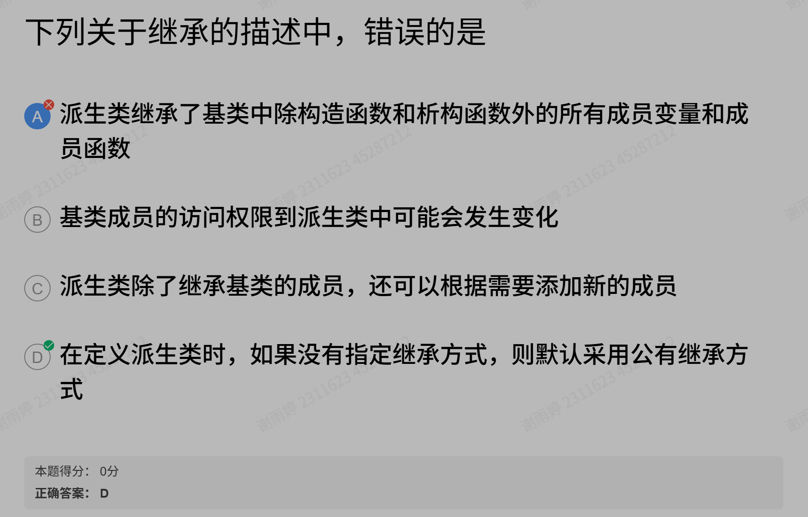
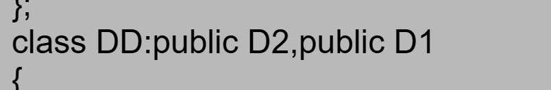
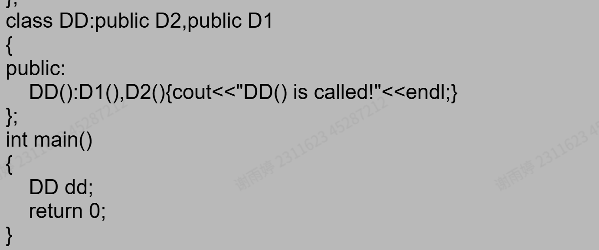

#

## weeek 4

- 3/15 牛客构造函数
  原来在构造函数里面完成初始化操作可以让用户进行输入，这样在类里也可以访问私有成员了；

- setfill 控制的是一整个 cout 流只写

操作符 作用范围 示例效果
setfill('0') 全局（直到再次修改） 所有后续 setw 用 0 填充
setw(n) 仅下一个输出项 仅控制紧随其后的一个输出的宽度一个就好
尽管用 c 也可 printf("04%d,02%d,02%d",y,m,d)

setfill 中使用单引号非双引号；

- 闰年判断的条件

week 5

- 为什么拷贝构造函数数组时要先释放空间呢是因为先调用了默认构造？

week 6
在 C++中，类的成员函数可以访问该类的所有对象的私有成员，而不仅限于当前对象。这是由 C++的访问控制规则决定的，访问权限是基于类而非实例的。

- 矩阵乘法： aij=aik\*akj

在运算符重载中，返回引用通常有两个前提条件：

引用的对象必须在函数返回后依然存在：
如果你在函数内部创建了一个局部对象（例如一个局部变量）并返回它的引用，那么这个引用会成为悬空引用，因为局部变量在函数结束后会被销毁。

返回引用的目的是为了避免不必要的拷贝，且引用指向的对象本身可以安全地被共享：
例如，在实现像 operator+= 这样的成员函数时，你可以修改当前对象并返回 \*this，这样返回的是当前对象的引用，且该对象在调用者那边依然有效。

strncpy(str, s, MaxLength - 1); // 安全拷贝字符串

'/0'与'\0'的不同啊，会出现一个报错 D:\petto\Documents\programs\c++\practice\exercise.cpp|16|warning: multi-character character constant [-Wmultichar]|

最大公约数 ……辗转相除法

```cpp

int gcd(int a,int b){

   if (b==0)return a;

   return gcd(b,a%b);

}


```

可以想象为一个长为 a 宽为 b 的长方形，求能够分他们的最小单元

- 构造函数如何提供默认值？在传参的时候写就好。rational (int a=0,int b=0)

- 后置自增的写法？

```cpp


operator ++(int)
{}


```

重载赋值时要注意避免自赋值

swich 只接受整形和字符型啊



DD 继承 D2, D1,按照继承顺序先调用 D2 构造函数，再调用 D1 构造函数

上而非下

熟悉 string 的 api 么 作业二关于字符串的继承

闰年的判断
year%4==0&&year%100!=0
year%400=0

输入解析：当遇到无效命令时，需要跳过其可能的参数以避免后续输入错误
string line;
getline(cin, line);

忘记了的是虚基类的析构函数和 const

irtual ~Shape() {} // 虚析构函数，虽然题目没提，但作为基类最好有

在测试一时基类函数需要声明为保护型，这样才可以在派生类里面访问

删除的步骤
写关键字 remove 啦

1. 判断 position 合法性（<= 0、head 为空）；
2. 如果删除的是第一个节点，特殊处理；
3. 从 head 出发，走到** position - 1** 个节点；走到前一个节点
4. 如果 current->next 为 null，说明越界；
5. 删除 current->next 指向的节点；

关于插入：

只要我后面的节点还存在，并且它的值比我要插入的小，我就继续往后走。与后一个节点比较，一般情况是两个条件，后面有并且后面的值比我小，继续走
节点的构造函数，初始化没有指的方向

每次拿到一个数，要先进行边界的检查
先特殊情况，再一般情况

if (current->next != nullptr && current->next->next != nullptr) cout << " ";输出空格的判断

name =new char[strlen(n)+1];
strcpy(name,n);
