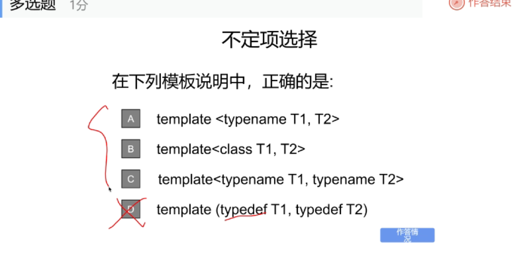
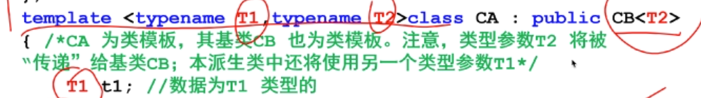

#

- 一个类里可以有该类的指针，但是不可以有该类，与内存有关，当实例化对象时，指针所占大小是确定的，为 4 个字节，而该对象就不确定了
- 公有函数 接口 传递消息，封装性， 封装的数据
- 类的定义只是一个框架 ，对象创建时才占内存对象 实例化
- 使用引用时要为引用赋初值

## 类和对象 part2

不考察 指向成员的指针，每个对象维护自身的成员

### 对象初始化 ：构造函数

- 根据数据成员访问控制方式
  公有： 一般数组 不常用
  常用：
  构造函数：
  - 无返回类型，
- 字符数组的首地址 为一个指针 ，传入的参数 address(long t, char add[])
  strcpy(,add)调用函数赋初值
  

## part 3

include <>和“”的区别

## part 5

### 赋值运算符重载

赋值 输入输出

返回本身 `return *this`： 可作为左值

1. 引用传参 ，减少内存转移
2. 加 const 保证不会改变实参的值
3. 以引用的格式返回自身对象，可作为左值参与运算
4. 为成员函数而不是友元函数

了解：后缀加加 临时对象保存原值，返回临时对象以引用形式返回
原值参与运算，自身加 1


### 链表

## 继承与多态 paet1

共同特征 基类

构造函数初始化 字符串指针开辟空间 拷贝


- final 最后的类不可再派生


去更严格的

派生类成员根据访问权限分为四类
多了一个不可访问的成员


保护也不可访问

按继承的顺序初始化，按照声明的顺序

## part2

核心：七八两章

属性成员对位赋值

### 派生类的拷贝构造函数

用一个已经存在的对象创建一个新的对象

- const
- & 引用

在类内进行访问： this 指针 自己 ；相同类 其他对象的属性成员，私有也可 只限制类定义中的成员函数，而不限制该函数访问的是哪个对象的属性成员

派生类构造之前先构造基类

派生类中可以使用 using 关键字显式地继承基类地构造函数，**无参构造函数除外**默认调用

`using box::box`继承所有有参的构造函数

- 初始化列表里的顺序不重要，只起到参数匹配的作用，还是看定义中继承的顺序以及声明的自定义类对象的顺序

### 友元的继承

**基类的友元不继承**
一样的东西可以访问，权限一样

!!! note

      赋值：两边的对象都存在
      拷贝构造

派生类对象是特殊基类对象 兼容

## 继承


cherno : 当在基类声明是 virtual 函数时，自动创建一张虚函数表，如果有覆盖，就相应的调用去找

## 第九章

重点 七章八章

模板 两到三周
函数
抽象出类型参数

- 函数调用时，有特殊到一般，先找有没有其他的普通函数重载，然后实例化模板为相应类型

* char \* a,可以为字符串常量，存在内存里，首地址其实存的是
* 隐式转换先指明类型参数是什么数据类型`func<float>(2,3.4)`
  
  typedefine 起别名

### 类模板

先指定实参

模板类外声明的函数：1.加上模板头 2.函数名 前面修饰的类名参数表提供对应的类型参数
及使用类型参数也可使用普通参数

静态成员：共享

类模板特例子版本，一个类有很多成员函数 对有必要的进行处理自定义的类型之类
类模板显示指明 而函数模板编译器自己推断
数据类型不匹配报编译错误，程序改编译错

区分前++和后++
设有一个 Counter 类：

cpp
复制
编辑
class Counter {
private:
int value;
public:
Counter(int v = 0) : value(v) {}

    // 前缀自增
    Counter& operator++() {
        ++value;
        return *this;
    }

    // 后缀自增
    Counter operator++(int) {
        Counter temp = *this;
        ++value;
        return temp;
    }

    int getValue() const { return value; }

};
🔍 使用区别
前缀自增（++i）：

先将对象的值增加，然后返回增加后的对象。

返回类型通常为引用（ClassName&），允许作为左值使用。
Old Times Documentation
博客园
+1
CSDN 博客
+1

后缀自增（i++）：

先返回对象当前的值，然后将对象的值增加。

返回类型通常为值（ClassName），返回的是增加前的副本。
CSDN 博客
+2
CSDN 博客
+2
Old Times Documentation
+2

⚠️ 注意事项
后缀自增由于需要返回原始值的副本，可能涉及额外的对象拷贝，效率略低。

在重载后缀自增时，int 参数仅用于区分函数签名，实际并不使用。

四种情况：
基类派生类 01 11（不使用） 11\*（使用类型参数指明的的数据类型） 12
注意写法 后面只写名字不写关键字


标准模板库：六大部件
容器：装数据的，动态数组，向量随着需要申请新的空间，自己完成内存的管理， 迭代器：指针 数组下表 算法 分配器：管理内存 适配器:类型适配 仿函数：对象的实现形式；算法

链表对内存的利用率最高碎片

类模板先实例化为模板类 `vector<int> vec1`;
vetor1.end()是指整个数组的最后一项的后一个

## io

- stream 为文件和内存建立关联

* 预定义的流类对象：`extern cin cout cerr clog`

### 格式控制标志位 一些成员函数

标志位：一堆二进制序列

setf 设置某一个标志位

flags 设置所有标志字？
以 long 类型返回

setf 两个参数的用法
掩码，basefiled ?16 进制
width 设置宽度只对后一位有效
没有设置宽度是右对齐的格式
`IOMANIP`

---

### 输入输出流

#### 输入输出流函数

- put(),输出一个字符 `ostream& put(char ch)`
- get(),提取一个字符 `istream& get(char& ch)`
- getline(),读入一行`getline(char* pch,int n,char delim='\n')`

#### read()和 write()读写二进制文件

```cpp

double d = 1.1;
ofstream outfile("asc.txt",ios::binary);
outfile.write((char *)&d,sizeof(d));
outfile.close();
```

#### 对数据文件进行随机访问

- seekg()和 seekp()：定位输入文件流对象和输出文件流对象的文件指针

* 将文件指针从参照位置 origin 移动 Offset 个字节，
  `seekg(long offset,seek_dir origin=ios::beg)`
* ios::beg/cur/end

---

- 下述程序的功能是把文件 source.txt 中的数据全部写到二进制文件 destination.bin 中，请完善该程序；

```c++

  #include<iostream>
  #include<fstream>
  using namespce std;

  void main(){
    int x;
    ifstream input("source.txt");
    ofstram output;
    while( ){
        ;
        ;
        ;
      output.close();
      input>>x;
    }
    input.close();
  }
```

```

1. `!input.eof()`
2. `output.open("destination.bin",ios::binary|ios::app)`
3. output.write((char *)(&x),size of(x))
```

```cpp
#include <iostream>
#include<fstream>
#include<string>
#include<algorithm>
#include<vector>

using namespace std;

class Student{};

//比较函数，按分数降序，同分按姓名升序；

bool compareStudents(const Student& a,const Student &b){
  if(a.score!=b.score){
    return a.score>b.score;
  }
  return strcmp(a.name,b.name)<0;
}


//比较函数：按往年最低分降序

bool compareDepartments(const Department&a,const Department&b){
  return a.lowest_score>b.lowest_score;
}

void Get_Student_Info(Student stu[]){
  ifstream file("Student.txt");
  if(!file.is_open()){
    cerr<<"无法打开该文件"<<endl;
    exit(1);
  }

  for(int i=0;i<8;i++){
    string name,choice1,choice2,choice3;
    int score;

    file>>name>>score>>choice1>>choice2>>choice>>3;

    //分配内存并复制数据

    stu[i].name=new char[name.size()+1];
    strcpy(stu[i].name,name.c_str());

    stu[i].choice1=new char[choice1.size()+1];
    strcpy(stu[i],choice1,choice1.c_str());
    stu[i].score=score;
    stu[i].dept=nullptr;//初始未分配专业

  }
  file.close();


}


void Get_Dept_Info(Department dept[]){

  ifstream file("Department.txt");
  if(!file.is_open()){
    cerr<<"无法打开该文件"<<endl;
    exit(1 );
  }

  for(int i=0;i<5;i++){
    string deptName;
    int count,lowest_score;
    file>>deptName>>count>>lowest_score;


  //分配内存并复制数据

  dept[i].deptName=new char[deptName.size()+1]
  strcpy(dept[i].deptName,deptName.c_str());
  ...
  }
  file.close();
}


void Student_Dept(Student stu[],Department dept[]){

//1. 按分数排序学生

sort(stu,stu+8,compareStudents);

//2.第一轮录取：按志愿

vector<Student*>unassigned;//未被录取的学生

for(int i=0;i<8;i++){
bool admitted=false;

//检查第一志愿

for(int j=0;j<5;j++){
  if(strcmp(stu[i].choice1,dept[j].departName)==0){
    if(dept[j].curr_count<dept[j].count){
      stu[i].dept=dept[j].deptName;
      dept[j].curr_count++;
      admittde=true;
      break;
    }
  }

}

//同理，检查二三志愿

//如果三个志愿都没有被录取，
if(!admitted){
  unassigned.push_back($stu[i]);
}

}

//3.第二轮录取，调剂录取

//按专业往年最低分排序

sort(dept,dept+5,compareDepartments);


for(Student*s:unassigned){
  for(int j=0;j<5;j++){
    if(dept[j].curr_count<dept[j].count){
      s->dept=dept[j].deptName;
      dept[j].curr_count++;
      break;
    }
  }
}

//4.输出到二进制文件

ofstream outfile("StudentDept.bin",ios::binary);
if(!outfile.is_open()){
  cerr<<"无法创建studentdept.bin文件"<<endl;
  exit(1);
}
for(int i=0;i<8;i++){

outfile.write(stu[i].name,strlen(stu[i].name)+1);

outfile.write((char *)(&stu[i].score),sizeof(int));

outfile.write(stu[i].dept,strlen(stu[i].dept)+1)

}

outfile.close();

}


}


```
