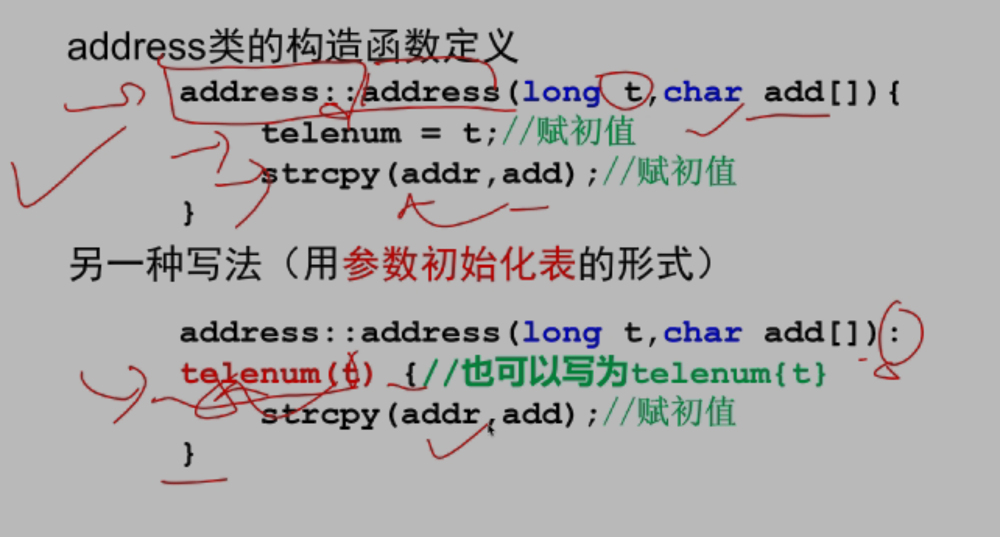
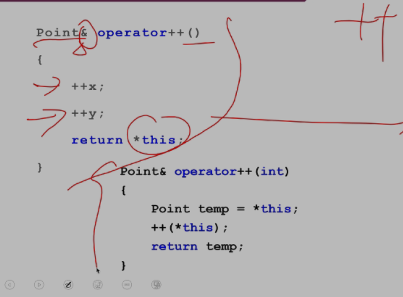
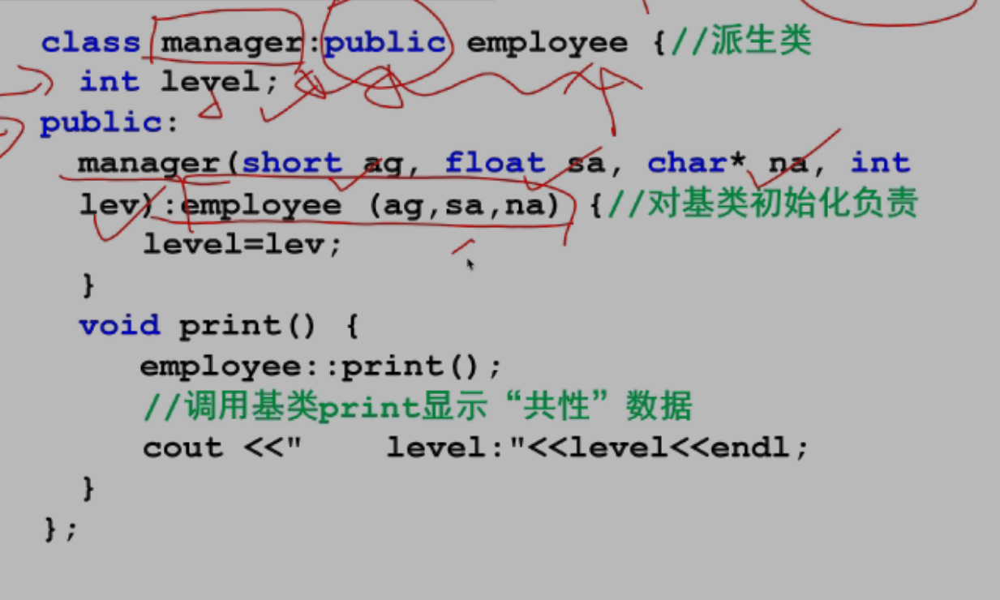
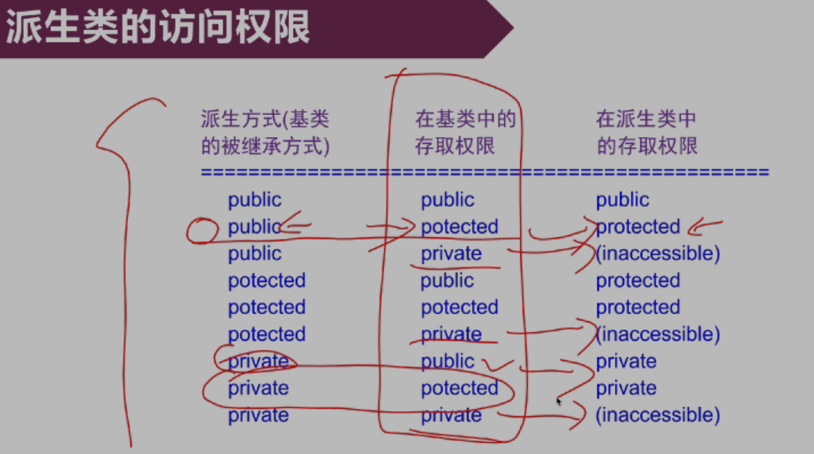
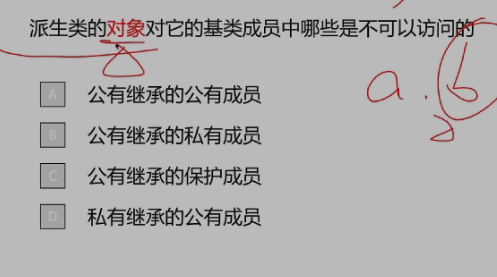
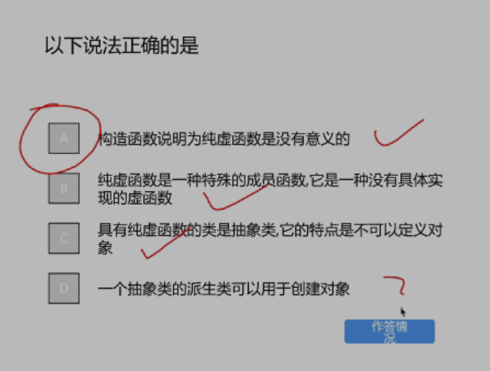

#

- 一个类里可以有该类的指针，但是不可以有该类，与内存有关，当实例化对象时，指针所占大小是确定的，为 4 个字节，而该对象就不确定了
- 公有函数 接口 传递消息，封装性， 封装的数据
- 类的定义只是一个框架 ，对象创建时才占内存对象 实例化
- 使用引用时要为引用赋初值

## 类和对象 part2

不考察 指向成员的指针，每个对象维护自身的成员

### 对象初始化 ：构造函数

- 根据数据成员访问控制方式
  公有： 一般数组 不常用
  常用：
  构造函数：
  - 无返回类型，
- 字符数组的首地址 为一个指针 ，传入的参数 address(long t, char add[])
  strcpy(,add)调用函数赋初值
  

## part 3

include <>和“”的区别

## part 5

### 赋值运算符重载

赋值 输入输出

返回本身 `return *this`： 可作为左值

1. 引用传参 ，减少内存转移
2. 加 const 保证不会改变实参的值
3. 以引用的格式返回自身对象，可作为左值参与运算
4. 为成员函数而不是友元函数

了解：后缀加加 临时对象保存原值，返回临时对象以引用形式返回
原值参与运算，自身加 1

### 链表

## 继承与多态 paet1

共同特征 基类

构造函数初始化 字符串指针开辟空间 拷贝

- final 最后的类不可再派生

去更严格的

派生类成员根据访问权限分为四类
多了一个不可访问的成员

保护也不可访问

按继承的顺序初始化，按照声明的顺序

## part2

核心：七八两章

属性成员对位赋值

### 派生类的拷贝构造函数

用一个已经存在的对象创建一个新的对象

- const
- & 引用

在类内进行访问： this 指针 自己 ；相同类 其他对象的属性成员，私有也可 只限制类定义中的成员函数，而不限制该函数访问的是哪个对象的属性成员

派生类构造之前先构造基类

派生类中可以使用 using 关键字显式地继承基类地构造函数，**无参构造函数除外**默认调用

`using box::box`继承所有有参的构造函数

- 初始化列表里的顺序不重要，只起到参数匹配的作用，还是看定义中继承的顺序以及声明的自定义类对象的顺序

### 友元的继承

**基类的友元不继承**
一样的东西可以访问，权限一样

!!! note
赋值：两边的对象都存在
拷贝构造

派生类对象是特殊基类对象 兼容

## 继承

cherno : 当在基类声明是 virtual 函数时，自动创建一张虚函数表，如果有覆盖，就相应的调用去找
