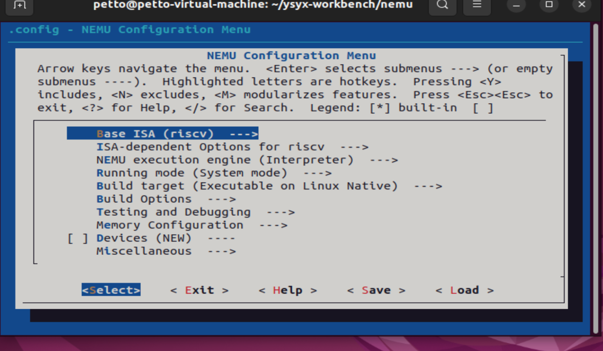

# risc v和开源芯片

## 大的趋势·

处理器芯片 ：运行软件 

芯片 生物 ？ 单细胞多细胞 跨度大
电源控制 

### 开发过程与生态

芯片开发的过程

* isa 硬软件交互的标准规范 螺钉螺母
* 微架构的设计 ： 将手册定义的功能实例化 设计文档 ；工程开发设计文档变成源代码；eda 版图 类到对象
* tape out;流片；散热材料 外壳；（制造）设备要求 光刻机

> 先完成 后完美

指令集博物馆 

计算机系统=标准规范+具体实现（外围设备 cpu 系统软件 应用软件 数据格式）文本格式：标准规范；生态一个网络 指令集与其他标准协议结合起来；

##  技术 

指令集重要：与软件联系

    早期ibm每个型号的计算机都是独立的指令集
    64年360重构 统一指令集；统一汇编器 编译器 函数库；软件单独成为产品
指令集不重要： 只是规范，微架构强时可换指令集；对芯片本身
    微架构的设计与实现 更重要

处理器生态体系： 与指令集架构相关的硬件软件 工具和服务

* 卡点：
  1. 指令集
  2.ip
  3.eda工具
  4.工艺

可控：静止
演进：动态 持续往下走迭代
电动车 

设计难 成本高 周期长 风险大 冰山模型 处理器核设计1/8 研发基础设施7/8；
risc v: 开放性 模块化

高铁模式：引进吸收消化再创新 海光 海思 飞腾
北斗模式： 完全自主构建技术体系 龙芯 神威 LX
5G模式： 参与开放标准指定 融入国际生态

rise

临床实习
