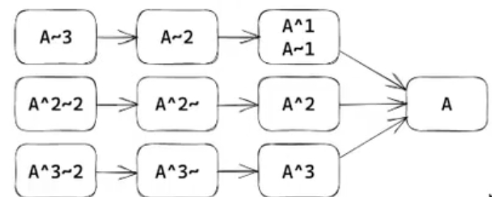
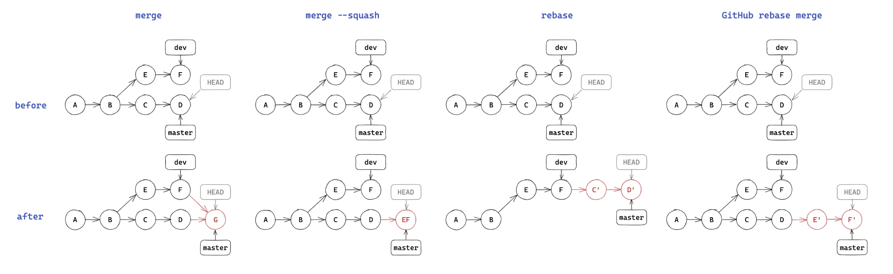
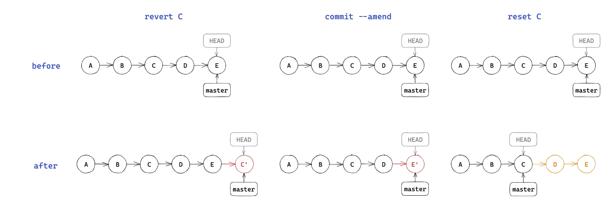

#

* 什么是tag,以及版本号的规范
* git commit message 编写规范
* 几种修改提交记录的方法
* 远程仓库与github的本质
* 如何自行探索git存储的奥秘
* GitHub配置好邮箱的必要性
* issue和pull request

## 自学

version control with git
pro git

网站 learning git branching

## 什么是git

分布式（不联网）版本控制系统
linus 开发
远程与本地

### 配置

创建版本库
git init
 账号配置
 全局： git config--global .user.name"name"
        git config--global.user.email"email"
  针对某一版本库：
  去掉global

### 基础用法

#### 文件暂存

* 暂存区：已经修改，等待后续提交的文件
* 将文件加入暂存区：
  git add file/folder(只会修改添加过的文件)
  git add .（当前目录下所有修改过的文件）
* 删除文件的几种情况：
  * 只在本地删除版本库中不存在的文件：rm
  * 同时删除本地和版本库中的文件 git rm 
  * 将一个已暂存的新文件取消暂存：git rm --cached
* 重命名文件 git mv
* 查看当前工作区和暂存区状态：git status
三种文件状态：untracked ignore tracked
关于.gitigonre github模板

#### 提交更改

* 将暂存内容提交到本地仓库，生成一个新版本
  * git commit: 默认*编辑器*编辑提交信息
  * git commit -m "message"
  * -a(all)

* 查看提交历史：git log
  *---oneline:每一个提交一行
  *-graph:显示分支结构
  *-stat:显示文件删改信息
  *-p:显示详细的修改信息
* 每个提交都有唯一的sha-1的标识符（40位16进制）将提交的所有内容进行散列
  *gitshowid 显示提交详细信息（id在不重复的前提下可以只写前几位）
* 给出之前的某一版本：git checkout id(回到原来的状态)


#### 关于commit message

* 意义：记录更改的原因/内容、方便定位/回溯（特别是合作项目）
* angular规范

``` a
<type>([scope]):<summary>

[body]

[footer]

```

* type:更改类型（fix（修bug）/feat(添加新特性)/docs/refactor（重构）/perf（提高性能）/test/ci（持续集成）/……）
* scope：影响范围（可选）
* summary：简要描述
* body：更详细的描述

#### 版本 标签

* 创建标签
  *轻量标签：git tag id
  *附注标签：git tag -a tag -m"message" id
* 查看标签：git tag
* 版本号命名一般规范：semantic versioning 2.0.0
  * v主版本号.次版本号.修订号[-预发布版本号（可选）]
  * 修订号：兼容修改，修正不正确的行为
  * 次版本号：添加新功能但是保持兼容
  *主版号：不兼容的api修改
    * 0不稳定
  * 预发布版本号：alpha(内测)/beta（公测）/rc1./rc2.（release candidate）


#### detached head 问题

* 什么是head:当前工作区在提交历史中的指针
* 什么是detached（游离） head:head 指向某个历史提交，而不是某个”分支“
* 什么情况下会出现detached head
  * git checkout id,此后的修改不会出现在任何分支
  * 切换回master后会出现一条不属于任何分支的提交（相当于修改会丢失）

* 如何解决： 在F位置上git checkout-b branch 创建并检出新分支

#### 分支

##### 创建

* git branch name:基于当前head
* git branch name id:基于id提交

##### 查看

* git branch(带-a显示远程分支)
* git show-branch 更详细

##### 切换分支

* git checkout name
* git checkout -b name:创建并切换

##### 内容比较

* git diff branch1 branch2
* git diff branch 比较工作区和分支
* git diff 比较工作区和暂存区

##### 如何更方便地定位提交

* 什么是分支名：和head一样也是一个指针（实际上叫ref引用）
* 可以基于ref使用~或^定位父提交
  * ~表示第一个父提交，~2表示第一个父提交的第一个父提交
  * ^表示第一个父提交，^2表示第个二父提交

* 一个提交可能有多个父提交（merge commit）


#### 合并

* 将多个分支的更改都合并到当前分支：git merge branch1 branch2
* 几种merge的情况：
  * 当前分支只比被合并分支多提交：already up to date
  * 被合并分支只比当前分支多提交：fast-forward(将head指向被合并分支)
  * 都有新的提交：产生一个merge commit
    * 有冲突时需要手动解决冲突（add commit merge commit)

* merge操作一般都在github通过pr完成，两种特殊方式：
  * squash merge:将目的分支多出的所有提交压缩为一个新提交并入当前分支
  * rebase:命令行/github
  

### git进阶

#### 修改提交历史

1.git revert id
2.修改最新提交的提交信息：git commit --amend
3.回到之前某一提交的状态：git reset id
几种模式：
--soft：只修改 HEAD 指针，不修改暂存区和工作区
--mixed：修改 HEAD 指针和暂存区，不修改工作区（默认）
--hard：修改 HEAD 指针、暂存区和工作区（完全回退）

