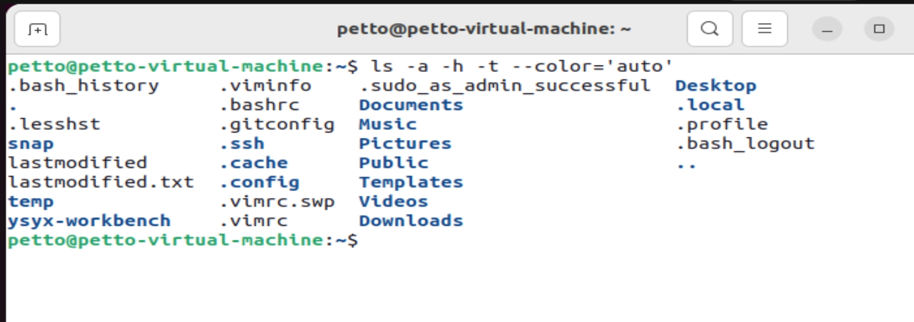
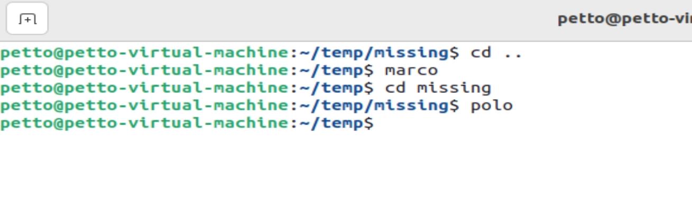

#

* 脚本语言

## shell scritping

* 变量 控制流 语法 
* 优化 执行与shell有关的代码时
* foo bar 中国玉雕 底座 福 
* **在 shell 中空格是 参数分配符**
* 单引号与双引号的不同：
  * 单引号只是文字字符串 不会替换 双引号会

* 将命令的输出作为变量；command substitution
`for file in $(ls)`
* **process substitution**:`diff <(ls foo) <(ls bar)`
  

* shell globbing
  * wildcards:通配符： `rm foo?`
  * 大括号： `convert image.{png,jpg}`->`convert image.png image.jpg`
  [shellcheck](https://github.com/koalaman/shellcheck):检查工具


## shell tools 

### find how to use commands

[简化man版本](https://tldr.sh/)

### find files

 [find简化版本](https://github.com/sharkdp/fd)

 `locate`类似数据库，构造索引

### find code(文件内容)

* grep : global regular experssion print,文本搜索工具，有很多的标识符；

### find shell commands

`history`: `history|grep find` : 打印出所有包含find的字符串命令
`ctrl + r`:回溯历史
[zsh 自动填充命令根据历史](https://github.com/zsh-users/zsh-autosuggestions)


### dicrectory navigation

快速跳转：[autojump](https://github.com/wting/autojump)


## Exercises

1. Read man ls and write an ls command that lists files in the following manner

  Includes all files, including hidden files
  Sizes are listed in human readable format (e.g. 454M instead of 454279954)
  Files are ordered by recency
  Output is colorized
  A sample output would look like this

  -rw-r--r--   1 user group 1.1M Jan 14 09:53 baz
  drwxr-xr-x   5 user group  160 Jan 14 09:53 .
  -rw-r--r--   1 user group  514 Jan 14 06:42 bar
  -rw-r--r--   1 user group 106M Jan 13 12:12 foo
  drwx------+ 47 user group 1.5K Jan 12 18:08 ..

  


2. Write bash functions marco and polo that do the following. Whenever you execute marco the current working directory should be saved in some manner, then when you execute polo, no matter what directory you are in, polo should cd you back to the directory where you executed marco. For ease of debugging you can write the code in a file marco.sh and (re)load the definitions to your shell by executing source marco.sh.



```bash
#!/bin/bash

marco(){
  export MARCO=$(pwd)
}
polo(){
  cd $(MARCO)
}

```

3. Say you have a command that fails rarely. In order to debug it you need to capture its output but it can be time consuming to get a failure run. Write a bash script that runs the following script until it fails and captures its standard output and error streams to files and prints everything at the end. Bonus points if you can also report how many runs it took for the script to fail.

```bash
 #!/usr/bin/env bash

 n=$(( RANDOM % 100 ))

 if [[ n -eq 42 ]]; then
    echo "Something went wrong"
    >&2 echo "The error was using magic numbers"
    exit 1
 fi

 echo "Everything went according to plan"

 ```

4. As we covered in the lecture find’s -exec can be very powerful for performing operations over the files we are searching for. However, what if we want to do something with all the files, like creating a zip file? As you have seen so far commands will take input from both arguments and STDIN. When piping commands, we are connecting STDOUT to STDIN, but some commands like tar take inputs from arguments. To bridge this disconnect there’s the xargs command which will execute a command using STDIN as arguments. For example ls | xargs rm will delete the files in the current directory.

  Your task is to write a command that recursively finds all HTML files in the folder and makes a zip with them. Note that your command should work even if the files have spaces (hint: check -d flag for xargs).


5. (Advanced) Write a command or script to recursively find the most recently modified file in a directory. More generally, can you list all files by recency?


* tar - an archiving utility