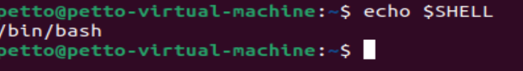
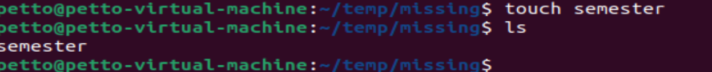
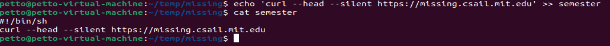
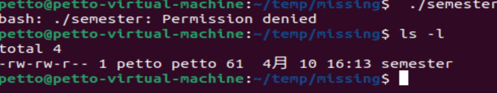
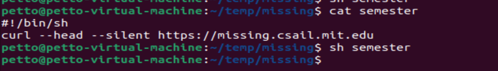
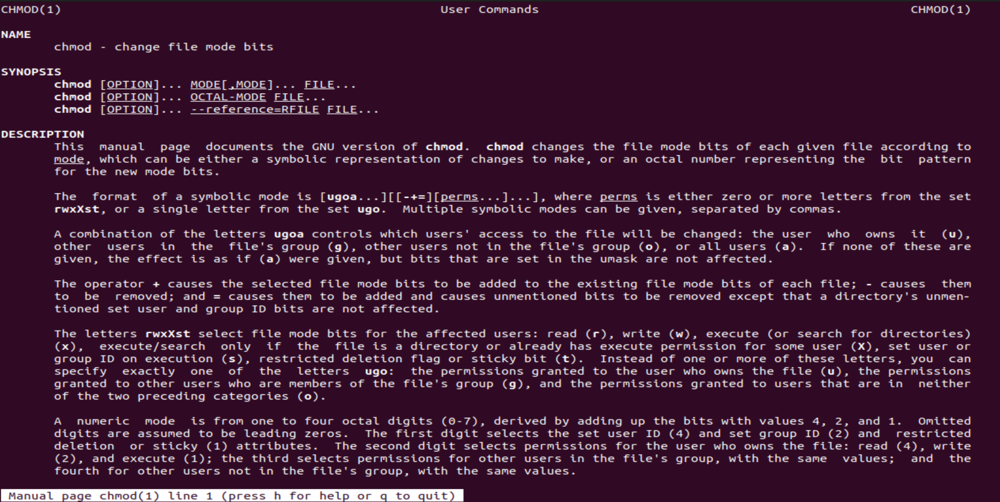
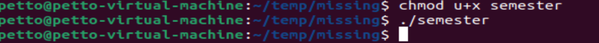
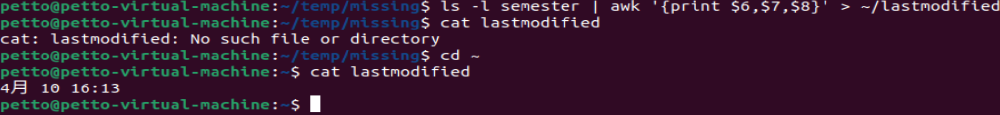
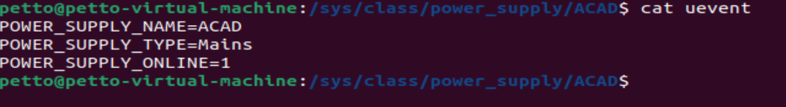

#

## 概念

* 核心 ： 允许用户运行程序，给输入 输出 以一种半结构化的方式？
* Bourne Again SHell aka bash
* 是一个编程环境

## 使用

* 美元符号意味着不是根用户
* 可输入命令去执行一个程序，例如`date`,带参数的命令
* shell通过空格来拆分解析它的命令，所以若参数中有空格时两种解决办法：
  1. 加引号（单双均可）
  2. escape just the relevant characters with \ 

* 环境变量$PATH： shell咨询的对象，会列出包含需要去找的编程关键字的目录的列表
* `which` :在给定程序名时找到时哪个文件被执行

## 导航

ls cd cd ..  man 
mv cp mkdir
q

* -l : use a long listing  format

## 程序的连接

**流的概念**：输入与输出流

* 重定向： `< file` `> file`;

* `cat`: concatenates files,直接使用将打印出后面的文件

* 管道的使用：`|` CHAIN 起来 将程序们，前者的输出是后者的输入

## 强大的工具

**sudo**: > lets you do sth. as su(super user)
* 一些根用户所做的事 ：write to the sysfs file system mounted under /sys.
  sysf 将大量内核参数暴露为文件，所以通过文件来配置他们；
* `tee` :  a program open the/sys files for writing ,&& running as root; 

## 练习

1. For this course, you need to be using a Unix shell like Bash or ZSH. If you are on Linux or macOS, you don’t have to do anything special. If you are on Windows, you need to make sure you are not running cmd.exe or PowerShell; you can use Windows Subsystem for Linux or a Linux virtual machine to use Unix-style command-line tools. To make sure you’re running an appropriate shell, you can try the command echo $SHELL. If it says something like /bin/bash or /usr/bin/zsh, that means you’re running the right program.

2. Create a new directory called missing under /tmp.
3. Look up the touch program. The man program is your friend.
4. Use touch to create a new file called semester in missing.

5. Write the following into that file, one line at a time:
#!/bin/sh
curl --head --silent https://missing.csail.mit.edu
The first line might be tricky to get working. It’s helpful to know that # starts a comment in Bash, and ! has a special meaning even within double-quoted (") strings. Bash treats single-quoted strings (') differently: they will do the trick in this case. See the Bash quoting manual page for more information.

6. Try to execute the file, i.e. type the path to the script (./semester) into your shell and press enter. Understand why it doesn’t work by consulting the output of ls (hint: look at the permission bits of the file).

没有x故不可执行
7. Run the command by explicitly starting the sh interpreter, and giving it the file semester as the first argument, i.e. sh semester. Why does this work, while ./semester didn’t?
权限问题；使用 sh semester 能够成功运行，明确调用解释器：无需依赖文件执行权限和 shebang。而直接执行 ./semester 会失败往往是因为文件缺少可执行权限或者缺少有效的 shebang 行。
8. Look up the chmod program (e.g. use man chmod).

change file mode bits，权限设置；两种方式： 数字和符号 
9. Use chmod to make it possible to run the command ./semester rather than having to type sh semester. How does your shell know that the file is supposed to be interpreted using sh? See this page on the shebang line for more information.

hash + bang #! 程序加载器将第一行的剩余内容解释为解释器指令
10. Use | and > to write the “last modified” date output by semester into a file called last-modified.txt in your home directory.

11. Write a command that reads out your laptop battery’s power level or your desktop machine’s CPU temperature from /sys. Note: if you’re a macOS user, your OS doesn’t have sysfs, so you can skip this exercise.
虚拟机无此信息，
