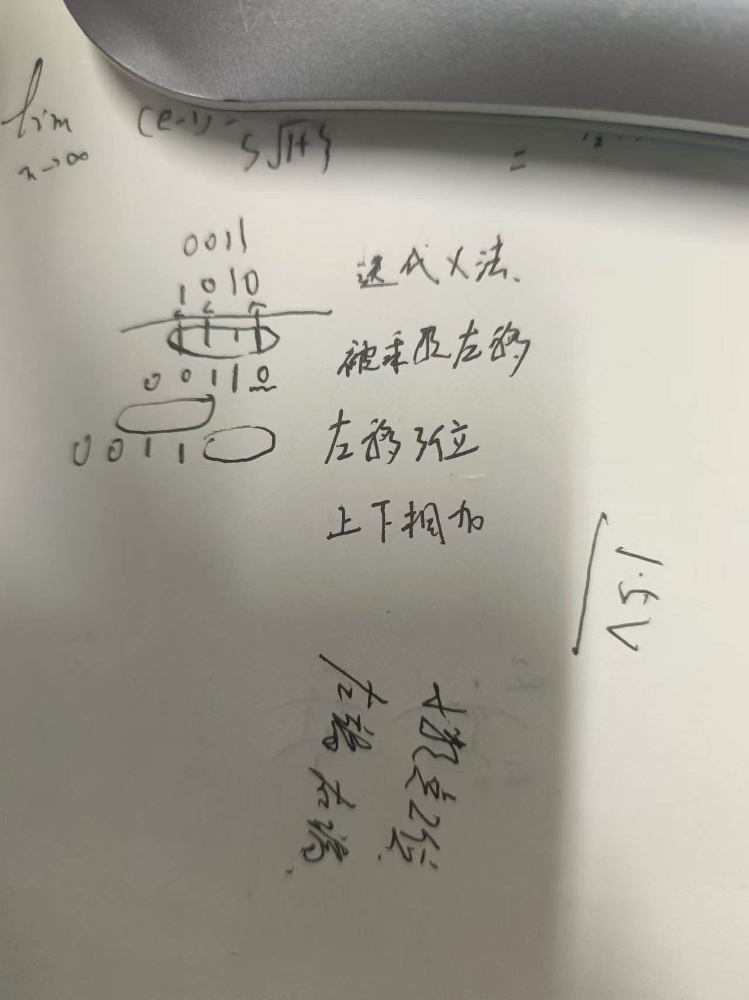

# 类似c++

编程语言 不是用来编程序 用来接线……
语言类 语法结构
一门学好

设计一个面包板 插元件
大作业 打分 红绿灯  **收获总结**
20个g……的vivado 单个Upan 4个g unless格式化
ppt引导
verilog 上下两行无先后顺序 类似做实验 无依赖
行为 函数 结构 输入输出
搭积木模块 ！递归 调用
仿真虚拟输入信号
节省生产成本
赋值 接线操作 连线实现功能
assignment 1  2选择器
不允许超过一页！！
做到Increment

半加器全加器 8位 中括号 7：08位位宽bus

## 逻辑功能

* assign 连线 *通常描述组合逻辑*
* 用元件(类 类似c++语言)例化，可以用现有模块
* always 引导块语句{}时序语句

``` verilog

always@(敏感信号)
```

**begin与end之间需要顺序执行**

## 标识符

* 在c++基础上可以加＄号

## 变量类型 有包含关系

* integer 无符号整数 用：做for循环控制变量
* parameter 常量类型 类似const 同时是参数
* reg (ister)暂存一个变量 穿的过程中可以存
* wire连线 不暂存信号 传的过程不存

## 常量

  x 任意1|0 z 高阻
  负数 原反补码
  interger
  第一个想的应该是位宽bus
  位宽指的是二进制数的位宽
    只能用现有的常量定义新的常量

    引脚约束
    artix 7
    fbg676
    -2
    testbanch不加端口
    输入reg
    输出wire
    #5 每隔5个单位取反
   *3 5 素数隔离开*
   8为加法器
   方法：每隔一段时间+1；always #5 tempa=random(32bit)%9 构造8位随机数

   module fulladder(
input a,input b,input ci,
output sum ,output co

    );
    wire t1,t2,t3;
    halfadder h1(a,b,t1,t2);
    halfadder h2(t1,ci,sum,t3);
    assign co=t2^t3;
endmodule

module halfadder(
    input a,
    input b,
    output sum,
    output carry
   );
    assign carry=a & b;
    assign  sum=a ^ b;
endmodule

module tb1();

reg tempa,tempb;
wire tsum,tc;
halfadder myha(tempa.tempb,tsum,tc);
initial begin
    tempa=1'b0;
    tempb=1'b0;
end
always #5 tempa=~tempa;
always #3 tempb=~tempb;
endmodule
module halfadder(input a,
input b,output sum,output carry
);
assign carry=a&b;
assign sum=a^b;
endmodule

module tb2( );
reg tempa,tempb,tempc;
wire tsum,tc;
fulladder myha(tempa,tempb,tempc,tsum,tc);
initial begin
    tempa=1'b0;
    tempb=1'b0;
    tempc=1'b0;
 end
 always #5 tempa=~tempa;
 always #3 tempb=~tempb;
 always #7 tempc=~tempc;
endmodule
module fulladder8(
    input [7:0] a,
    input [7:0] b,
    input ci,
    output [7:0] sum,
    output [7:0] co
);

    wire [7:0] internal_co;  // 内部进位信号

    // 实例化8个全加器
    genvar i;
    generate
        for (i = 0; i < 8; i = i + 1) begin : fa_inst
            fulladder fa (
                .a(a[i]),
                .b(b[i]),
                .ci(i == 0 ? ci : internal_co[i-1]),
                .sum(sum[i]),
                .co(internal_co[i])
            );
        end
    endgenerate

    // 最高位的进位输出
    assign co[7] = internal_co[7];
    assign co[6:0] = internal_co[6:0];

## 1121

### hw

* 波形截图当前时刻描述功能验证
* 代码注释
* 模块图 手绘解释 模块

### 运算符与表达式

* 类比c++
* 等式运算 **缩减运算**与c++唯一不一样
* 取最低8位 % 8位加法器随机数生成
* 不定x 所以红色
* 真假值只是1bit与c++不一样
* 括号的使用 优先级的体现
* 位运算 与逻辑运算不一样 同或？操作数位宽一样，不一样右端对齐位数少高位补齐高位反码和补码为1
* 关系运算符1位
* *等式运算*
  *全等与等于的区别
* **缩减运算符**
  * 单目运算符 与位运算的区别
  * 判断一个数是否为全1 or0 或01
  * 2的倍数-1？
  * 移位相当于*2或/2，乘法运算 用以为来做  ×3 移1位+原来的？

```v
//16bitfulladder
mudule adder16(input[15:0] int a 
input[15:0]int b
input cin
output cout
output sum[15:0]
);
assign {cout,sum}=int a+int b+cin
//tb
五端口
reg[15:0] a,b;
reg cin;
wire[15] tsum;
wire cout
adder16 my(a,b,);
initial begin
    a=16'd0;b=16'd0;cin=1'b0;
end
always #3 a=$random% 17'b
endmodule


```

``` v

module simpleoperation(input [7:0] ina,
input[7:0] inb,
output[7:0]sumab,
output[7:0]leftshiftA,
output lessflag,
output equalflag,
output bitXorflag

    );
    assign {sumflag,sumab}=ina+inb;
    assign leftshiftA=ina<<inb;
    assign lessflag =(ina<inb)?1'b1:1'b0;
    assign equalflag = (ina==inb)? 1'b1:1'b0;
    assign bitXorflag=^ina;
  
    
endmodule

module tb();
reg[7:0] ina,inb;
wire [7:0]sumab,leftshiftA;
wire lessflag,equalflag,bitXorflag;
simpleoperation myunit(ina,inb,sumab,leftshiftA,lessflag,equalflag,bitXorflag);
initial begin
ina=8'd0;
inb=8'd0;
end
  always #3 ina=$random % 9'b100_000_000;
  always #5 inb=$random %8'b00_000_100  ; 

endmodule
```


* 时钟 每次移位
* 

module counttimes(
    input wire [31:0] input_data,  // 32位输入数据
    output reg [4:0] zero_count,   // 0的计数，最多为32，所以需要5位
    output reg [4:0] one_count     // 1的计数，最多为32，所以需要5位
);
integer i;

// 用于计数的always块
always @(*) begin
    // 初始化计数器
    zero_count = 5'b0;
    one_count = 5'b0;

    // 定义循环变量
    
    // 遍历32位输入数据
    for ( i = 0; i < 32; i = i + 1) begin
        if (input_data[i] == 1'b0) begin
            zero_count = zero_count + 5'b00001;
        end else if (input_data[i] == 1'b1) begin
            one_count = zero_count + 5'b00001;
        end
    end
end

endmodule
module testbench();

    // Signal declarations
                 // Clock sig
    reg [31:0] data_in;     // 32-bit input data
    wire [4:0] out_0;     // Output count of 0s
    wire [4:0] out_1;     // Output count of 1s

    initial begin
        data_in=$random%33'h100_000_000; 
    end

  
endmodule
 module testbench;
    reg [31:0] input_data;
    wire [4:0] zero_count;
    wire [4:0] one_count;

    counttimes uut (
        .input_data(input_data),
        .zero_count(zero_count),
        .one_count(one_count)
    );

    initial begin
        input_data = 32'b10101010_10101010_10101010_10101010;  // 示例输入
        #10;  // 等待10个时间单位，确保计数完成
        $display("0的计数: %d, 1的计数: %d", zero_count, one_count);
    end

    always #5 input_data = ~input_data;  // 每5个时间单位翻转输入数据

endmodule
always块语句，实现一个十分频器，divider10( input clk_in,input reset,
 output count, output clk_out)。
 其功能可以理解为将时钟降频为原来的10分之一（
 思路：对clk_in进行count计数，count取值0~9，count数到5时，clk_out由1变0，
 count数到10时自动归零同时clk_out由0变1）

```verilog
module divider10 (
    input wire clk_in,  // 输入时钟
    input wire reset,   // 复位信号
    output reg clk_out  // 输出时钟
);
    reg [3:0] count;  // 4位计数器

    always @(posedge clk_in or posedge reset) begin
        if (reset) begin
            count <= 0;  // 复位计数器
            clk_out <= 0;  // 复位输出时钟
        end else begin
            if (count == 9) begin
                count <= 0;  // 计数器达到9后重置
                clk_out <= ~clk_out;  // 翻转输出时钟
            end else begin
                count <= count + 1;  // 计数器加1
            end
        end
    end
endmodule

 module tb;
    // 定义输入和输出信号
    reg clk_in;         // 输入时钟
    reg reset;          // 复位信号
    wire clk_out;       // 输出时钟

    // 实例化被测模块（DUT）
    divider10 uut (
        .clk_in(clk_in),
        .reset(reset),
        .clk_out(clk_out)
    );

    // 初始块：设置初始条件并启动仿真
    initial begin
        // 初始化信号
        clk_in = 0;
        reset = 1;

        // 等待一段时间后释放复位信号
        #10 reset = 0;

        // 运行仿真一段时间
        #500 $finish;  // 仿真运行500个时间单位后结束
    end

    // 生成时钟信号
    always #5 clk_in = ~clk_in;  // 每5个时间单位翻转一次时钟信号

    // 监控信号变化
   
endmodule


```
w
写模块 接线
类型变量的位宽一定要写。赋值时一定要保证位宽一致。32不写32，任意一个变量都要注意位宽

12.5
核心 语句

* 条件语句 两种
    特点 判断真假再操作，块语句内部（begin end）aleays 语句内initial 也可 一般不用
    位宽明确要求
    改成读秒器 分频成1秒一个周期

    逻辑的封闭性大类和小类分清楚
    case语句没有break
    铭感表达式的值可能出现x或z
    一定要覆盖所有情况。其余放在default
    代码 1111 优先级

    if一定要对应一个else 逻辑封闭性
    两位位宽四种情况，保证位宽所有的值都要有对应的情况
* 循环 同样也有先后顺序
always块语句内部
巧妙 sum[2] sum>4 同计数器
熟悉 例二 乘法做累加 a左移 *2
迭代乘法
aleays语句内部有触发器

``` verilog
module multiple_32(outcome,a,b);
parameter size=32;  //位宽
output[2*size-1:0] outcome;
input[size-1:0] a,b;

reg [2*size-1:0] outcome ;
integer i;//循环变量

always@(a or b)
begin
    outcome=64'h0000;
    for(i=0;i<=size;i=i+1)
        if(b[i])
            outcome=outcome + (a<<i);//迭代乘法

end
    
endmodule

module tb();
    // 定义参数
    parameter size = 32;

    // 声明信号
    reg [size-1:0] a, b;
    wire [2*size-1:0] outcome;

    // 实例化被测模块
    multiple_32 test(.outcome(outcome), .a(a), .b(b));

    // 初始化
    initial begin
        a = 32'd0;
        b = 32'd0;
        #10; // 等待一段时间以观察初始状态
    end

    // 生成随机输入
   always #32 a=$random % 33'h100;
      always #32 b=$random %33'h100; 
    // 监控输出
    initial begin
        $monitor("At time %t, a = %d, b = %d, outcome = %d", $time, a, b, outcome);
    end

    // 结束仿真
    initial begin
        #1000 $finish; // 仿真运行1000个时间单位后结束
    end
endmodule

```
module Counter(
    input clk,                // 时钟信号
    input rst_n,              // 复位信号（低有效）
    input inc,                // 增加计数的信号（按键或拨码开关）
    output reg [5:0] count,   // 计数器值（6位）
    output reg overflow       // 溢出信号
);

    always @(posedge clk or negedge rst_n) begin
        if (!rst_n) begin
            count <= 6'd0;      // 复位时计数器清零
            overflow <= 0;      // 清除溢出信号
        end else if (inc) begin
            if (count == 59) begin
                count <= 6'd0;  // 溢出后计数器归零
                overflow <= 1;  // 设置溢出信号
            end else begin
                count <= count + 1; // 计数器加1
                overflow <= 0;      // 清除溢出信号
            end
        end
    end

endmodule
module SevenSegment(
    input [5:0] count,    // 计数器值（6位）
    output reg [6:0] seg1, // 个位数码管显示
    output reg [6:0] seg2  // 十位数码管显示
);

    // 数码管显示编码（七段显示编码，共阴极数码管）
    reg [6:0] seg_map [0:9];
    
    initial begin
        // 数码管段的编码（共阴数码管）
        seg_map[0] = 7'b0111111; // 0
        seg_map[1] = 7'b0000110; // 1
        seg_map[2] = 7'b1011011; // 2
        seg_map[3] = 7'b1001111; // 3
        seg_map[4] = 7'b1100110; // 4
        seg_map[5] = 7'b1101101; // 5
        seg_map[6] = 7'b1111101; // 6
        seg_map[7] = 7'b0000111; // 7
        seg_map[8] = 7'b1111111; // 8
        seg_map[9] = 7'b1101111; // 9
    end

    always @(count) begin
        seg1 = seg_map[count % 10];  // 个位显示
        seg2 = seg_map[count / 10];  // 十位显示
    end

endmodule
module OverflowIndicator(
    input overflow,          // 溢出信号
    output reg led_overflow // 溢出指示灯
);

    always @(overflow) begin
        if (overflow) begin
            led_overflow <= 1; // 溢出时LED亮
        end else begin
            led_overflow <= 0; // 无溢出时LED熄灭
        end
    end

endmodule
module TopModule(
    input clk,              // 时钟信号
    input rst_n,            // 复位信号（低有效）
    input inc,              // 增加计数的信号（拨码开关或按键）
    output [6:0] seg1,      // 第一位数码管的段选择信号
    output [6:0] seg2,      // 第二位数码管的段选择信号
    output led_overflow     // 溢出指示灯
);

    // 内部信号定义
    wire [5:0] count;
    wire overflow;

    // 实例化计数器模块
    Counter counter_inst (
        .clk(clk),
        .rst_n(rst_n),
        .inc(inc),
        .count(count),
        .overflow(overflow)
    );

    // 实例化数码管显示模块
    SevenSegment seven_segment_inst (
        .count(count),
        .seg1(seg1),
        .seg2(seg2)
    );

    // 实例化溢出指示模块
    OverflowIndicator overflow_inst (
        .overflow(overflow),
        .led_overflow(led_overflow)
    );

endmodule
`timescale 1ns / 1ps

module TopModule_tb;

    // 测试信号声明
    reg clk;               // 时钟信号
    reg rst_n;             // 复位信号（低有效）
    reg inc;               // 增加计数的信号（拨码开关或按键）
    wire [6:0] seg1;       // 第一位数码管的段选择信号
    wire [6:0] seg2;       // 第二位数码管的段选择信号
    wire led_overflow;     // 溢出指示灯

    // 实例化顶层模块
    TopModule uut (
        .clk(clk),
        .rst_n(rst_n),
        .inc(inc),
        .seg1(seg1),
        .seg2(seg2),
        .led_overflow(led_overflow)
    );

    // 时钟生成
    always begin
        #5 clk = ~clk; // 每5ns翻转一次时钟，频率为100MHz
    end

    // 测试过程
    initial begin
        // 初始化信号
        clk = 0;
        rst_n = 0;
        inc = 0;

        // 复位测试
        $display("==== 复位测试 ====");
        rst_n = 0;  // 激活复位
        #10;
        rst_n = 1;  // 解除复位
        #10;

        // 模拟按下增计数按钮
        $display("==== 增计数测试 ====");
        inc = 1;
        #10;  // 计数器增加1
        inc = 0;
        #10;
        inc = 1;
        #10;  // 计数器再次增加1
        inc = 0;
        #10;
        
        // 达到59时溢出测试
        $display("==== 溢出测试 ====");
        // 将计数器设置为59
        repeat(59) begin
            inc = 1;
            #10;
            inc = 0;
            #10;
        end
        
        // 模拟溢出后，检查led_overflow是否点亮
        inc = 1;
        #10;  // 应该回到0并激活溢出LED
        inc = 0;
        #10;

        // 再次增计数，测试正常计数过程
        $display("==== 再次增计数 ====");
        inc = 1;
        #10;
        inc = 0;
        #10;
        
        // 完成测试
        $finish;
    end

    // 打印波形
    initial begin
        $dumpfile("TopModule_tb.vcd"); // VCD文件用于波形查看
        $dumpvars(0, TopModule_tb);    // 指定dump的信号
    end

endmodule
`timescale 1ns / 1ps
//////////////////////////////////////////////////////////////////////////////////
// Company: 
// Engineer: 
// 
// Create Date: 2024/12/20 20:02:27
// Design Name: 
// Module Name: counters
// Project Name: 
// Target Devices: 
// Tool Versions: 
// Description: 数码管计数器设计，包含分频、计数、数码管显示与溢出指示功能
// 
// Dependencies: 
// 
// Revision:
// Revision 0.01 - File Created
// Additional Comments:
// 
//////////////////////////////////////////////////////////////////////////////////
// 分频器模块
module ClockDivider(
    input clk_in,           // 全局时钟输入（100 MHz）
    input rst_n,            // 复位信号（低有效）
    output reg clk_out      // 分频后的时钟输出
);

    reg [26:0] cnt;         // 分频计数器（适合1 Hz分频）
    localparam DIV_VAL = 27'd100_000_000; // 分频系数，100 MHz 除以 2 得到 1 Hz

    always @(posedge clk_in or negedge rst_n) begin
        if (!rst_n) begin
            cnt <= 27'd0;
            clk_out <= 0;
        end else if (cnt == DIV_VAL - 27'd1) begin
            cnt <= 27'd0;
            clk_out <= ~clk_out; // 翻转输出时钟
        end else begin
            cnt <= cnt +27'd1;
        end
    end

endmodule

// 计数器模块
module Counter(
    input clk,                // 时钟信号
    input rst_n,              // 复位信号（低有效）
    input inc,                // 增加计数的信号（按键或拨码开关）
    output reg [5:0] count,   // 计数器值（6位）
    output reg overflow       // 溢出信号
);

    always @(posedge clk or negedge rst_n) begin
        if (!rst_n) begin
            count <= 6'd0;      // 复位时计数器清零
            overflow <= 0;      // 清除溢出信号
        end else if (inc) begin
            if (count == 59) begin
                count <= 6'd0;  // 溢出后计数器归零
                overflow <= 1;  // 设置溢出信号
            end else begin
                count <= count + 6'd1; // 计数器加1
                overflow <= 0;      // 清除溢出信号
            end
        end
    end

endmodule

// 数码管显示模块
module SevenSegment(
    input [5:0] count,    // 计数器值（6位）
    output reg [6:0] seg1, // 个位数码管显示
    output reg [6:0] seg2  // 十位数码管显示
);

    // 数码管显示编码（七段显示编码，共阴极数码管）
    reg [6:0] seg_map [0:9];
    
    initial begin
        // 数码管段的编码（共阴数码管）
        seg_map[0] = 7'b0111111; // 0
        seg_map[1] = 7'b0000110; // 1
        seg_map[2] = 7'b1011011; // 2
        seg_map[3] = 7'b1001111; // 3
        seg_map[4] = 7'b1100110; // 4
        seg_map[5] = 7'b1101101; // 5
        seg_map[6] = 7'b1111101; // 6
        seg_map[7] = 7'b0000111; // 7
        seg_map[8] = 7'b1111111; // 8
        seg_map[9] = 7'b1101111; // 9
    end

    always @(count) begin
        seg1 = seg_map[count % 10];  // 个位显示
        seg2 = seg_map[count / 10];  // 十位显示
    end

endmodule

// 溢出指示模块
module OverflowIndicator(
    input overflow,          // 溢出信号
    output reg led_overflow // 溢出指示灯
);

    always @(overflow) begin
        if (overflow) begin
            led_overflow <= 1; // 溢出时LED亮
        end else begin
            led_overflow <= 0; // 无溢出时LED熄灭
        end
    end

endmodule
module counters(
    input clk,              // 全局时钟输入（100 MHz）
    input rst_n,            // 全局复位信号（低有效）
    input inc,              // 增加计数的信号（拨码开关或按键）
    output [6:0] seg,       // 数码管段选择信号
    output [7:0] digit_sel, // 数码管位选择信号
    output led_overflow     // 溢出指示灯
);

    // 分频后的时钟信号
    wire clk_1Hz;
    wire scan_clk;

    // 分频器实例化（1 Hz 时钟）
    ClockDivider clk_div_inst (
        .clk_in(clk),        // 输入 100 MHz 时钟
        .rst_n(rst_n),       // 复位信号
        .clk_out(clk_1Hz)    // 输出 1 Hz 时钟
    );

    // 动态扫描分频器（生成扫描时钟）
    reg [15:0] scan_counter;
    always @(posedge clk or negedge rst_n) begin
        if (!rst_n)
            scan_counter <= 16'd0;
        else
            scan_counter <= scan_counter + 1;
    end
    assign scan_clk = scan_counter[15]; // 扫描时钟

    // 内部信号定义
    wire [5:0] count;
    wire overflow;
    reg [1:0] digit_select;
    reg [7:0] digit_sel_reg;
    reg [6:0] seg_reg;

    // 计数器模块实例化
    Counter counter_inst (
        .clk(clk_1Hz),       // 使用分频后的 1 Hz 时钟
        .rst_n(rst_n),       // 复位信号
        .inc(inc),           // 增加计数信号
        .count(count),       // 输出计数值
        .overflow(overflow)  // 输出溢出信号
    );

    // 动态扫描的位选逻辑（只激活两位）
    always @(posedge scan_clk or negedge rst_n) begin
        if (!rst_n)
            digit_select <= 2'b00;
        else
            digit_select <= digit_select + 1;
    end

    always @(*) begin
        case (digit_select)
            2'b00: digit_sel_reg = 8'b00000001; // 激活第一个数码管（个位）
            2'b01: digit_sel_reg = 8'b00000010; // 激活第二个数码管（十位）
            default: digit_sel_reg = 8'b00000000; // 未激活
        endcase
    end
    assign digit_sel = digit_sel_reg;

    // 动态扫描段选信号生成
    always @(*) begin
        case (digit_select)
            2'b00: seg_reg = seg_map[count % 10];       // 个位数
            2'b01: seg_reg = seg_map[(count / 10) % 10]; // 十位数
            default: seg_reg = 7'b0000000;               // 默认熄灭
        endcase
    end
    assign seg = seg_reg;

    // 溢出指示灯模块实例化
    OverflowIndicator overflow_inst (
        .overflow(overflow), // 输入溢出信号
        .led_overflow(led_overflow) // 输出溢出指示灯
    );

    // 数码管段选映射
    reg [6:0] seg_map [0:9];
    initial begin
        seg_map[0] = 7'b0111111; // 0
        seg_map[1] = 7'b0000110; // 1
        seg_map[2] = 7'b1011011; // 2
        seg_map[3] = 7'b1001111; // 3
        seg_map[4] = 7'b1100110; // 4
        seg_map[5] = 7'b1101101; // 5
        seg_map[6] = 7'b1111101; // 6
        seg_map[7] = 7'b0000111; // 7
        seg_map[8] = 7'b1111111; // 8
        seg_map[9] = 7'b1101111; // 9
    end

endmodule


`timescale 1ns / 1ps
//////////////////////////////////////////////////////////////////////////////////
// Company: 
// Engineer: 
// 
// Create Date: 2024/12/23 00:35:15
// Design Name: 
// Module Name: sm_ip
// Project Name: 
// Target Devices: 
// Tool Versions: 
// Description: 
// 
// Dependencies: 
// 
// Revision:
// Revision 0.01 - File Created
// Additional Comments:
// 
//////////////////////////////////////////////////////////////////////////////////
//数码管 ip 核
module smg_ip_model(clk,data,sm_wei,sm_duan); 
input clk;
input [15:0] data;
output [3:0] sm_wei;
output [7:0] sm_duan;
//----------------------------------------------------------
//分频
integer clk_cnt; 
reg clk_400Hz;
always @(posedge clk) 
if(clk_cnt==32'd100000)
begin clk_cnt <= 1'b0; clk_400Hz <= ~clk_400Hz;end 
else
clk_cnt <= clk_cnt + 1'b1;
//----------------------------------------------------------
//位控制
reg [3:0]wei_ctrl=4'b1110; 
always @(posedge clk_400Hz)
wei_ctrl <= {wei_ctrl[2:0],wei_ctrl[3]};
//段控制
reg [3:0]duan_ctrl; 
always @(wei_ctrl) 
case(wei_ctrl)
4'b1110:duan_ctrl=data[3:0]; 
4'b1101:duan_ctrl=data[7:4]; 
4'b1011:duan_ctrl=data[11:8];
4'b0111:duan_ctrl=data[15:12]; 
default:duan_ctrl=4'hf; 
endcase
//----------------------------------------------------------
//解码模块
reg [7:0]duan;
always @(duan_ctrl) 
case(duan_ctrl) 
4'h0:duan=8'b0011_1111;//0
4'h1:duan=8'b0000_0110;//1
4'h2:duan=8'b0101_1011;//2
4'h3:duan=8'b0100_1111;//3
4'h4:duan=8'b0110_0110;//4
4'h5:duan=8'b0110_1101;//5
4'h6:duan=8'b0111_1101;//6
4'h7:duan=8'b0000_0111;//7
4'h8:duan=8'b0111_1111;//8
4'h9:duan=8'b0110_1111;//9 
4'ha:duan=8'b0111_0111;//a 
4'hb:duan=8'b0111_1100;//b 
4'hc:duan=8'b0011_1001;//c 
4'hd:duan=8'b0101_1110;//d 
4'he:duan=8'b0111_1000;//e 
4'hf:duan=8'b0111_0001;//f
// 4'hf:duan=8'b1111_1111;//不显示
default : duan = 8'b0011_1111;//0 
endcase
//----------------------------------------------------------
assign sm_wei =~wei_ctrl; 
assign sm_duan = duan; 
endmodule

//测试数码管 ip 
module test(clk,data); 
input clk;
output [15:0]data;
//----------------------------------------------------------
//分频 1Hz 
reg clk_1Hz;
integer clk_1Hz_cnt; 
always @(posedge clk)
if(clk_1Hz_cnt==32'd25000000-1)
begin clk_1Hz_cnt <= 1'b0; clk_1Hz <= ~clk_1Hz;end 
else
clk_1Hz_cnt <= clk_1Hz_cnt + 1'b1;
//----------------------------------------------------------
//循环显示 0-9
reg [39:0]disp=40'h1234567890;
reg [15:0]data;
always @(posedge clk_1Hz) 
begin
disp <= {disp[35:0],disp[39:36]}; 
data <= disp[39:24];
end 
endmodule

//顶层模块

module smg_ip(
    input clk,              // 全局时钟输入
    input rst_n,            // 复位信号（低有效）
    input inc,              // 增加计数的按键信号
    output [3:0] sm_wei,    // 数码管位选
    output [7:0] sm_duan,   // 数码管段选
    output led_overflow     // 溢出指示灯
);

    // 内部信号定义
    reg [5:0] count;        // 计数器值（0-59）
    reg overflow;           // 溢出信号
    wire inc_edge;          // 按键上升沿检测信号
    wire [15:0] display_data; // 数码管显示数据

    // 分频模块（1 Hz时钟生成）
    reg [25:0] clk_div_cnt;
    reg clk_1Hz_reg;

    always @(posedge clk or negedge rst_n) begin
        if (!rst_n) begin
            clk_div_cnt <= 26'd0;
            clk_1Hz_reg <= 1'b0;
        end else if (clk_div_cnt == 26'd50_000_000 - 1) begin
            clk_div_cnt <= 26'd0;
            clk_1Hz_reg <= ~clk_1Hz_reg;
        end else begin
            clk_div_cnt <= clk_div_cnt + 1;
        end
    end
    wire clk_1Hz = clk_1Hz_reg;

    // 按键去抖与上升沿检测
    reg inc_reg1, inc_reg2;
    always @(posedge clk or negedge rst_n) begin
        if (!rst_n) begin
            inc_reg1 <= 1'b0;
            inc_reg2 <= 1'b0;
        end else begin
            inc_reg1 <= inc;
            inc_reg2 <= inc_reg1;
        end
    end
    assign inc_edge = inc_reg1 & ~inc_reg2; // 检测 inc 的上升沿

    // 计数器逻辑
    always @(posedge clk or negedge rst_n) begin
        if (!rst_n) begin
            count <= 6'd0;
            overflow <= 1'b0;
        end else if (inc_edge) begin
            if (count == 6'd59) begin
                count <= 6'd0;
                overflow <= 1'b1; // 溢出时指示灯点亮
            end else begin
                count <= count + 1;
                overflow <= 1'b0; // 清除溢出信号
            end
        end
    end

    // 数码管显示数据生成
    assign display_data = {4'h0, count / 10, 4'h0, count % 10};

    // 数码管驱动实例化
    smg_ip_model smg_driver (
        .clk(clk),
        .data(display_data),
        .sm_wei(sm_wei),
        .sm_duan(sm_duan)
    );

    // 溢出指示灯
    assign led_overflow = overflow;

endmodule

``` v
module test(clk,data,out_LED3_NS,out_LED3_WE);
input clk;
output [15:0]data;
output [2:0] out_LED3_NS,out_LED3_WE;
//分频 1Hz 
reg clk_1Hz;
integer clk_1Hz_cnt; 
always @(posedge clk)
if(clk_1Hz_cnt==32'd25000000-1)
begin clk_1Hz_cnt <= 1'b0; clk_1Hz <= ~clk_1Hz;end 
else
clk_1Hz_cnt <= clk_1Hz_cnt + 1'b1;
//----------------------------------------------------------
//循环显示 0-9
reg [15:0]data;
reg[2:0] out_LED3_NS,out_LED3_WE; 
reg[3:0] Time_10=2'd2,Time_1=2'd0; 
reg[1:0] Stage=2'b00;
always @(posedge clk_1Hz) 
begin
case(Stage)
2'b00:
begin//NS pass
if((Time_10==0) & (Time_1==0)) begin
Stage<=2'b11; 
Time_10<=4'd1; 
Time_1 <=4'd0; 
end
else
begin 
if(Time_1==0)
begin 
Time_1<=4'd9;
Time_10<=Time_10-1; 
end
else
end
begin 
Time_1<=Time_1-1; 
end
data[15:8]<={Time_10,Time_1}; 
data[7:0]<={Time_10,Time_1}; 
out_LED3_NS<=3'b001; 
out_LED3_WE<=3'b100;
end 
2'b01:
begin//WE pass
if((Time_10==0) & (Time_1==0)) begin
Stage<=2'b10; 
Time_10<=4'd1; 
Time_1 <=4'd0; 
end
els
e begin 
else
end
Time_1<=4'd9; 
Time_10<=Time_10-1; 
end
begin 
Time_1<=Time_1-1; 
end

```


module smg_dynamic_display(
    input clk,             // 100MHz 时钟输入
    input rst_n,           // 复位信号（低有效）
    input inc,             // 按键：计数+1
    output [3:0] sm_wei,   // 数码管位选
    output [7:0] sm_duan,  // 数码管段选
    output led_overflow    // 溢出指示灯
);

    // 内部信号定义
    reg [5:0] count;        // 计数值（范围：0-59）
    reg overflow;           // 溢出信号
    wire inc_edge;          // 按键上升沿检测信号

    // 动态扫描相关
    wire clk_400Hz;         // 动态扫描时钟
    reg [1:0] scan_index;   // 当前扫描的位索引（0-3）
    reg [3:0] wei_ctrl;     // 位选信号寄存器
    reg [3:0] current_digit; // 当前扫描的数字
    reg [7:0] duan_ctrl;    // 段选信号寄存器

    // ==================== 1. 分频器：生成 400Hz 时钟 ====================
    reg [16:0] clk_div_cnt; // 分频计数器
    reg clk_400Hz_reg;      // 400Hz 时钟寄存器

    always @(posedge clk or negedge rst_n) begin
        if (!rst_n) begin
            clk_div_cnt <= 17'd0;
            clk_400Hz_reg <= 1'b0;
        end else if (clk_div_cnt == 17'd125_000 - 1) begin
            clk_div_cnt <= 17'd0;
            clk_400Hz_reg <= ~clk_400Hz_reg;
        end else begin
            clk_div_cnt <= clk_div_cnt + 1;
        end
    end
    assign clk_400Hz = clk_400Hz_reg;

    // ==================== 2. 按键上升沿检测 ====================
    reg inc_reg1, inc_reg2;
    always @(posedge clk or negedge rst_n) begin
        if (!rst_n) begin
            inc_reg1 <= 1'b0;
            inc_reg2 <= 1'b0;
        end else begin
            inc_reg1 <= inc;
            inc_reg2 <= inc_reg1;
        end
    end
    assign inc_edge = inc_reg1 & ~inc_reg2;

    // ==================== 3. 计数器逻辑 ====================
    always @(posedge clk or negedge rst_n) begin
        if (!rst_n) begin
            count <= 6'd0;
            overflow <= 1'b0;
        end else if (inc_edge) begin
            if (count == 6'd59) begin
                count <= 6'd0;
                overflow <= 1'b1; // 溢出时点亮指示灯
            end else begin
                count <= count + 1;
                overflow <= 1'b0; // 清除溢出信号
            end
        end
    end

    // ==================== 4. 动态扫描逻辑 ====================
    // 扫描位选信号
    always @(posedge clk_400Hz or negedge rst_n) begin
        if (!rst_n) begin
            scan_index <= 2'd0;
        end else begin
            scan_index <= scan_index + 1;
        end
    end

    // 位选信号生成
    always @(*) begin
        case (scan_index)
            2'd0: wei_ctrl = 4'b1110; // 第一位亮
            2'd1: wei_ctrl = 4'b1101; // 第二位亮
            2'd2: wei_ctrl = 4'b1011; // 第三位亮
            2'd3: wei_ctrl = 4'b0111; // 第四位亮
            default: wei_ctrl = 4'b1111;
        endcase
    end

    // 段选信号生成
    always @(*) begin
        case (scan_index)
            2'd0: current_digit = count % 10;     // 个位
            2'd1: current_digit = count / 10;     // 十位
            default: current_digit = 4'd15;       // 空位
        endcase

        case (current_digit)
            4'd0: duan_ctrl = 8'b0011_1111; // 数字0
            4'd1: duan_ctrl = 8'b0000_0110; // 数字1
            4'd2: duan_ctrl = 8'b0101_1011; // 数字2
            4'd3: duan_ctrl = 8'b0100_1111; // 数字3
            4'd4: duan_ctrl = 8'b0110_0110; // 数字4
            4'd5: duan_ctrl = 8'b0110_1101; // 数字5
            4'd6: duan_ctrl = 8'b0111_1101; // 数字6
            4'd7: duan_ctrl = 8'b0000_0111; // 数字7
            4'd8: duan_ctrl = 8'b0111_1111; // 数字8
            4'd9: duan_ctrl = 8'b0110_1111; // 数字9
            default: duan_ctrl = 8'b0000_0000; // 不显示
        endcase
    end

    // ==================== 5. 输出信号分配 ====================
    assign sm_wei = wei_ctrl;
    assign sm_duan = duan_ctrl;
    assign led_overflow = overflow;

endmodule


`timescale 1ns / 1ps
//////////////////////////////////////////////////////////////////////////////////
// Company: 
// Engineer: 
// 
// Create Date: 2024/12/30 22:47:50
// Design Name: 
// Module Name: test
// Project Name: 
// Target Devices: 
// Tool Versions: 
// Description: 
// 
// Dependencies: 
// 
// Revision:
// Revision 0.01 - File Created
// Additional Comments:
// 
//////////////////////////////////////////////////////////////////////////////////
//数码管 ip 核
module smg_ip_model(clk,data,sm_wei,sm_duan); 
input clk;
input [15:0] data;
output [3:0] sm_wei;
output [7:0] sm_duan;
//----------------------------------------------------------
//分频
integer clk_cnt; 
reg clk_400Hz;
always @(posedge clk) 
if(clk_cnt==32'd100000)
begin clk_cnt <= 1'b0; clk_400Hz <= ~clk_400Hz;end 
else
clk_cnt <= clk_cnt + 1'b1;
//----------------------------------------------------------
//位控制
reg [3:0]wei_ctrl=4'b1110; 
always @(posedge clk_400Hz)
wei_ctrl <= {wei_ctrl[2:0],wei_ctrl[3]};
//段控制
reg [3:0]duan_ctrl; 
always @(wei_ctrl) 
case(wei_ctrl)
4'b1110:duan_ctrl=data[3:0]; 
4'b1101:duan_ctrl=data[7:4]; 
4'b1011:duan_ctrl=data[11:8];
4'b0111:duan_ctrl=data[15:12]; 
default:duan_ctrl=4'hf; 
endcase
//----------------------------------------------------------
//解码模块
reg [7:0]duan;
always @(duan_ctrl) 
case(duan_ctrl) 
4'h0:duan=8'b0011_1111;//0
4'h1:duan=8'b0000_0110;//1
4'h2:duan=8'b0101_1011;//2
4'h3:duan=8'b0100_1111;//3
4'h4:duan=8'b0110_0110;//4
4'h5:duan=8'b0110_1101;//5
4'h6:duan=8'b0111_1101;//6
4'h7:duan=8'b0000_0111;//7
4'h8:duan=8'b0111_1111;//8
4'h9:duan=8'b0110_1111;//9 
4'ha:duan=8'b0111_0111;//a 
4'hb:duan=8'b0111_1100;//b 
4'hc:duan=8'b0011_1001;//c 
4'hd:duan=8'b0101_1110;//d 
4'he:duan=8'b0111_1000;//e 
4'hf:duan=8'b0111_0001;//f 4'hg:duan=8'b1111_1111;//不显示
default : duan = 8'b0011_1111;//0 
endcase
//----------------------------------------------------------
assign sm_wei =~wei_ctrl; 
assign sm_duan = duan; 
endmodule


module test(clk,data,out_LED3_NS,out_LED3_WE);
input clk;
output [15:0]data;
output [2:0] out_LED3_NS,out_LED3_WE;
//分频 1Hz 
reg clk_1Hz;
integer clk_1Hz_cnt; 
always @(posedge clk)
if(clk_1Hz_cnt==32'd25000000-1)
begin clk_1Hz_cnt <= 1'b0; clk_1Hz <= ~clk_1Hz;end 
else
clk_1Hz_cnt <= clk_1Hz_cnt + 1'b1;
//----------------------------------------------------------
//循环显示 0-9
reg [15:0]data;
reg[2:0] out_LED3_NS,out_LED3_WE; 
reg[3:0] Time_10=2'd2,Time_1=2'd0; 
reg[1:0] Stage=2'b00;
always @(posedge clk_1Hz) 
begin
case(Stage)
2'b00:
begin//NS pass
if((Time_10==0) & (Time_1==0)) begin
Stage<=2'b11; 
Time_10<=4'd1; 
Time_1 <=4'd0; 
end
else
begin 
if(Time_1==0)
begin 
Time_1<=4'd9;
Time_10<=Time_10-1; 
end
else

begin 
Time_1<=Time_1-1; 
end
end
data[15:8]<={Time_10,Time_1}; 
data[7:0]<={Time_10,Time_1}; 
out_LED3_NS<=3'b001; 
out_LED3_WE<=3'b100;
end 
2'b01:
begin//WE pass
if((Time_10==0) & (Time_1==0)) begin
Stage<=2'b10; 
Time_10<=4'd1; 
Time_1 <=4'd0; 
end
else begin 
if(Time_1==0)
begin


Time_1<=4'd9; 
Time_10<=Time_10-1; 
end
else
begin 
Time_1<=Time_1-1; 
end
end
data[15:8]<={Time_10,Time_1}; 
data[7:0]<={Time_10,Time_1}; 
out_LED3_WE<=3'b001; 
out_LED3_NS<=3'b100;
end 
2'b10:
begin//Yellow to NS pass 
if((Time_10==0) & (Time_1==0))
begin 
Stage<=2'b00; 
Time_10<=4'd2; 
Time_1 <=4'd0; 
end
else begin 
if(Time_1==0)
begin 
Time_1<=4'd9;
Time_10<=Time_10-1; 
end
else

begin 
Time_1<=Time_1-1; 
end
end
data[15:8]<={Time_10,Time_1}; 
data[7:0]<={Time_10,Time_1}; 
out_LED3_NS<=3'b010; 
out_LED3_WE<=3'b010;
end 
2'b11:
begin//Yellow to WE pass 
if((Time_10==0) & (Time_1==0))
begin 
Stage<=2'b01;
Time_10<=4'd2;
Time_1 <=4'd0; 
end
else
begin 
if(Time_1==0)
begin 
Time_1<=4'd9;
Time_10<=Time_10-1; 
end
else

begin 
Time_1<=Time_1-1; 
end
end
data[15:8]<={Time_10,Time_1}; 
data[7:0]<={Time_10,Time_1}; 
out_LED3_NS<=3'b010; 
out_LED3_WE<=3'b010;
end 
default:
begin 
Stage<=2'b00; 
Time_10<=4'd2; 
Time_1<=4'd0; 
end
endcase 
end 
endmodule
module smg(clk,sm_wei,sm_duan,out_LED3_NS,out_LED3_WE); 
input clk;
output [3:0]sm_wei; 
output [7:0]sm_duan;
output [2:0] out_LED3_NS,out_LED3_WE;
//----------------------------------------------------------
wire [15:0]data; 
wire [3:0]sm_wei; 
wire [7:0]sm_duan;
wire [2:0] out_LED3_NS,out_LED3_WE;
//----------------------------------------------------------
test U0 (.clk(clk),.data(data),.out_LED3_NS(out_LED3_NS),.out_LED3_WE(out_LED3_WE));
smg_ip_model U1 (.clk(clk),.data(data),.sm_wei(sm_wei),.sm_duan(sm_duan));
endmodule


set_property PACKAGE_PIN P17 [get_ports clk]
set_property IOSTANDARD LVCMOS33 [get_ports clk]
set_property PACKAGE_PIN G2 [get_ports {sm_wei[0]}]
set_property PACKAGE_PIN C2 [get_ports {sm_wei[1]}]
set_property PACKAGE_PIN C1 [get_ports {sm_wei[2]}]
set_property PACKAGE_PIN H1 [get_ports {sm_wei[3]}]
set_property PACKAGE_PIN B4 [get_ports {sm_duan[0]}]
set_property PACKAGE_PIN A4 [get_ports {sm_duan[1]}]
set_property PACKAGE_PIN A3 [get_ports {sm_duan[2]}]
set_property PACKAGE_PIN B1 [get_ports {sm_duan[3]}]
set_property PACKAGE_PIN A1 [get_ports {sm_duan[4]}]
set_property PACKAGE_PIN B3 [get_ports {sm_duan[5]}]
set_property PACKAGE_PIN B2 [get_ports {sm_duan[6]}]
set_property PACKAGE_PIN D5 [get_ports {sm_duan[7]}]
set_property PACKAGE_PIN G3 [get_ports {out_LED3_WE[0]}]
set_property IOSTANDARD LVCMOS33 [get_ports {sm_duan[2]}]
set_property IOSTANDARD LVCMOS33 [get_ports {sm_duan[1]}]
set_property IOSTANDARD LVCMOS33 [get_ports {sm_duan[0]}]
set_property IOSTANDARD LVCMOS33 [get_ports {sm_wei[3]}]
set_property IOSTANDARD LVCMOS33 [get_ports {sm_wei[2]}]
set_property IOSTANDARD LVCMOS33 [get_ports {sm_wei[1]}]
set_property IOSTANDARD LVCMOS33 [get_ports {sm_wei[0]}]


// 数码管IP核模块，用于控制数码管显示
module smg_ip_model(clk, data, sm_wei, sm_duan);  
    input clk;                // 输入时钟信号
    input [15:0] data;        // 输入数据，用于数码管显示的内容
    output [3:0] sm_wei;      // 位选信号，用于控制数码管的位
    output [7:0] sm_duan;     // 段选信号，用于控制数码管的段
    //----------------------------------------------------------
    // 分频模块：将输入时钟分频为约400Hz的时钟
    integer clk_cnt; 
    reg clk_400Hz;
    always @(posedge clk) 
        if(clk_cnt == 32'd100000) begin
            clk_cnt <= 1'b0; 
            clk_400Hz <= ~clk_400Hz;
        end else
            clk_cnt <= clk_cnt + 1'b1;

    //----------------------------------------------------------
    // 位控制：控制当前显示的数码管位（轮流选择）
    reg [3:0] wei_ctrl = 4'b1110; 
    always @(posedge clk_400Hz)
        wei_ctrl <= {wei_ctrl[2:0], wei_ctrl[3]};  // 循环移位

    // 段控制：根据当前位控制信号选择相应的数据位
    reg [3:0] duan_ctrl; 
    always @(wei_ctrl) 
        case(wei_ctrl)
            4'b1110: duan_ctrl = data[3:0];   // 显示最低位
            4'b1101: duan_ctrl = data[7:4];   // 显示第二位
            4'b1011: duan_ctrl = data[11:8];  // 显示第三位
            4'b0111: duan_ctrl = data[15:12]; // 显示最高位
            default: duan_ctrl = 4'hf;        // 默认值
        endcase

    //----------------------------------------------------------
    // 解码模块：将4位二进制数据解码为数码管的段选信号
    reg [7:0] duan;
    always @(duan_ctrl) 
        case(duan_ctrl) 
            4'h0: duan = 8'b0011_1111;  // 数字0
            4'h1: duan = 8'b0000_0110;  // 数字1
            4'h2: duan = 8'b0101_1011;  // 数字2
            4'h3: duan = 8'b0100_1111;  // 数字3
            4'h4: duan = 8'b0110_0110;  // 数字4
            4'h5: duan = 8'b0110_1101;  // 数字5
            4'h6: duan = 8'b0111_1101;  // 数字6
            4'h7: duan = 8'b0000_0111;  // 数字7
            4'h8: duan = 8'b0111_1111;  // 数字8
            4'h9: duan = 8'b0110_1111;  // 数字9
            4'ha: duan = 8'b0111_0111;  // 字母A
            4'hb: duan = 8'b0111_1100;  // 字母B
            4'hc: duan = 8'b0011_1001;  // 字母C
            4'hd: duan = 8'b0101_1110;  // 字母D
            4'he: duan = 8'b0111_1000;  // 字母E
            4'hf: duan = 8'b0111_0001;  // 字母F
            default: duan = 8'b1111_1111; // 默认值（不显示）
        endcase

    //----------------------------------------------------------
    // 输出信号：将位选信号和段选信号输出
    assign sm_wei = ~wei_ctrl; // 取反后输出位选信号
    assign sm_duan = duan;     // 输出段选信号
endmodule

// 测试模块，模拟交通灯和数码管显示逻辑
module test(clk, data, out_LED3_NS, out_LED3_WE);
    input clk;                     // 输入时钟信号
    output reg [15:0] data;        // 输出数据，用于数码管显示
    output reg [2:0] out_LED3_NS;  // 南北方向交通灯状态
    output reg [2:0] out_LED3_WE;  // 东西方向交通灯状态

    // 分频模块：将输入时钟分频为1Hz的时钟
    reg clk_1Hz;
    integer clk_1Hz_cnt; 
    always @(posedge clk)
        if(clk_1Hz_cnt == 32'd25000000 - 1) begin
            clk_1Hz_cnt <= 1'b0; 
            clk_1Hz <= ~clk_1Hz;
        end else
            clk_1Hz_cnt <= clk_1Hz_cnt + 1'b1;

    //----------------------------------------------------------
    // 交通灯状态机与计时器
    reg [3:0] Time_10 = 4'd2, Time_1 = 4'd0; // 计时器：十位和个位
    reg [1:0] Stage = 2'b00;                 // 状态机：当前交通灯状态
    always @(posedge clk_1Hz) begin
        case(Stage)
            2'b00: begin // 南北方向通过（绿灯）
                if ((Time_10 == 0) && (Time_1 == 0)) begin
                    Stage <= 2'b11;          // 切换到南北黄灯
                    Time_10 <= 4'd1; 
                    Time_1 <= 4'd0; 
                end else begin
                    if (Time_1 == 0) begin  // 十位减1，个位归9
                        Time_1 <= 4'd9;
                        Time_10 <= Time_10 - 1; 
                    end else
                        Time_1 <= Time_1 - 1;
                end
                data[15:8] <= {Time_10, Time_1}; // 南北显示时间
                data[7:0] <= {Time_10, Time_1};  // 东西显示时间
                out_LED3_NS <= 3'b001;           // 南北绿灯
                out_LED3_WE <= 3'b100;           // 东西红灯
            end
            2'b01: begin // 东西方向通过（绿灯）
                if ((Time_10 == 0) && (Time_1 == 0)) begin
                    Stage <= 2'b10;          // 切换到东西黄灯
                    Time_10 <= 4'd1; 
                    Time_1 <= 4'd0; 
                end else begin
                    if (Time_1 == 0) begin
                        Time_1 <= 4'd9; 
                        Time_10 <= Time_10 - 1; 
                    end else
                        Time_1 <= Time_1 - 1;
                end
                data[15:8] <= {Time_10, Time_1}; 
                data[7:0] <= {Time_10, Time_1}; 
                out_LED3_WE <= 3'b001;           // 东西绿灯
                out_LED3_NS <= 3'b100;           // 南北红灯
            end
            2'b10: begin // 南北黄灯
                if ((Time_10 == 0) && (Time_1 == 0)) begin
                    Stage <= 2'b00;          // 切换到南北绿灯
                    Time_10 <= 4'd2; 
                    Time_1 <= 4'd0; 
                end else begin
                    if (Time_1 == 0) begin
                        Time_1 <= 4'd9;
                        Time_10 <= Time_10 - 1; 
                    end else
                        Time_1 <= Time_1 - 1;
                end
                data[15:8] <= {Time_10, Time_1}; 
                data[7:0] <= {Time_10, Time_1}; 
                out_LED3_NS <= 3'b010;           // 南北黄灯
                out_LED3_WE <= 3'b010;           // 东西黄灯
            end
            2'b11: begin // 东西黄灯
                if ((Time_10 == 0) && (Time_1 == 0)) begin
                    Stage <= 2'b01;          // 切换到东西绿灯
                    Time_10 <= 4'd2;
                    Time_1 <= 4'd0; 
                end else begin
                    if (Time_1 == 0) begin
                        Time_1 <= 4'd9;
                        Time_10 <= Time_10 - 1; 
                    end else
                        Time_1 <= Time_1 - 1;
                end
                data[15:8] <= {Time_10, Time_1}; 
                data[7:0] <= {Time_10, Time_1}; 
                out_LED3_NS <= 3'b010;           // 南北黄灯
                out_LED3_WE <= 3'b010;           // 东西黄灯
            end
            default: begin // 默认初始化状态
                Stage <= 2'b00; 
                Time_10 <= 4'd2; 
                Time_1 <= 4'd0; 
            end
        endcase 
    end 
endmodule

// 顶层模块：将测试模块和数码管IP核模块连接
module smg(clk, sm_wei, sm_duan, out_LED3_NS, out_LED3_WE); 
    input clk;                     // 输入时钟信号
    output [3:0] sm_wei;           // 位选信号
    output [7:0] sm_duan;          // 段选信号
    output [2:0] out_LED3_NS;      // 南北方向交通灯状态
    output [2:0] out_LED3_WE;      // 东西方向交通灯状态

    //----------------------------------------------------------
    // 内部信号连接
    wire [15:0] data; 
    wire [3:0] sm_wei; 
    wire [7:0] sm_duan;
    wire [2:0] out_LED3_NS, out_LED3_WE;

    //----------------------------------------------------------
    // 实例化测试模块和数码管IP核模块
    test U0 (.clk(clk), .data(data), .out_LED3_NS(out_LED3_NS), .out_LED3_WE(out_LED3_WE));
    smg_ip_model U1 (.clk(clk), .data(data), .sm_wei(sm_wei), .sm_duan(sm_duan));
endmodule
