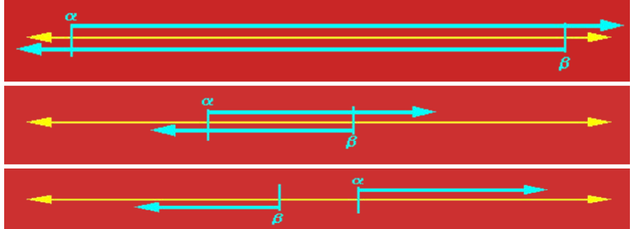

#

## 逻辑与推理

### **命题逻辑**

逻辑与推理是人工智能的核心问题
逻辑推理是基于知识的操作
符号 ai
思维链

### **谓词逻辑**

### **知识图谱推理**

#### 基本概念

- 知识图谱可视为包含多种关系的图
- 可将知识图谱中任意两个相连节点及其连接边表示成一个三元组
- inference:通过机器学习等方法对知识图谱所蕴含的关系进行挖掘
- 可利用一阶谓词来表达刻画知识图谱中节点之间存在的关系

#### 归纳学习

- **归纳逻辑程序设计算法 inductive logic programming**
  - 机器学习与逻辑程序设计交叉领域
  - 使用一阶谓词逻辑进行知识表示，通过修改和扩充逻辑表达式对现有知识归纳，完成推理任务。
  - 作为 ilp 的代表性方法，foil 通过序贯覆盖实现规则推理

#### 知识图谱推理：foil

- 推理思路：从一般到特殊。逐步给目标谓词添加前提约束谓词，知道所构成的推理规则不覆盖任何反例。
- 给定目标谓词，foil 算法从实例（正 反 背景样例）出发，不断测试所得到的推理规则是否还包含反例，一旦不包含负例，则学习结束，展示了归纳学习的能力

#### 知识图谱推理：路径排序

> 将实体之间的关联路径作为特征，来学习目标关系的分类器

- **特征抽取**：生成并选择路径特征集合。生成路径的方式有：随机游走 广度优先 深度优先
- **特征计算**：计算每个训练样例的特征值
- **分类器训练**：根据训练样例的特征值，为目标关系训练分类器。当训练好分类器后，即可将该分类器用于推理两个实体之间是否存在目标关系

wiki

### 因果推理

#### 辛普森悖论

> 在总体样本上成立的某种关系在分组样本里可能不成立

#### 有向无环图

- 对于任意的 dag,模型中 d 个变量的联合概率分布由每个节点与其父节点之间的条件概率的乘积给出$P(child|parentss)$
- 一个有向无环图唯一的决定了一个联合分布
- 一个联合分布不能唯一决定有向无环图

#### D-分离

> 用于判断集合 A 中变量是否与集合 B 中变量相互独立

## 搜索与求解

### 对抗搜索

- 也称博弈搜索 adversarial search game search
- 在一个竞争的环境中，智能体之间通过竞争实现相反的利益，一方最大化这个利益，另一方最小化这个利益
- 讨论在确定的、全局可观察的、竞争对手轮流行动、零和游戏下的对抗搜索 zero-sum.属于非合作博弈

#### minimax 算法

- 给定一个游戏搜索树，minimax 算法通过每个节点的 minimax 值来决定最优策略
- complete,optimal,时间复杂度：$O(b^m)$m 为游戏树的最大深度，在每个节点存在 b 个有效走法；空间复杂度：$O(b*m)$深度优先
- 优点：
  - 是一种简单有效的对抗搜索手段
  - 在对手也尽力而为前提下，算法可返回最有结果
- 缺点：
  - 如果搜索树极大，则无法在有效时间内返回结果
- 改善：
  - alpha-beta 剪枝减少搜索节点
  - 对节点进行采样，而非逐一搜索阿蒙

#### $\alpha$-$\beta$剪枝搜索

- $\alpha$ $\beta$初始值分别设置为 **-∞**到 **∞**
- $\alpha$为可能解法的最小下界
- $\beta$为可能解法的最大上界
- 每个节点由两个值 a 和 b,两者一直变化，若 a>b,则该节点后续节点可剪枝
- 继承与更新上一个节点
- 看题吧

#### 蒙特卡洛树搜索

##### 单一状态蒙特卡洛规划：多臂赌博机

- 单一状态，k 种行动，k 个摇臂，
- 每次以随机采样形式采取一种行动 a,随机拉动第 K 个赌博机的臂膀，得到 r(s,a_k)的回报
- 问题：下一次要拉动哪个赌博机的臂膀，才能获得最大汇报呢
- 是一种序列决策问题，这种问题需要在利用和探索之间保持平衡
- 悔值函数表示了在第 t 次对赌博机操作时，假设知道哪个赌博机能够给出最大奖赏，则将得到的最大奖赏减去实际操作第 I_t 个赌博机所得到的奖赏，将 n 次操作的差值加起来，就是悔值函数的结果
- 很明显，问题求解的目标为最小化悔值函数的期值，智能体所采取的策略越优，收益越高，悔值函数值越小

##### $\epsilon$-贪心算法

- 以 1-$\epsilon$的概率选择在过去摇动赌博机臂膀种所得平均收益分数最高的赌博机进行摇动
- 以$\epsilon$的概率随机选择一个赌博机进行摇动

#### 上限置信区间

- 在 t 时刻，ucb 算法一般会选择具有如下最大值的第 j 个赌博机：
  $$UCB=\avgX_j +C*\sqrt{2Inn/n_j}$$

  其中 x 为第 j 个赌博机在过去时间内所获得的平均奖赏值，n_j 是过去时间内拉动第 j 个赌博机臂膀的总次数，n 是拉动所有赌博机的总次数。c 是一个平衡因子，决定是偏重搜索还是片中利用

#### 蒙特卡洛树搜索 （Monte-Carlo Tree S）

- 用于游戏树的搜索方法，包括了四个步骤

## 监督学习

### 机器学习基本概念

#### ：从数据中学习知识

- 原始数据中提取特征
- 学习映射函数 f
- 通过映射函数 f 将原始数据映射到语义空间，即寻找数据和任务目标之间的关系。

#### 分类

- 监督学习：数据有标签，一般为回归或分类等任务
- 无监督学习：数据无标签，一般为聚类或若干降维任务
  |
  |
  以上可统称为半监督学习

- 强化学习：序列数据决策学习，一般为与从环境交互中学习

#### 监督学习的重要元素

- 标注数据：**学什么**，标识了类别信息的数据
- 学习模型：**如何学**，如何学习得到映射模型
- 损失函数:**学到否**，如何对学习结果进行度量

#### 损失函数

#### 训练数据和测试数据

#### 经验风险和期望风险

### 回归分析

- 分析不同变量之间存在的关系
- logistic 回归

### 决策树

- 是一种通过树形结构来进行分类的方法。在决策树中，树形结构的每个非叶子节点表示对分类目标在某个属性上的一个判断，每个分支代表基于该属性做的一个判断，最后树形结构中每个叶子节点表示的是一种分类结果，决策树可以看作是一系列以叶子节点为输出的决策规则。

#### 信息熵

K 个信息，组成了集合样本 D,记第 k 个信息发生的概率为$p_k$(1\<k\<K)等于，如下定义这 K 个信息的信息熵：
$$E(D)=-\sum_{k=1}^{K}p_klog_2p_k$$
熵值越小，表示 D 包含的信息越确定，纯度越高，所有的$p_k$累加起来的和为 1.

#### 信息增益

$$Gain(D,A)=Ent(D)-\sum_{i=1}^{i=n}{|D_i|/|D|}Ent(D_i)$$

a 为选择的属性

#### 课上练习 id3 算法

- step 1:计算出集合 D 的总信息熵
- 计算每个属性的信息熵
- 计算每个属性的信息增益
- 选择信息增益大的作为第一个属性

### 线性区别分析（linear discriminant analysis,LDA）

- 一种基于监督学习的降维方法，也称 fisher 线性区别分析
- 利用类别信息，将高维度数据样本线性投影到一个低维空间
- 类内方差小，类间间隔大

#### 符号定义

$m_i$为第 I 类样本的均值向量，

- $\sum_i$为第$i$类样本的协方差矩阵，定义为$$\sum_i=\sum_{s∊X_i}(x-m_i)(x-m_i)的转置$$

#### 二分类问题

- 类间散度矩阵 sb:衡量两个类别均值点之间的分离程度
- 类内散度矩阵 sw：衡量每个类别中数据点的分离程度
- 拉格朗日乘法……

#### 线性判别分析的降维步骤

- 计算数据样本集中每个类别样本的均值
- 计算类内散度矩阵$S_w$和类间散度矩阵$S_b$
- 根据公式求解所对应前 r 个最大特征值所对应的特征向量，构成矩阵$W$
- 通过矩阵 W 将每个样本映射到低维空间，实现特征降维

### Ada boosting,自适应提升

- 对于一个复杂的分类任务，可以将其分解为若干子任务，然后将若干子任务完成方法综合，最终完成该复杂任务
- 将若干分类器组合起来，形成一个强分类器

#### 计算学习理论

- 图灵可停机可计算
- 霍夫丁不等式：当 n 足够大时，全国人口收视率与样本人口收视率差值超过误差范围 μ 的概率非常小
- 概率近似正确（PAC），对于统计收视率这样的任务，可以用不同的采样方法来计算，这就是概率近似正确要回答的问题，如果得到完成任务的若干弱模型，是否可以将这些弱模型组合起来，形成一个强模型，使其误差很小呢
- 在 pac 背景下，有强可学习模型和弱可学习模型，强可学习和弱可学习是等价的，也就是说，如果已经发现了弱可学习算法，可将其提升（boosting）为强可学习算法。ada boosting 即为这种方法，具体而言，它是将一系列弱分类器组合起来，构成一个强分类器

#### 思路描述

该算法中两个核心问题：

1. 在每个弱分类器学习过程中，如何改变训练数据的权重：提高在上一轮中分类错误样本的权重。
2. 如何将一系列弱分类器组合成强分类器:通过加权多数表决方法来提高分类误差小的弱分类器的权重，使其在最终分类中起到更大的作用。同时较少分类误差大的弱分类器的权重，让其在最终分类中仅起到较小作用。

#### 算法描述

##### 数据样本权重初始化

给定包含 N 个标注数据的训练集合
该算法将从这些标注数据出发，训练得到一系列弱分类器，并将这些弱分类器线性组合得到一个强分类器

1. 初始化每个训练样本的权重
2. 迭代的利用加权样本训练弱分类器并增加错分类样本权重
3. 以线性加权形式组合弱分类器

##### 第 m 个弱分类器训练

迭代的利用加权样本训练弱分类器并增加错分类样本权重

##### 弱分类器组合成强分类器

#### 算法解释

错误率越小的弱分类器会赋予更大的权重
在每一轮学习过程中，该算法均在划重点（重视当前尚未被正确分类的样本）

#### 回归与分类的区别

均是学习将输入变量映射到输出变量的潜在关系模型

回归分析中：学习一个函数将输入变量映射到连续输出空间，离散（分类模型）

### 支持向量机（--不考--）

通过结构风险最小化来解决过学习问题。
一个两类分类问题的最佳分类平面。途中存在多个可将样本分开的超平面，支持向量机学习算法会去寻找一个最佳超平面，使得每个类别中距离超片面最近的样本点到超平面的最小距离最大

#### 线性可分 支持向量机

寻找一个最优的超平面，其方程为$\textbf{w}^Tx+b=0$
这里的 **w** 为向量，超平面的法向量,与超平面的方向有关
b 为偏置项，是一个标量，其决定了超平面与原点之间的距离

#### 用高维空间映射解决线性不可分

把数据映射到线性可分的高维空间

### 生成学习模型

生成学习方法从数据中学习联合概率分布`P(X,C)`,然后求出条件概率分布 P(C|X)作为预测模型

#### 常见的生成模型

- 朴素贝叶斯
- 隐马尔可夫模型
- 隐迪利克雷分布

#### 常见的判别性模型：直接学习后验条件概率

- 线性回归
- 决策树
- 支持向量机
- 都为监督学习

## **无监督学习**（重点）

- 重要因素： 数据特征，相似度函数

### K 均值聚类

- 输入：n 个数据（无任何标注信息）
- 输出:k 个聚类结果
- 目的：将 N 个数据聚类到 k 个集合（类簇）

#### 算法描述

- n 个 m 维数据，两个 m 维数据之间的欧氏距离为……，聚类集合数目 k
- 问题：如何将 n 个数据依据其相似度将他们分别
  聚类到 k 个集合，使得每个数据金属与一个聚类集合。

#### kmeand 聚类算法：初始化

- 第一步初始化聚类质心,k 个聚类质心

#### 对数据进行聚类

- 第二步：将每个待聚类数据放入唯一一个聚类集合中
  计算带聚类数据$x_i$和质心$c_j$之间的欧氏距离$d(x_i,c_j)$(i 为 1 到 n,j 为 1 到 k)
  - 将每个 x_i 放入与之距离最近聚类质心所在聚类集合中

#### 更新聚类质心

- 第三步：根据聚类结果，更新聚类质心
  根据每个聚类集合所包含的数据，更新该剧类集合质心值，即$c_j=\frac{\sum_x_i∈G_j x_i}{|G_j|}$

* 第四步：算法循环迭代，直到满足条件
  - 在新聚类质心基础上，根据欧式距离大小，将每个带聚类数据放入唯一一个聚类集合中
  - 根据新的聚类结果，更新聚类质心
  - 聚类迭代满足如下任意一个条件，则聚类停止：
    - 已经达到了迭代次数上线
    - 前后两次迭代满中，聚类质心基本保持不变

#### kmeans 聚类的另一个视角：最小化每个类簇的方差

- 方差：用来计算变量与样本平均值之间的差异

* 欧氏距离与方差量纲相同
* 最小化每个类簇方差将使得最终聚类结果中每个聚类集合中所包含数据呈现出来差异性最小

#### 不足

- 需要事先确定聚类数目：很多时候我们并不知道数据应被聚类的数目
- 需要初始化聚类质心：初始化聚类中心堆聚类结果有较大的影响
- 算法是迭代的，时间开销非常大
- 欧氏距离假设数据每个维度之间的重要性是一样的

#### 应用

- 图像压缩
- 文本分类

### 主成分分析

- 是一种特征降维方法，人类在认知过程中会主动化繁为简
- 奥卡姆剃刀定理：如无必要，勿增实体，即简单有效原理

#### 概念：方差与协方差

- 方差为各个数据与样本均值之差的平方和之平均数

* 方差描述了样本数据的波动程度
* 数据样本的协方差：衡量两个变量之间的相关度$$cov(X,Y)=\frac{\sum_{i=i}^{n}(x_i-E(X))(y_i-E(Y))}{n-1}$$
* 其中 E(X)和 E(Y)分别是 X 和 Y 的样本均值
* 当协方差大于 0，x 和 y 正相关/负相关/不相关（=0）

#### 从协方差到相关系数

- 通过皮尔逊相关系数将两组变量之间的关联度规整到一定的取值范围内（pearson correlation coefficient）$$corr(X,Y)=\frac{cov(X,Y)}{\sqrt{Var(X)Var(Y)}}=\frac{Cov(X,Y)}{θ_x\theta_y}$$
- 皮尔逊相关系数所具有的性质如下：
  - 数刻画了变量 xY 之间的线性相关程度，|corr|越大，两者在线性相关的意义下相关度越大，=1 的充要条件是存在常数 ab，使得 y=ax+b.
  - =0 表示两只不存在线性相关关系
  - 他的相关系数是对称的，即 corr(X,Y)=corr(Y,x)
- 相关性与独立性
  - 如果两者线性不相关，则 corr(x,y)一定为 0，且两者不存在任何线性或非线性关系
  - 不相关是一个比独立要弱的概念，即独立一定不相关，但不相关不一定相互独立，独立指两个变量彼此之间不相互影响

#### 算发动机

- 在数理统计中，方差被经常用来度量数据和其数学期望（均值）之间偏离程度，这个偏离程度反映了数据分布结构
  - 在降维之中，需要尽可能将数据向方差最大方向进行投影，使得数据所蕴含信息没有丢失，彰显个性
- 保证样本投影后方差最大：

* 主成分分析是将 n 维特征数据映射到 l 维空间，去除原始数据之间的冗余性（通过去除相关性手段达到这一目的）
  - 将原始数据向这些数据方差最大的方向进行投影。一旦发现了方差最大的投影方向，则继续寻找保持方差第二的方向进行投影。
  - 将每个数据从 n 维高维空间映射到 l 维低维空间，每个数据所得到的 l 维特征就是使得每一维上样本方差都尽可能大

#### 算法描述

-输入：n 个 d 维样本数据所构成的矩阵 X,降维后的维数 L

- 输出：映射矩阵 W={w_1,……w_l}
- 算法步骤：
  1. 去中心化处理
  2. 计算原始样本数据的协方差矩阵
  3. 对协方差矩阵进行特征值分解，对所得特征根按其值大到小排序
  4. 取前 l 个最大特征根所对应的特征向量组成映射矩阵 W
  5. 将每个样本按照如下方法降维：（x_i）l*d(W)d*l=1\*l

### 特征人脸法

#### 动机

- 是一种应用主成分分析法来实现人脸图像降维的方法，其本质是用一种称为特征人脸的特征向量按照线性组合形式来表达每一张原始人脸图像，进而实现人脸识别。

* 用（特征 ）人脸表示人脸，而非用像素点表示人脸

#### 算法描述

- 输入：n 个 1024 维人脸样本数据构成的矩阵 x,降维后的维数 l
- 输出：映射矩阵 w(w_j 是特征人脸)
- 算法步骤
  特征向量 = 数据的主要“方向”
  特征值 = 每个方向上数据变化“多大”
  特征值分解 = 帮你找出这些方向和大小

#### 人脸识别方法对比

- 特征人脸：使用 L 个特征人脸的线性组合来表达原始人脸数据 x_i
- 聚类表示：用待表示人脸最相似的聚类质心来表示
- 非负矩阵人脸分解方法表示：通过若干特征人脸的线性组合来表达原始人脸数据 x_i,体现了部分组成整体

## 深度学习

### 深度学习历史发展

- 以端到端的方式逐层抽象、逐层学习：通过卷积 池化 误差反向传播等手段，进行特征学习

### **前馈神经网络**

#### 生物学中的神经元

- 基于神经元细胞的结构特性与传递信息的方式，神经科学家 warren mculloch 和逻辑学家 walter pitts 合作提出了 mcculloch-pitts(mcp)模型
- 给定 n 个二值化的输入数据和连接参数，该模型对输入数据线性加权求和，然后使用函数将加权累加结果映射为 0 或 1，以完成两类分类的任务：

### **卷积神经网络**

### **循环神经网络**

## 博弈论相关概念
