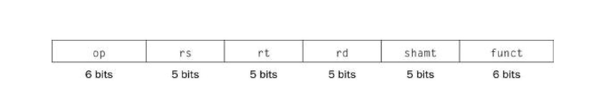
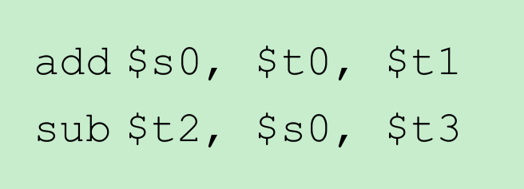

#

## 第一章 计算机抽象及相关技术

### 七个伟大思想

1. 通过抽象简化设计，硬件与软件之间的接口，指令集体系结构；在更高级别隐藏细节，汇编器将汇编语言翻译为机器可以理解的二进制代码，甚至通过创造硬件中没有的符号指令来“扩展”指令集
2. 加速大概率事件 pc 相对寻址 寻址附近的指令，条件分支（2 个设计原则）；大常数操作的立即数寻址；mips 汇编语言的寄存器约定（p77）
3. 通过并行提高性能
4. 流水线（提高了吞吐量率，但不能提高指令的固有执行时间）
5. 预测（处理分支）
6. 存储层次
7. 通过冗余提高可靠性

### 性能

#### 性能评价的不同方法

- 响应时间： 也叫执行时间，是计算机完成某任务所需的总时间，包括硬盘访问、内存访问、i/o 活动、操作系统开销和 cpu 执行时间
- 吞吐率：也叫带宽，性能的另一种度量参数，表示单位时间内完成的任务数量
- 在前几章中性能和执行时间成反比

#### 计算机用户和设计者的角度描述性能的测量的度量标准

都关注 cpu 的执行时间

#### 分析这些度量标准之间的内在联系

#### 提出经典的处理器性能方程式

cpu 时间=指令数*cpi*时钟周期时间，需要用三种因素去衡量性能，任何一个独立的因子都不可以衡量

程序的性能与算法 编程语言 编译器 指令集体系结构有关
时钟频率是 cpu 的

## 第二章 指令： 计算机的语言

### 计算机中指令的表示


硬件设计原则

### mips 中 32 位立即数和地址的寻址

lui
or i

!!! example

        * 远距离的分支转移：
        假设在寄存器`$ s0`和`$s1`值相等时需要跳转，可以使用如下指令:

        ```asm
        beq $s0,$s1,l1

        ```
        用两条指令替换上面的指令，以获得更远的转移距离：

        ```
        bne $s0,$s1,l2
        j l1
        l2:

        ```

1. 立即数寻址
2. 寄存器寻址
3. 基址寻址
4. pc 相对寻址
5. 伪直接寻址

### 总结

#### 三条设计原则

1. 简单源于规整：所有指令长度统一；算术指令总是需要三个寄存器操作数；寄存器字段在每种指令格式的位置相同；
2. 越小越快。 对速度的要求导致 Mips 只有 32 个寄存器而不是更多
3. 优秀的设计需要好的权衡和折中。 mips 在指令中提供更大地址与常数，与保持所有的指令具有相同的长度之间进行折中。

## 第四章 处理器

- 计算机的性能由三个因素决定：指令数由编译器和指令集决定；处理器的实现方式决定了时钟周期长度和 cpi;
- **数据通路** **控制单元**
- 一个简单的 Mips 指令实现：
  - 存储器访问指令
  - 算数逻辑指令
  - 分支指令

### 流水线

- **流水线**：一种实现多条指令重叠执行的技术，与生产流水线类似。
- 5 个步骤：

  1.  从指令存储器中读取指令；
  2.  指令译码的同时读取寄存器，mips 的指令格式允许同时进行指令译码和读寄存器
  3.  执行操作或计算地址
  4.  从数据存储器中读取操作数
  5.  将结果写回寄存器

- 流水线所带来的性能提高是通过增加指令的吞吐率，而不是减少单条指令的执行时间实现的

#### 冒险

> 在下一个时钟周期中下一条指令不能执行

1.  结构冒险

    > 因缺乏硬件支持而导致指令不能再预定的时钟周期内执行的情况

    !!! example
    假设流水线结构中只有一个存储器，而不是两个，那么若有第四条指令，第一条指令在访问存储器的同时，第四条指令将会在同一存储器中预取指令

2.  数据冒险

    > 因无法提供指令所需数据而导致指令不能再预定的时钟周期内完成

    - 原因：一条指令依赖于更早的一条还在流水线中的指令造成的

    !!! example

          
         减法指令要用到加法指令的和，加法指令知道第五步才能返回它的结果

    - 解决方法：**前推（forwarding）**或者**旁路(bypassing)**:从内部缓冲器而非程序可见的寄存器或存储器中提前取出数据。
      - 前推：将结果从前面的指令直接发送到后面的指令
      - 旁路：把寄存器堆中的结果直接传递到需要的单元中

    * **取数-使用型数据冒险（load-use data hazard）**:一种特殊的数据冒险，指当 load 指令要取得数还没取回来是其他指令就需要使用的情况。
      - load 指令，所需得数据需要在流水线得第四级完成后生效；
      - **流水线阻塞**（pipeline stall）:bubble;
      - 如何避免？采用硬件上的检测和阻塞；在软件上重新安排代码顺序，以避免取数=使用型数据冒险。

3.  控制冒险

    > 也称分支冒险。因为取到的指令并不是所需要的（或者说指令地址的变化并不是流水线所预期的）而导致指令不能再预定的时钟周期内执行
    > 决策指令依赖于一条指令的结果，而其他指令正在执行中。

    - 解决方法：
      - 阻塞（stall）:穿行
      - 分支预测：
        > 预测分支结果并立即沿预测方向执行，而不是等真正的分支结果确定后才开始执行。预测一些分支发生而预测另一些分支不发生。

#### 流水线数据结构与通路

- 更新状态：寄存器堆，存储器 ,pc

#### 加入控制

- 最后三级需要加
- 9 个
- 旁路单元控制 alu 多选器，用相应的流水线寄存器的值代替通用寄存器的值（算术运算）
- 冒险检测单元控制 pc 和 if/id 流水线寄存器的写入，以及在实际控制信号与全 0 中进行选择的多选器。load-use 为真，会阻塞并清除所有的控制字段（数据传输）

#### 小结

流水线是一种在顺序指令流中开发指令间并行性的技术。与多处理器编程相比，其优势在于它堆程序员是不可兼得。
