#

## 1 基本概念

### 1.1 病毒和木马

- **病毒**：_自我执行_：将自己的代码置于另一个程序的执行路径；_自我复制_：可能受病毒感染的文件副本替换其他可执行文件。

- **蠕虫 worm**:利用网络进行复制和传播，**自包含**的程序，能传播自身功能的拷贝或自身的某些部分到其他的计算机系统中
- 普通病毒与蠕虫病毒的区别
  - 复制方式：普通病毒需要传播受感染的驻留文件来进行复制，而蠕虫不使用驻留文件即可在系统之间进行自我复制
  - 普通病毒的传染能力主要是针对计算机内的文件系统而言，而蠕虫病毒的传染目标是互联网内的所有计算机。
- 两个经典的蠕虫病毒
  - 震网：(stuxnet)攻击真实世界基础设施，（能源）核电站、睡吧、国家电网
  - 比特币勒索：wannacry(wanna decryptor)微软视窗
- **木马（Trojan Horse）**表面上是有用的软件，实际目的却是危害计算机安全并导致严重破坏的计算机程序。
  - 隐蔽性
  - 非授权性：一旦控制端与服务端连接后，控制端将窃取到服务端的很多操作权限，如修改文件、修改注册表、控制鼠标、键盘、窃取信息等
  - 木马与病毒的区别
    - **木马不具有传染性，它并不能像病毒那样复制自身，业并不刻意地去感染其他文件，它主要通过将自身伪装起来，吸引用户下载执行**
    - **木马一般主要以窃取用户相关信息或隐蔽性控制为主要目的**，病毒破环你的信息，而木马窥视你。

### 1.2 软件漏洞

#### 1.2.1 软件安全漏洞

- **软件缺陷 bug**:程序员编的软件造成的问题导致软件崩溃不能运行
- **软件漏洞**：软件中存在的一些问题可以在某种情况下被利用来对用户造成恶意攻击，如给用户计算机安装木马病毒，或者直接盗取用户计算机上都秘密信息，这时软件的问题不再是 bug 而是软件安全漏洞了

- **电脑肉鸡**：**受别人控制的远程电脑**，植入木马

#### 1.2.2 漏洞分类

##### 0day 漏洞

> **还处于未公开状态的漏洞**

- **是当前网络战中的核武器**

  - !!! example 入侵伊朗的震网病毒

        * **微软操作系统**中的至少4个漏洞，3个全新的0day漏洞
        * 西门子公司的**数据采集**和**监控系统wincc系统**的**2个漏洞**

##### 1day 漏洞

> **发布补丁时间不长的漏洞**

- 已公开漏洞：**厂商已经发布补丁或修补方法，大多数用户都已打过补丁的漏洞**

#### 1.2.3 漏洞产业链

- **网络黑客产业链有很多环节，或者说分上中下游，其中每一个环节都有其利润所在，相互协作，上下游之间为供需关系**

- 上游：技术开发；中游：执行，生产，实施病毒传播，信息窃取，网络攻击；下游：销赃，销售

### 1.3 漏洞库

#### 1.3.1 CVE

> 美国资助。common vulnerabilities and exposures

- 行业标准
- **实现了安全漏洞命名机制的规范化和标准化**

#### 1.3.2 NVD

> national vulenrabilities database

- 美国国家标准与技术局 NIST
- **收录三个漏洞数据库的信息**，cve,us-cert,cert
- 数据量最大，条目最多的漏洞数据库之一

#### 1.3.3 CNNVD

> China National Vulnerability Database of information security

- **中国信息安全测评中心**

#### 1.3.4 CNVD

> **国家信息安全漏洞共享平台**

- 联合国内重要信息系统单位，基础电信运营商、网络安全厂商建立的信息安全漏洞信息共享知识库

### 1.4 渗透测试

#### 1.4.1 基本概念

> **通过模拟恶意黑客的攻击方法，来评估计算机网络系统安全的一种评估方法**
> 渗透人员在不同位置（内外网）利用各种手段对某个特定网络进行测试，以期发现和挖掘系统中存在的漏洞，然后输出渗透测试报告，并交给网络所有者。

- 两个显著特点：
  - 渐进，逐步深入
  - 不影响业务系统正常运行

#### 1.4.2 渗透测试方法

- 黑箱测试：zero-knowlege testing,信息获取来自 dns,web,email 及各种公开对外的服务器
- 白盒
- 隐秘：对被侧单位而言，极少数人知晓

## 2 堆栈基础

编制程序的四个步骤：编辑 编译 链接 运行

### 2.1 内存区域

> 一个<u> **进程**</u>可能被**分配到不同的内存区域去执行**

-四类：代码区，静态数据区，堆区，栈区

#### 堆区和栈区

- 栈：**主要存储函数运行时的局部变量、数组**，栈变量在使用时不需要额外的申请操作，系统栈会根据函数中的变量声明自动为其预留内存空间，同样，栈变量的释放也无需程序员参与由系统栈跟随函数调用的结束自动回收。
- 栈区是向**低地址扩展**的数据结构，是一种先入后出的特殊结构，栈顶的地址和栈的最大容量是系统预先规定好的，在 windows 下，栈的默认大小是 2m，如果申请的空间超过栈的剩余空间时，将会提示溢出
- **堆区是一种程序运行时动态分配的内存，**所谓动态，就是说所需内存的大小在程序设计过大无法在栈区分配，需要在程序运行的时候参考用户的反馈
- 堆区在使用的时候需要程序员**使用专有的函数进行申请**，如 c 语言的 malloc 函数，c++语言的 new 函数，它是**向高地址扩展的数据结构，堆的大小受限于计算机的虚拟内存**

##### 堆与栈的区别

- 申请方式：栈：由系统自动分配，例如：声明一个局部变量 Int b,系统自动在栈中为 b 开辟空间；堆：需要程序员自己申请，并指明大小，在 c 中 malloc 函数，如`p1=(char *) malloc(10)`
- 申请效率：栈由系统自动分配，速度较快，但程序员无法控制；堆是由程序员分配的内存，一般速度比较慢，并且容易产生内存碎片，不过用起来方便

#### 堆结构

堆包括堆块和堆表两部分

- **堆块是堆的基本组织单位，包括两个部分，即块首和块身**。块首是用来标识这个堆块的信息，例如块大小，空闲还是占用；块身紧随其后，是最终分配给用户使用的数据区。

- **堆表一般位于整个堆区的开始位置，用于索引堆区中所有堆块的重要信息**，包括堆块的位置，堆块的大小，空闲还是占用等。堆表的数据结构决定了整个堆区的组织方式，是快速检索空闲块，保证块分配效率的关键，堆表在设计的时候，可能会采用平衡二叉树等高效数据结构用于优化查找效率。现代操作系统的堆表往往不止一种数据结构

##### （1）堆块

- **指向堆块的指针或者句柄，指向的是块身的首地址**。也就是，我们使用函数申请得到的地址指针都会越过 8 字节的块首，直接指向数据区，块身。
- **堆块的大小包括块首在内**，如果申请 32 字节，实际会分配 40 字节
- **堆块的单位是 8 字节**

##### （2）堆表

- **占有态的堆块被使用他的程序索引，而堆表只索引所有空闲态的堆块**。其中，最重要的堆表有两种：**空闲双向链表 freelist(简称空表)和快速单向链表 lookaside**.快表是为了加速堆块分配而采用的堆表，从来不发生堆块合并，由于堆溢出一般不利用快表，故不作详述
- 空表包括**空表索引**和**空闲链块**两个部分。空表索引也叫空表表头，是一个大小为 128 的指针数组，该指针的每一项包括两个指针，用于标识一条空表

##### （3）堆块的分配和释放

> 以空表为例，来讲解堆块的分配、释放和合并

- **堆块分配**：依据既定的查找空闲堆块的策略，找到合适的空闲堆块之后，将其状态修改为占用态，把它从堆表中卸下、返回一个指向堆块块身的指针给程序使用。
  - **普通空表分配时首先寻找最优的空闲块分配，**若失败，一个稍大些的块会被用于分配。这种**次优**分配发生时，**会先从大块中按请求的大小精确地“割”出一块进行分配，然后给剩下的部分重新标注块首，链入空表**。也就是说，**空表分配存在找零钱的情况。**
  - 零号空表中按照大小升序链着大小不同的空闲块，故在分配时先从 free[0]反向查找最后一个块（即最大块），看能否满足要求，如果满足要求，再正向搜索最小能满足要求的空闲堆块进行分配。
- **堆块释放**。操作包括将堆块状态由占用态改为空闲态，链入相应的堆表。所有释放的堆块都链入相应的表尾
- **堆块合并**。堆块的分配和释放可能引发堆块合并。即当堆管理系统发现两个空闲堆块相邻时，就会进行堆块合并操作。合并包括的几个动作：将堆块从空表中卸下、合并堆块、修改合并后的块首、链接入新的链表

### **函数调用**

- 函数调用时将借助系统栈来完成函数状态的保存和恢复

* **当函数被调用时，系统栈会为这个函数开辟一个新的栈帧，并把它压入栈中**。**每个栈帧对应着一个未运行完的函数**。从逻辑上讲，栈帧就是一个函数的执行环境：函数参数、函数局部变量、函数执行完后返回到哪里等等。
* 当函数返回时，系统栈会弹出该函数所对应的栈帧

#### 函数调用的步骤

1. 参数入栈：从右向左依次压入系统栈
2. 返回地址入栈：将当前代码区调用指令的下一条指令地址压入栈中，供函数返回时继续执行
3. 代码区跳转：处理器
4. 栈帧调整：
   1. 保存当前栈帧状态值，以备后面恢复本栈帧时使用
   2. 将当前栈帧切换到新栈帧

### 常见寄存器和栈帧

概念

- **我们长看到的 32 位 cpu，63 位 cpu 这样的名称，其实指的就是寄存器的大小**
- 两个特殊的寄存器用于标识位于**系统栈顶端的栈帧**：
  - esp:**栈指针寄存器**永远指向系统栈最上面一个栈帧的栈顶
  - ebp:**基址指针寄存器**永远指向系统栈最上面一个栈帧的底部
- 换句话说，**esp 和 ebp 之间的内存空间为当前栈帧，ebp 标识了当前栈帧的底部，esp 标识了当前栈帧的顶部**
- 在函数栈帧中，一般包含以下几类重要信息：
  - 1. 局部变量
  - 2. 栈帧状态值，保存前栈帧底部，前栈帧的顶部可以通过堆栈平衡计算得到？，用于在本帧被弹出后恢复出上一个栈帧
  - 3. 函数返回地址。保存当前函数调用前的断点信息，也就是函数调用前的指令位置，以便在函数返回时能够恢复到函数被调用前的代码区中继续执行指令

* **除了与栈相关的寄存器，另外一个重要的寄存器**：
  - **指令寄存器：**，其内存放着一个指针，<u>该指针永远指向下一条等待执行的指令地址，</u>,可以说**如果控制了 eip 寄存器的内容，就控制了进程**

- 在函数调用过程中：保存当前栈帧状态值，已被后面恢复本栈帧时使用（ebp 入栈）；将当前栈帧切换到新栈帧（esp 赋值给 ebp,更新栈帧底部）

### 主要寄存器

#### 数据寄存器

> **用来保存操作数和运算结果等信息**

- eax:累加器。（accumulator），**通常用于存储函数的返回值**
- ebx:基地址寄存器：作为存储器指针，访问存储器
- ecx：count,循环次数，位操作移位
- edx:data;乘除运算可作为默认操作数参与运算，也可用于存放 i/o 的端口地址

#### 变址寄存器

> **变址寄存器主要用来存放操作数的地址，用于堆栈操作和变址运算中计算操作数的有效地址**

- esi:源地址指针
- edi:目的地址指针

#### 指针寄存器

- 寄存器 ebp 和 esp，**主要用于存放堆栈内存储单元的偏移量，用他们来实现多种存储器操作数的寻址方式**，为以不同的地址形式访问存储单元提供方便；
- ebp,通过它减去一定的偏移值，来访问栈中的元素；
- esp 时钟指向栈顶

#### 段寄存器

- **段寄存器是根据内存分段的管理模式而设置的，内存单元的物理地址由段寄存器的值和一个偏移量组合而成**

* 融合变址寄存器，在很多字符串操作指令中，ds:dsi 指向源串而 es:edi 指向目标串

#### 指令指针寄存器

- **IR**,instruction register,**是临时放置从内存里面取得的程序指令的寄存器，用于存放当前从主存储器读出的正在执行的一条指令**
- **指令指针寄存器用英文简称为 IP(isntruction pointer)**,**指令指针寄存器存放下次要执行的指令在代码段的偏移量**
- **32 位 cpu 把指令指针扩展到 32 位，并记作 EIP**

#### 标志寄存器

- **标志寄存器在 32 位操作系统中大小是 32 位的，也就是说，它可以存 32 个标志**，重点认识三个标志寄存器
- **Z-Flag(零标志)**：设为 0 或 1
- **O-falg(溢出标志)**：
- **C-falg**(进位标志)

## 汇编语言

### **内存寻址方式**

- **寻址方式就是处理器根据指令中给出的地址信息来寻找有效地址的方式，是确定本条指令的数据地址以及下一条要执行的指令地址的方法。**
- **当采用地址指定方式时，形成操作数或指令地址的方式称为寻址方式**

#### 指令寻址（两种）

1. **顺序寻址方式**：通常需要使用指令计数器来完成顺序指令寻址，在**x86**架构称为 Ip 指令指针寄存器，在**arm**或**c51**架构中也称为程序计数器 pc
2. **跳跃寻址方式**：下条指令的地址吗不是由程序计数器给出，而是由本条指令给出，程序跳跃后，按新的指令地址开始顺序执行，跳跃的结果是当前指令修改 pc 程序计数器的值，所以下一条指令仍是通过程序计数器 pc 给出

#### 操作数寻址

1. 立即寻址：**指令的地址字段给出的不是操作数的地址，而是操作数本身，这种寻址方式称为立即寻址**，`mov cl,05H`
2. 直接寻址：**由于操作数的地址直接给出而不经过某种变换，所以称这种寻址方式位直接寻址方式**`mov al ,[3100H]`表示将地址[3100H]中的数据存储到 al 中
   - 通常情况下，操作数放在数据段中，所以，默认情况下，操作数的物理地址由数据段寄存器 ds 中的值和指令给出的有效地址直接形成，上述指令中，操作数的物理地址应为 ds:31000H
   - **但是，如果在指令中使用段超远前缀指定使用的段，则可从其他段中取出数据，如:mov al ,es:[3100H] ? 所以他也是直接寻址吗**
3. 间接寻址：**指令地址字段中的形式地址不是操作数的真正地址，而是操作数地址的指示器**，或者说，此形式地址单元的内容才是操作数的有效地址。`mov [bx],12H`这是一种寄存器间接寻址，bx 寄存器存操作数的偏移地址，操作数的物理地址应该时 ds:bx,表示将 12H 这个数据存储到 ds:bx 中
4. 寄存器寻址，操作数放在寄存器中，通过指定寄存器来获取数据。`mov bx ,12H`
5. 相对寻址：操作数的有效地址是一个基址寄存器或变址寄存器（si,di）的值加上指令中给定的偏移量之和。`mov ax,[di+1234H]`操作数的物理地址应该是 ds:di+1234H,与间接寻址相比，可以认为**相对寻址是在间接寻址基础上，添加了偏移量**
6. 基址变址寻址：**将基址寄存器的内容，加上变址寄存器的内容而形成操作数的有效地址**`mov eax,[ebx+esi]`
7. 相对基址变址寻址:**在基址变址寻址方式融合的相对 1 寻址方式，即增加偏移量**`mov eax,[ebx+esi+1000H]`

### 主要指令

#### 数据传送指令

- mov;xchg;push;pop;pushf,popf,pusha,popa;lea,lds,les;

#### 位运算指令集

and,or,xor,not,

#### 算术运算指令

#### 程序流程控制指令集

- cmp:比较两个值是否相等，相等则设置 zf 为 1,若 A=B，则 A-B=0，因此 ZF=1

* call:将当前 eip 中的指令地址压入栈中，并调用 call 后的子程序

### 函数调用示例

## 调试分析工具

### PE 文件格式

### 虚拟内存

**计算法**虚拟地址=基址+相对
**lordpe**获得信息地址界面熟悉

### 调试分析工具

### PE 文件代码注入示例

### 软件破解示例

## 软件漏洞

### 溢出漏洞基本概念

- **漏洞也称为脆弱性（vulnerability）**

- 造成缓冲区溢出的根本原因：**缺乏类型安功能的程序设计语言**，**部分函数不对数组边界条件和函数指针引用等进行边界检查，数组和指针都没有自动边界检查**

### 栈溢出漏洞

为什么 why u are here ；
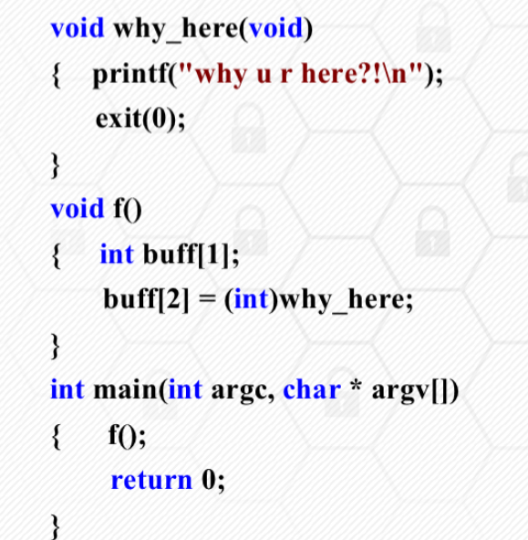

在函数 f 中，所声明的数组长度为 1

返回地址-ebp-buff;

- **返回地址被覆盖**
- **邻接变量被覆盖**
  - 输入的密码为 8 个字符
  - 输入的字符串大于 12345678.因为执行 strcmp 之后要确保 authenticated 的值为 1，其他字节为 0。小端
  - 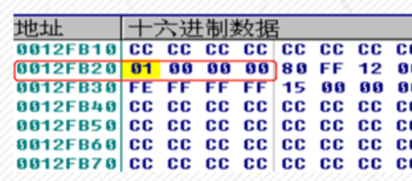

### 堆溢出漏洞

> **覆盖一个目标堆块的块身数据**

堆块的分配 释放

- **dwordshoot** 攻击 原理 能够向任意位置内存写入任意数据的攻击。通过堆溢出覆写一个**空闲堆块**的块首的前向指针和后指针，精心构造一个地址和数据，获得一次向内存构造的任意地址写入一个任意数据的机会

- **堆块的三类操作：**堆块分配、堆块释放、堆块合并。堆空表链的修改。
  - **向链表里链入和卸下堆块**
  - **在 Windows 堆内存分配时会调用函数 rtlallocheap**，该函数从空闲堆链上摘下一空闲堆块，完成双向链表里相关节点的前后指针的变更操作

### 其他溢出漏洞

的原理 特点

#### SEH 攻击

- **通过栈溢出或者其他漏洞，使用精心构造的数据覆盖 seh 链表的入口地址、异常处理函数句柄或者链表指针等，**实现程序执行流程的控制

#### 单字节溢出

程序的缓冲区仅能溢出一个字节，他溢出的一个字节必须与栈帧指针紧挨，就是要求必须是函数中**首个变量**。

### 格式化字符串漏洞

- printf()的第一个参数就是格式化字符串，他来告诉程序将数据以什么格式输出
  **printf()函数特性**

`printf("format",输出表列)`，format 的结构为:% [标志][输出最小宽度][.精度][长度]类型

- 控制 format 参数之后结合**printf()函数特性**就可以进行相应攻击

读
写：%n 给格式化函数输出字符串的函数

#### 格式化字符串漏洞的利用-数据泄露

- **特性一：格式化字符串允许可变参数**
  - 它根据传入的格式化字符串获知可变参数的个数和类型，并根据格式化符号进行参数的输出。如果调用这些函数时，给出了格式化符号传，但**没有提供实际对应参数时**，<u>这些函数会将格式化字符串后面的多个栈中的内容取出作为参数，并根据格式化符号将其输出。</u>
    > %X 以 16 进制形式输出堆栈内容，为%S 则输出对应地址所指向的字符串

#### 格式化字符串漏洞的利用-数据写入 1

- **特性二：利用%n 格式符写入数据**

  > 它的作用是将格式化函数输出字符串的长度，写入函数参数指定的位置

  - `printf("Jamsa%n",&first_count)`，将向整形变量 first_count 处写入整数 5
  - sprintf()函数的作用是**把格式化的数据写入某个字符串缓冲区**
  - 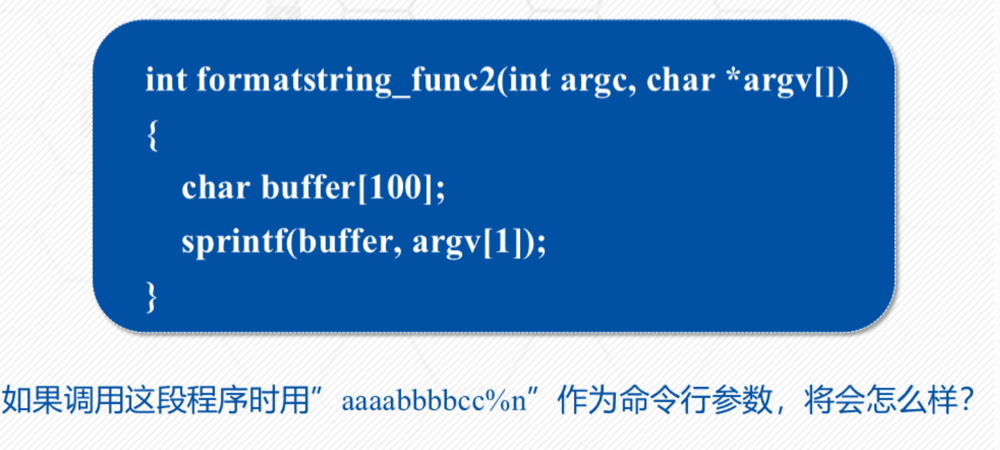
  - 数值 10 被写入地址为 0x61616161 的内存单元
    - 首先，aaaabbbbcc 写入 buffer,然后，从堆栈中取出下一个参数，**并将其当作整数指针使用**，由于调用 sprintf 时没有传入下一个参数，因而**buffer 中的前四个字节被当作参数**，同样可以实现向任意内存写入任意数值

- **特性三：自定义打印字符串宽度**

- **在格式符中间加上一个中间加上一个十进制整数来表示输出的最少位数**，若实际位数多于定义的宽度，则按实际位数输出，若实际位数少于定义的宽度则补以空格或 0.

  ```c
    # include <stdio.h>
    main(){

      int num=66666666;
      printf("Before :num=%d\n",num);
      printf("%100d%n\n",num,&num);
      printf("After:num=%d\n",num);
    }

  ```

### 整数溢出漏洞

> 当对整数进行加、乘等运算时，计算的结果如果大于该类型的整数所表示的范围时，就会发生整数溢出

- 根据溢出原理的不同，可以分为三类：
  - 存储溢出：使用另外的数据类型来存储整型树造成的，大变量放入小变量
  - 运算溢出：对整形变量进行运算时没有考虑到其边界范围
  - 符号问题：有符号和无符号。忽略了符号，在进行安全检查判断的时候就可能出现问题

### 攻击 c++虚函数

- **虚函数的入口地址被统一保存在虚表中**
- **对象在使用虚函数时，先通过虚表指针找到虚表，然后从虚表中取出最终的函数入口地址进行调用**
- **虚表指针保存在对象的内存空间中，紧接着虚表指针的是其他成员变量；虚函数的入口地址被统一存在虚表中**

* 攻击虚函数：对象使用虚函数时通过调用虚表指针找到虚表，然后从虚表中取出最终的函数入口地址进行调用。如果需表里存储的虚函数指针被篡改，程序调用虚函数时就会执行篡改后的指定地址的 shellcode，发动虚函数攻击

### 其他类型漏洞

#### 1.注入类型

- 分类：
  - **二进制代码注入**：将计算机可以执行的二进制代码注入到**应用程序的执行代码**中
  - **脚本注入**：通过特定的**脚本解释类**程序提交可被解释执行的数据

##### sql 注入

> 将 web 页面的原 url 表单域或数据包输入的参数，修改拼接的 sql 语句传递给 web 服务器，进而传给数据库服务器一致性数据库命令

##### 操作系统命令注入

**大多数 web 服务器都能够使用内置 api 与服务器的操作系统进行几乎任何必须的交互，如 Php 中的 system,exex 和 asp 中的 wscript 类函数**

##### web 脚本语言注入

- 合并了用户提交数据的代码的动态执行
- 根据用户的数据指定的带啊吗文件的动态包含

* soap 协议注入：xml 解释性语言

#### 2.权限类漏洞

- 水平与垂直越权

## 漏洞利用基础

### 漏洞利用概念

#### 概念

- **是指针对已有的漏洞，根据漏洞的类型和特点而采取的相应的技术方案，进行尝试性或实质性的攻击。**

#### 手段

- 96 年的一篇论文《smashing the stack for fun and profit》，演示了如何向进程中植入一段用于获得 shell 的代码，并在论文中称这段**被植入进程的代码为"shellcode"**.现在 shellcode 指的是**广义上的植入进程的代码**

#### 漏洞利用的核心

- **利用程序漏洞去劫持进程的控制权，实现控制流劫持，以便执行植入的 shellcode 或者达到其他的攻击目的**
- 内存错误漏洞，当攻击者掌握后，发起控制流劫持攻击；早期攻击采用代码植入的方式；栈溢出漏洞攻击的目的是**淹没返回地址**

#### exploit 结构

- 漏洞利用要达到攻击目标，要做的工作更多，比如**对应的出发漏洞、将控制权转移到 shellcode**一般均不相同，而且他们通常独立于 shellcode 的代码
- **能实现特定目标的 exploit 的有效载荷，称为 payload**
- 一个经典的比喻，将漏洞利用过程比作导弹发射的过程：**exploit,payload,shellcode 分别是导弹发射装置，导弹和弹头**。导弹除了弹头之外的其余部分用来实现对目标进行定位追踪、对弹头引爆等功能，在漏洞利用中，对应 payload 的非 shellcode 部分
- **exploit 利用漏洞进行攻击的动作；shellcode 用来实现具体的功能；payload 除了包含 shellcode 之外，还需要考虑如何触发漏洞并让系统或者程序去执行 shellcode**

### 覆盖临接变量示例

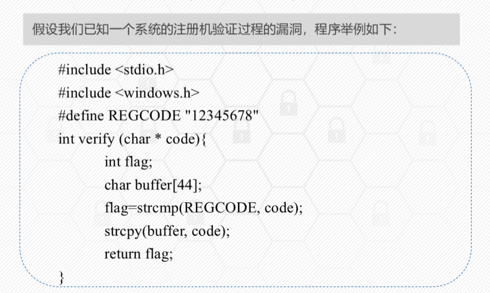
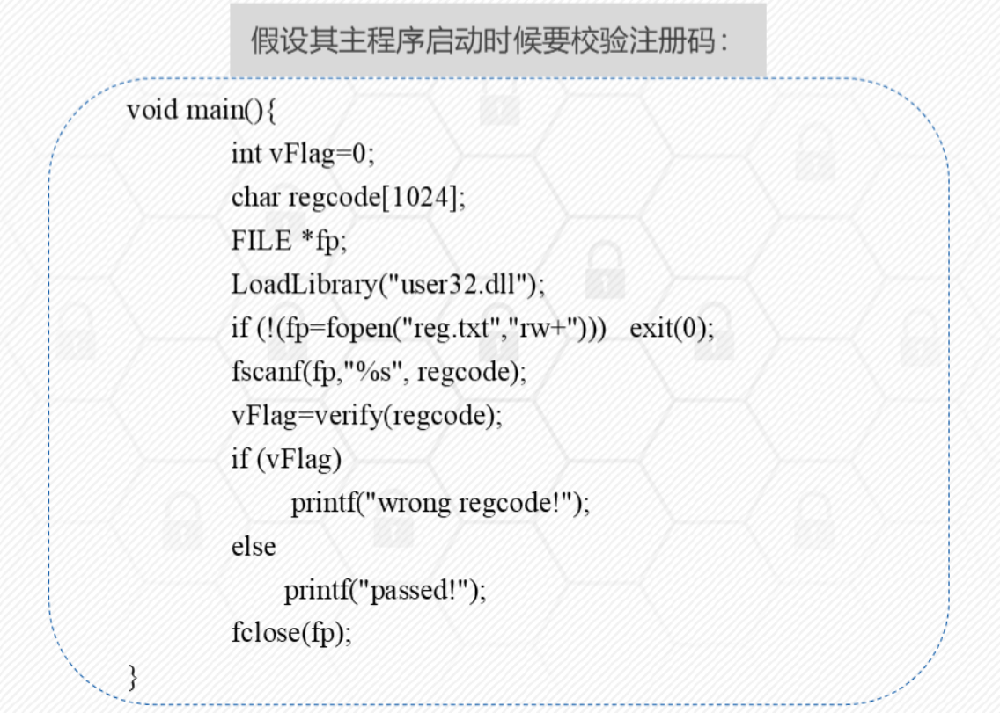
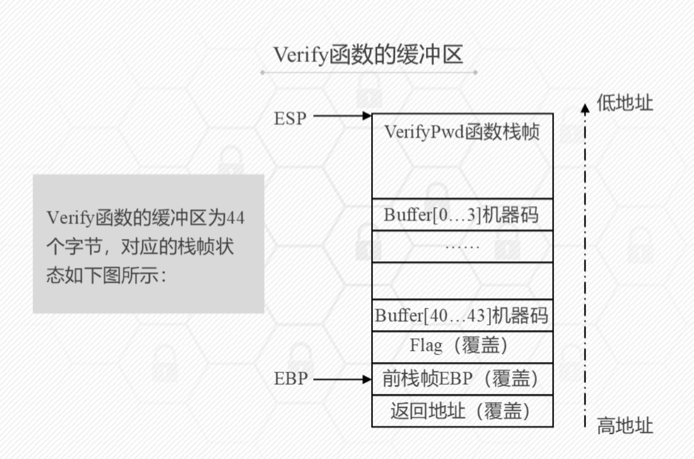

- **利用目标：**利用溢出覆盖临接变量，实现控制流劫持，完成软件破解

* 淹没 flag 状态位，使其变为 0；设计 buffer(44 字节)+1 字节(整数 0)，即向 reg.txt 写入 45 个字节，其中最后一个字节位 0

### shellcode 代码植入示例

- **利用目标：**利用溢出覆盖返回地址，转去执行植入的恶意程序
  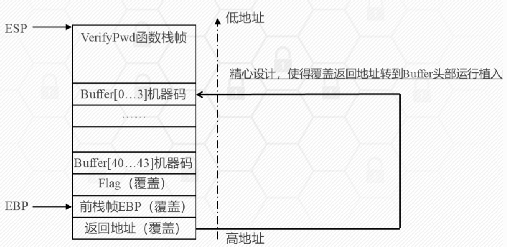

* **植入代码前需要做大量的调试工作**
* 目标：植入一段代码，使其达到可以淹没返回地址，该返回地址将执行一个 messagebox 函数，弹出窗体
* 为了能淹没返回地址，需要在 reg.txt 至少写入 buffer+flag+前 ebp 的字节。
* 让程序弹出一个消息框只需要调用 windows 的 api 函数 messagebox 函数
* 用汇编语言调用 Messageboxa 需要三个步骤

  1. **装载动态链接库 user32.dll**
  2. 在汇编语言中调用这个函数**获得函数的入口地址**
  3. 在调用前需要**向栈中按从右向左的顺序压入**

* 第一步：**获取函数入口地址**：messageboxa 的入口地址可以通过 user32.dll 在系统中加载的基址 messageboxa 在库中的偏移相加得到；也可以用代码来获取相关函数地址
* 第二步：**编写函数调用的汇编代码**
* 第三步：注入 shellcode 代码，**将得到的二进制 shellcode 写入 reg.txt 文件中，并在返回地址写入 buffer 的地址**

### shellcode 编写

#### 编写的难点

1. **对一些特定字符需要转码**，null 字符串的终结，strcpy 等函数造成的缓冲区溢出
2. **函数 api 的定位很困难**

#### 简单编写 shellcode 的方法

1. 用 c 语言书写要执行的 shellcode 代码
2. 转换成对应的汇编代码，对于 push 0;xor ebx ebx
3. 根据汇编代码，找到对应地址中的机器码

### shellcode 编码

#### shellcode 编码必要性

- **字符集的差异**
- **绕过换字符** 0x0D(\r)、0x0A(\n)或者 0x20(空格)
- **绕过安全防护检测**

#### shellcode 编码方法

- **网页 shellcode**:采用**base64 编码**
- **二进制机器代码**：采用类似加壳的思想
  1. 自定义编码（异或、计算、简单加解密）
  2. 精心构造*精简干练的解码程序*，放在 shellcode 开始执行的地方，完成编解码；当 exploit 成功时，shellcode 顶端的解码程序首先运行，它会在内存中将真正的 shellcode 还原成原来的样子，然后执行。

#### 异或编码

- **编码程序是独立的**。选取编码字节时，不可与已有字节相同，否则会出现 0
- 异或 0x44
- 怎么让 eax 记录 shellcode 当前的起始位置？

  ```asm

  call label;
  lable:
  pop eax

  ```

* **call 会执行 push eip**;eip 的值又是下一条指令 pop eax 的地址;pop eax 会将栈顶 eip(自身指令地址)出栈，保存到 eax

## 漏洞利用技术

### windows 安全防护技术

**原理**都要知道

#### 1. ASLR(addressspace layout randomization)

- 通过将系统关键地址随机化，从而使攻击者无法获得需要跳转的精确地址的技术。
- aslr 随机化个关键系统地址包括：pe 文件（exe 文件和 dll 文件）映像加载地址，堆栈基址，对地址，peb 进程环境快和 teb 线程环境快地址等
- 两种方法：操作系统加载时的地址变化和可执行程序编译时的编译器选项

#### 2. GS stack protection

- **编译器针对函数调用和返回时添加保护和检查功能的代码，在函数被调用时，在缓冲区和函数返回地址增加一个 32 位随机数 security_cookie**
- 随即存放，随机产生当进程启动的时候
- 发生栈缓冲区攻击时，对返回地址或其他指针进行覆盖的同时，会覆盖 security_cookie，因此在函数调用结束返回时，对它检查发现变化而来，就会发现缓冲区溢出的操作

#### 3 DEP

> **数据执行保护技术可以限制内存堆栈区的代码为不可执行状态，从而防范溢出后代码的执行**

- 分为软件 dep 和硬件 dep，硬件需要 cpu 的支持，在页表增加一个保护位 nx（no execute）
- 编译器提供了一个链接标志/nxcompat

#### 4 safeseh

- 编译器选项/safeseh，采用该选项编译的程序将 pe 文件中所有合法的 seh 异常处理函数的地址解析出来制成一张 seh 表，放在 pe 文件的数据块中，用于异常处理时进行匹配检查。在该 pe 文件被加载时，将加密后的 seh 函数表地址等信息，放入 ntdll.dll 的 sehindex 结构中
- **在 Pe 文件运行时**，**针对程序的每个异常处理函数检查是否在合法的 seh 函数表中**，**接着要检查异常处理句柄是否在栈上**，两个检测可以防止在堆上伪造异常链和把 shellcode 防止在栈上的情况

#### 5 sehop

- **核心：检测程序栈中所有 seh 结构链表的完整性**
- **seh 结构中异常处理函数的句柄（handle）即处理函数地址必须不在栈上**

### 地址定位技术（3 种）

#### 1. 静态 shellcode 地址的利用技术

- 直接将 shellcode 代码在栈帧中的静态地址覆盖原有返回地址
- 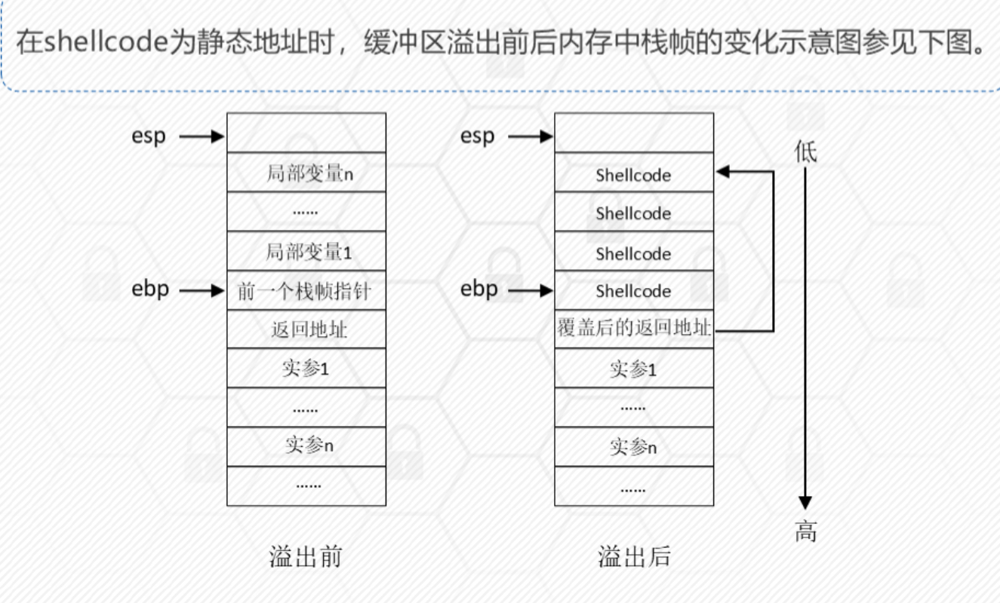

#### 2. 基于跳板指令的地址定位技术

- 原因：一些软件漏洞存在某些动态链接库中，在进程运行时被**动态加载**，因而在下一次被重新装载到内存时，其**在内存中的栈帧地址是动态变化的**。则插入的 shellcode 也时变化的，**此外，若使用 aslr，地址会因引入随机数每次发生变化**
- 使用**esp 寄存器**，在函数调用结束后，被调用函数的栈帧被释放，esp 寄存器中的栈顶指针指向返回地址在内存高地址方向的相邻位置
- 对 shellcode 的动态定位：
  - 1. **找到内存中任意一个汇编指令 jmp esp**,这条指令执行后可跳转到 esp 寄存器保存的地址，下面准备在溢出后**将这条指令的地址覆盖返回地址**
  - 2. 设计好**输入数据**，使缓冲区溢出后，前面的填充内容为任意数据，紧接着**覆盖返回地址的使 jmp esp 指令的地址**，再接着覆盖**与返回地址相邻的高地址位置**并写入 shellcode 代码。
  - 3. 函数调用完成函数返回，根据返回地址中指向的 jmp esp 指令的地址去执行 jmp esp 操作，shellcode 代码被执行
  - 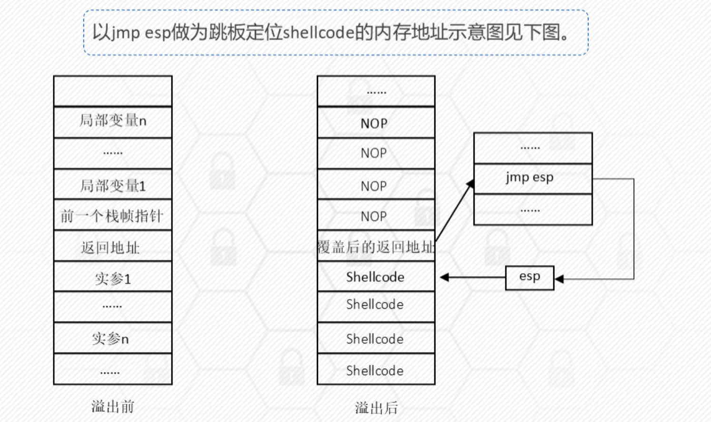
- - **使用 jmp esp 指令作为跳板**

* 也可以使用`mov eax,esp;jmp eax`进入栈区

#### 3. 内存喷洒技术

- **代表是堆喷洒。heap spray**,在 shellcode 的前面加上大量的滑板指令（slide code）,组成一个非常长的注入代码段。然后向系统申请大量空间，并反复用这个注入代码段来填充。攻击者再结合漏洞利用技术，只要使程序跳转到堆中被填充了注入代码的任何一个地址，程序指令就会顺着滑板指令最终执行到 shellcode 代码

### **api 函数自搜索技术**

步骤 定位

#### 引入

- 前面的 shellcode**硬编址的方式来调用相应 api 函数**。编写通用 shellcode,shellcode 自身就必须具备动态的自动搜索 api 函数地址的能力

#### 通用编写逻辑（以 messageboxa 函数调用为例）

kernel32.dll->loadlibraryA->user32.dll->MessageBoxA

1. **定位 kernel32.dll**
2. **定位导出表及函数列表**
3. **遍历函数列表，定位函数**

### **返回导向编程 return-oriented programming**

原理 示例
eax 的值

指令写道 eax 中
pop eax

!!! note
_ 是一种新型的**基于代码复用技术**的攻击，**它从已有的库或可执行文件中提取指令片段，构建恶意代码**
_ 基本思想：借助已存在的**代码块**，这些配件**来自程序已加载的模块；**在已加载模块中找到一些**以 retn 结尾的配件**，把这些配件的地址布置在堆栈上，当控制 eip 并返回时，程序就会跳去执行这些小配件，这些小**配件是在别的模块代码段**，不受 dep 的影响

!!! note 三点总结

        1. rop通过rop链retn实现有序汇编指令的执行
        2. rop链由一个个rop小配件组成，gadets,相当于一个小节点
        3. rop小配件由“目的执行指令+rern指令组成”

!!! example
`???????=>`表示当前返回地址里包含的指令及跳转到该指令处执行

- 基于该漏洞的利用：
  1. **调用相关 api 关闭或绕过 dep 保护**
  2. **实现地址跳转**，直接转向不受 dep 保护的区域里保存的 shellcode 执行
  3. **调用相关 api 将 shellcode 写入不受 dep 保护的可执行内存**，进而配合基于 rop 编写的地址跳转指令，完成漏洞利用
     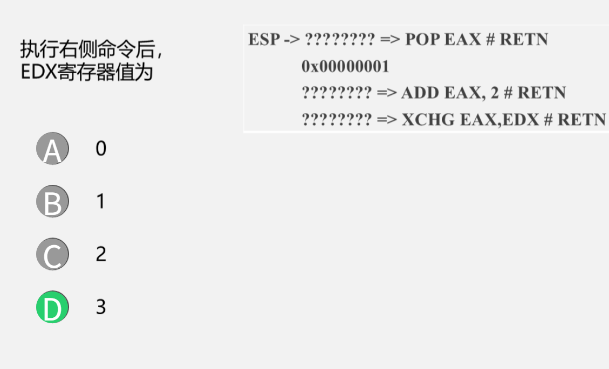

### 绕过其他安全防护

#### aslr 缺陷和绕过方法

- 增加随机偏移使得攻击变得困难
- 但是，该技术存在很多脆弱性

#### seh 保护机制缺陷和绕过方法

- **当一个进程中存在一个不是/safeseh 编译的 dll 或者库文件时，整个 safeseh 机制就可能失效**
- 可行的方法：
  - **利用未开启 safeseh 模块作为跳板绕过**
  - **利用加载模块之外的地址进行绕过**

## 漏洞挖掘基础

### 方法概述

#### 分类

- 静态分析技术：词法分析、数据流分析、控制流分析、模型检测、定理证明、符号执行、污点传播分析等
- **不需要运行程序、分析效率高、资源消耗低**
- 动态分析技术：模糊测试、动态污点分析、动态符号执行
- **需要运行程序，准确率非常高、误报率很低**
- 符号执行和污点分析分别都支持动静态

#### 符号执行

- 基本思路：使用符号值替代具体值，模拟程序的执行。

- 三个关键点：**变量符号化、程序执行模拟、约束求解**
  - 程序执行模拟：**运算语句**和**分支语句**的模拟：对于运算语句：使用符号表达式的方法表示变量的值；分支语句：**收集到所有执行路径的约束条件表达式**
- 约束求解主要负责*路径可达性判定及测试输入生成*的工作
- 优点：代价小 效率高
- 缺点：程序执行的可能路径随着程序规模的增大呈指数级增长

#### 污点分析

- 分为污点传播分析（静态）和动态污点分析；

##### 基本思想：

- **首先，确定污点源**，表示外部数据或用户所关心的内部数据，是需要进行标注分析的输入数据
- **然后，标记和分析污点**
- **控制流劫持**：程序的执行流程将被外部数据任意控制

##### 核心要素:

- **污点源**
- **传播规则**：**污点扩散规则和清除规则**，是污点分析的计算依据
- **污点检测**：在程序执行过程中的**敏感位置（sink 点）**进行**污点判定**，**敏感位置主要包括程序跳转以及系统函数调用**

##### 优缺点：

- 污点分析的核心是分析输入参数和执行路径之间的关系，**它适用于由输入参数引发漏洞的检测**，比如 sql 注入漏洞等
- 具有**较高的分析准确率**，然而，针对大规模代码的分析，由于**路径数量较多**，其分析的性能会受到较大的影响

### 词法分析

#### 1 基本概念

- 通过对代码**基于文本或字符标识的匹配分析对比**，以查找**符合特定特征和词法规则的危险函数、api 或简单语句组合**
- **主要思想**：将代码文本与归纳好的缺陷模式比如边界条件检查进行匹配，以此发现漏洞
- **优点：**：算法**简单**，检测**性能较高**
- **缺点：**：只能**进行表面的词法检测**，会出现**较高的漏报和误报**

### 数据流分析

#### 1 基本概念

- 是一种用来获取相关数据沿着数据执行路径流动的信息分析技术，分析对象是程序执行路径上的数据流动或可能的取值。
- 根据分析程序路径的深度，将数据流分析分为**过程内分析**和**过程间分析**

#### 2 方法分类

- **过程内分析只针对程序中函数内的代码进行分析**，又分为：
  - 流不敏感分析:flow insensitive,按照代码行号从上而下进行分析
  - 流敏感分析：flow sensitive,首先是产生程序控制流图，control flow graph,cfg,再按照 cfg 的拓扑排序正向或逆向分析；
  - 路径敏感分析：path sensitive,不仅考虑到语句先后顺序，还会考虑语句可达性，即会沿着实际可执行到路径进行分析
- **过程间分析则考虑函数之间的数据流，即需要跟踪分析目标数据在函数之间的传递过程**
  - 上下文不敏感分析：忽略调用位置和函数参数取值等函数调用的相关信息
  - 上下文敏感分析：对不同调用位置调用的统一函数加以区分

#### 3 程序代码模型

- 数据流分析使用的程序代码模型主要包括**程序代码的中间表示**以及一些**关键的数据结构**，利用程序代码的中间表示可以对程序语句的指令语义进行分析
- **抽象语法树**：是程序抽象结构的树状表现形式
- **三地址码**：three address code.**每个指令具有不多于三个的运算分量，每个运算分量都像是一个寄存器**
- **控制流图（cfg）**:**用于描述程序过程内的控制流的有向图**，节点和有向边
- **调用图：call graph**:描述程序中过程之间的调用和被调用关系的有向图

#### 基于数据流的漏洞分析流程

- 首先：进行**代码建模**，将代码构造成抽象语法树或程序控制流图
- 然后：**追踪获取变量的变化信息，**，根据**漏洞分析规则**检测安全缺陷和漏洞
- 基于数据流的漏洞分析非常适合检查因控制流信息非法操作而导致的安全问题，如内存访问越界，常数传播

!!! example 检测指针变量的错误使用
在检测指针变量的错误使用时，我们关心的是变量的状态，左侧代码可能出现 use after free 漏洞。
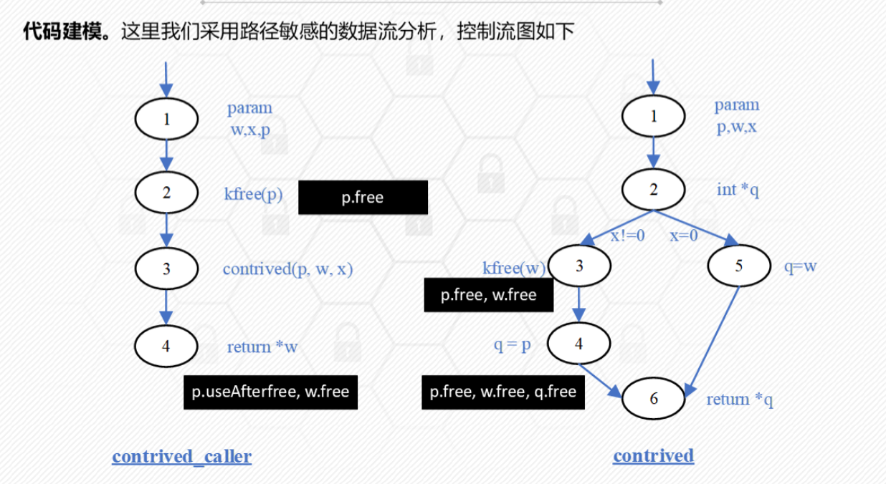

!!! example 检测缓冲区溢出 \* 我们**关心的是变量的取值**，并在一些预定义的敏感操作所在的程序点上，**对变量的取值进行检查**

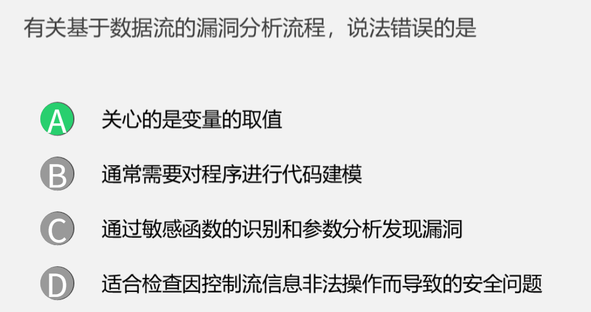
而是取值变化？

### 模糊测试

概念
步骤

#### 概念

- 是一种自动化或半自动化的安全漏洞检测技术，通过向目标软件输入大量的**畸形数据**并监测目标系统的异常来发现潜在的软件漏洞
- 属于**黑盒测试**的一种
- **缺点是畸形数据的生成具有随机性，**而随机性造成代码覆盖不充分导致了**测试数据覆盖率不高**

#### 分类

- 基于生成：**依据特定的文件格式或者协议规范组合生成测试用例**
- 基于变异：**在原有合法的测试用例基础上，通过变异策略生成新的测试用例**

#### 模糊测试步骤

1. 确定测试对象和输入数据
2. 生成模糊测试数据
3. 检测模糊测试数据
4. 监测程序异常
5. 确定可用性（非必须）

- 模糊测试不能发现被测软件所有错误原因：**随机性**的测试样本生成方式

#### 智能模糊测试

- **引入了基于符号执行、污点传播分析等可进行程序理解的方法，在实现程序理解的基础上，有针对性的设计测试数据的生成**结合了程序理解和模糊测试的方法
- 步骤：
  - 1. **反汇编**可执行代码，智能模糊测试的前提是对可执行代码进行输入数据控制流执行路径之间相关关系的分析
  - 2. 将汇编语言**中间语言转换**
  - 3. **采用智能技术分析输入数据和执行路径的关系**，符号执行和约束求解技术、污点传播分析、执行路径遍历等技术手段，**检测出可能产生漏洞的程序执行路径集合和输入数据集合**
  - 4. **利用分析获得的输入数据集合，对执行路径集合进行测试**
- 核心思想：**以尽可能小的代价找出程序中最可能产生漏洞的执行路径集合**。从而避免盲目全路径覆盖，使其具有针对性。**由模糊化测试向精确化测试**转变

### AFL 模糊测试框架

#### 概念

- 一款**基于覆盖引导的模糊测试工具**，**通过记录输入样本的代码覆盖率，从而调整输入样本以提高覆盖率，增加发现漏洞的概率**
- **主要用于 c/c++程序的测试，**，被测程序**有无程序源码均可**，有源码可以进行编译时插桩，无源码可以借助 qemu 的 user-mode 模式进行二进制插桩

#### 工作流程

1. 从源码编译程序时进行**插桩**，**以记录代码覆盖率**
2. 选择一些输入文件作为初始测试集加入输入队列；
3. **将队列中的文件按策略进行突变**
4. 如果经过编译文件更新了覆盖范围，则保留在队列中；
5. 循环进行时，期间**触发了 crash 的文件**会被记录下来
   `afl-fuzz -i in -o out -- ./test @@`

- `afl-fuzz`: 这是 AFL 工具的主要可执行文件，用于进行模糊测试。

- `-i in`: 指定输入种子目录（input directory）。`in`是包含初始测试用例（种子文件）的目录。AFL 会基于这些种子文件进行变异生成新的测试用例。

- `-o out`: 指定输出目录（output directory）。`out`目录将存储模糊测试的结果，包括导致崩溃的测试用例、代码覆盖率信息等。

- `--`: 这是一个分隔符，表示选项的结束，后面的部分是被测试程序的命令。

- `./test @@`: 这是被测试的目标程序。`./test`是要运行的程序（在当前目录下的名为`test`的可执行文件）。`@@`是一个占位符，AFL 在运行时会将其替换为实际输入文件的路径。
  使用 AFL 对当前目录下的`test`程序进行模糊测试，初始种子文件位于`in`目录中，输出结果保存到`out`目录中。运行测试时，AFL 会将生成的测试文件作为参数传递给`test`程序（替换`@@`）。

## 漏洞挖掘技术进阶

### 程序切片技术

#### 定义

- **旨在从程序中提取满足一定约束条件的代码片段**，对指定变量施加影响的代码指令，或者指定变量所影响的代码片段
- **可以从大规模程序中精确定位分析员所关心的代码片段**
- **Mark Weise，**,一个程序切片由程序中的一些语句和判定表达式组成的集合。
- 分类：**前向加后向。前向切片的计算方向和程序运行方向是一致的**

#### 控制流图

> cfg,**是一个过程或程序的抽象表现，代表了一个程序执行过程中会便利到的所有路径**
> 控制流图：四元组，v,e,s,e 变量的集合，边的集合，控制流图的入口和出口

- 程序中的每一条指令都映射为该图上的一个节点，具有控制依赖关系的点之间用一条边连接

* 控制依赖的来源：程序上下文，控制指令

#### 程序依赖图

- 五元组：v,dde,cde,s,e;dde 表示数据依赖边的集合，cde 表示控制依赖边的集合。
- **控制依赖：流程上存在的依赖**
- **数据依赖：定义-引用**

#### 系统依赖图

- 七元组：sdg(v,dde,cde,ce,tde,s,e):ce 表示函数调用边，**tde 表示参数传递造成的传递依赖边的集合**

### 程序切片方法

#### 工作原理

- **在实际程序调试过程中，通常程序员只关注程序的部分行为**
- **切片语句可以利用数据依赖和控制依赖分析方法来获取**

* **分为 3 个步骤**
  1. **程序依赖关系提取**
  2. **切片规则制定**：静态，动态，条件或者前向 后向
  3. **切片生成**，数据流方程，图可达算法

#### 图可达算法

- **程序依赖图，具有直接依赖关系和间接依赖关系的结点都用一条边连接**
- pdgslice 详细步骤如下
  1. 输入：节点 node
  2. 输出：节点集 visitednodes
  3. step1:判断 node 是否在节点集合里，若是，返回；否，进入步骤 2
  4. step2:将 node 添加到 visitednodes 中
  5. step3:在程序依赖图中便利 node 依赖的节点，得到节点集 pred;
  6. step4:对于每一个 pred 属于 Pred,迭代调用 PDGSlice(pred)

#### 动态切片

- **考虑特定程序的特定输入**
- **静态切片和动态切片可以看作条件切片的两个特例**

### 程序插桩技术

概念 作用

#### 概念

- **在代码中插入一段我们自己定义的代码**
- **插入输入输出语句；断言是一种特殊的插桩**

#### 插桩分类

- **源代码插桩**
- **静态二进制插桩，编译之后，运行之前**
- **动态二进制插桩，在程序运行时**

#### pin 插桩示例

- **pin 是 intel 公司开发的动态二进制插桩框架，支持 ia-32 和 x86-64 指令集架构，支持 win 和 linux**
- **pintool.pin 通过已经定义的 tools 或自己开发的 tool 来完成对目标程序的插桩**

##### 使用 pintool

1. 编译现有 pintool
2. Inscount 插桩示例，首先编译产生动态链接库

- 插桩模式：
  - 指令集，轨迹，镜像，函数；各种粒度

### 消息 hook 技术

#### hook 概念

- hook,钩子，是一种过滤或叫挂钩消息的技术；
- 它的目的是过滤一些关键函数调用，在执行函数前先执行自己的挂钩函数，达到监控函数调用，改变函数功能的目的

#### 消息 hook

- **win 系统建立在事件驱动机制上，整个系统通过消息传递实现的。消息 hook 就是一个 win 消息的拦截机制**
- 如果对同一事件即安装了线程钩子又安装了系统钩子，先线程在系统

##### 基于消息 hook 的 dll 注入

- 编制键盘消息的 hook 函数；通过 setwindowshookex 创建键盘消息钩子实现 dll 注入

### api hook 技术

#### 概念

- 多种方法：iat hook,代码 hook,eat hook
- **iat hook:将输入函数地址表 iat 内部的 api 地址更改为 hook 函数地址**
- **代码 hook:系统库（\*.dll）映射到进程内存，从中朝朝 api 的实际地质并直接修改代码**

### 符号执行基本原理

### Z3 约束求解器

### Angr 应用示例

### 污点分析基本原理

### 污点分析方法

## web 进阶

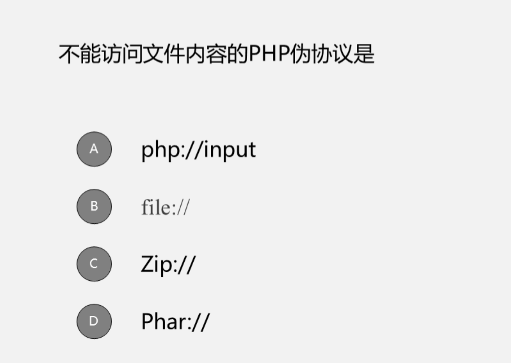
输入输出流而非文件
